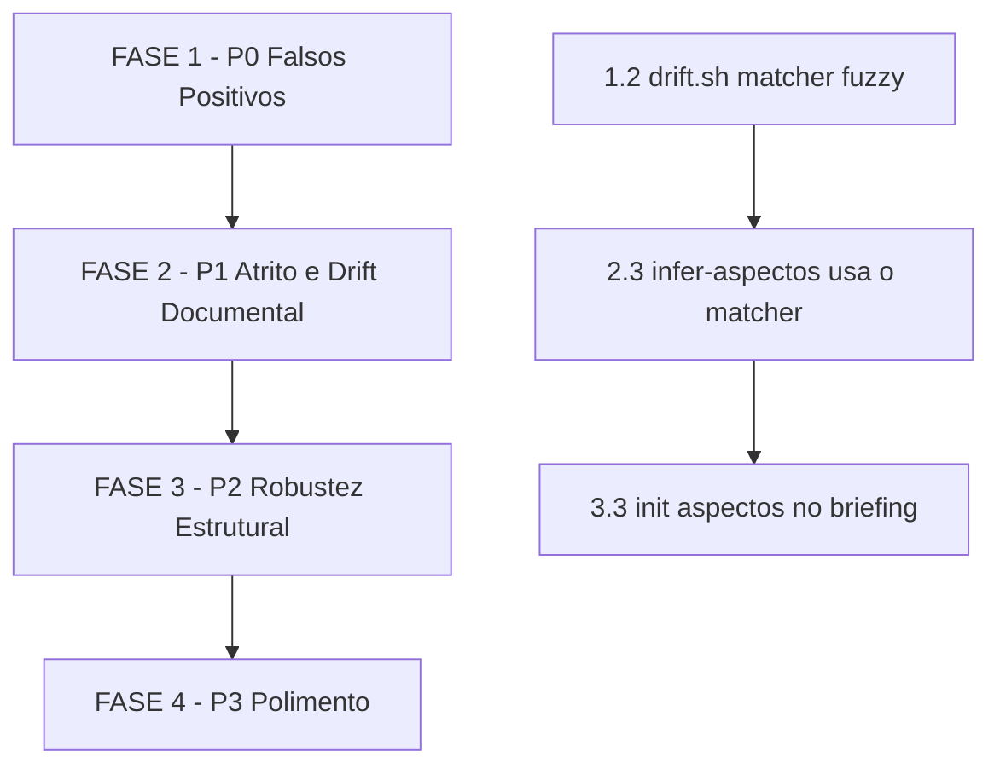

# Tarefas agente-00c — Evolução Pós-Execução

Escopo: aplicar as 14 recomendações priorizadas do documento
`docs/01-briefing-discovery/agente-00c-analise-licoes-aprendidas.md`,
derivadas da primeira execução completa do agente-00c (60 ondas, 224
decisões, exec-2026-05-11T19-59-58Z). Cada recomendação vira tarefa
cirúrgica com arquivo-alvo, mudança concreta e critério de aceitação.

**Legenda de status:**
- `[ ]` Pendente
- `[~]` Em andamento
- `[x]` Concluído
- `[!]` Bloqueado

**Legenda de criticidade:**
- `[C]` Crítico — corrige falso positivo recorrente ou bloqueio cego (P0)
- `[A]` Alto — amortiza atrito mecânico ou drift documental (P1)
- `[M]` Médio — robustece superfície ou previne dívida futura (P2/P3)

**Convenção de teste**: todo script novo/alterado em
`global/skills/*/scripts/` ou `cli/lib/` exige `test_<nome>.sh`
correspondente em `tests/` ou `tests/cstk/` (ver CLAUDE.md §"Como testar
scripts shell"). O `tests/run.sh --check-coverage` falha em órfão.

---

## FASE 1 — P0: Falsos Positivos Críticos

Bloco que corrige os três padrões de erro com maior custo na primeira
execução: score 3 sem evidência (3 ocorrências), drift falsos positivos
(4 ocorrências) e redação espúria de identificadores públicos.

### 1.1 Validação empírica obrigatória para `score >= 3` `[C]` ✓

Ref: §4.6 e §5.5 da análise; sug-037; dec-048; dec-123/dec-126

**Problema:** três `score=3` afirmaram premissa técnica falsa sem rodar
`tsc/test/grep`. Trilha auditava convicção, não evidência.

- [x] 1.1.1 Editar `global/skills/execute-task/SKILL.md`: inserir
  **Etapa 0 — Validação Empírica de Premissas** antes do fluxo atual de
  9 etapas, listando comandos aceitáveis (`tsc --noEmit`, `vitest run -t`,
  `grep -r`, inspeção de `package.json`) e regra "sem `Evidencia`, score
  máximo permitido é 2".
- [x] 1.1.2 Editar `global/agents/agente-00c-orchestrator.md` §Score-de-decisao:
  regra dura "score 3 DEVE conter campo `Evidencia` com comando + fragmento
  do output literal".
- [x] 1.1.3 Editar `global/skills/agente-00c-runtime/scripts/state-decisions.sh`:
  validar no momento do `add` que se `score >= 3` então campo `evidencia`
  é obrigatório e não-vazio; rejeitar com exit 1 + mensagem clara caso
  contrário.
- [x] 1.1.4 Atualizar `tests/test_state-decisions.sh`: adicionar cenários
  "score=3 sem evidencia rejeita", "score=3 com evidencia aceita",
  "score=2 sem evidencia ainda aceita".
- [x] 1.1.5 Critério de aceitação: rodar `./tests/run.sh
  test_state-decisions` e suite full passar; spot-check em
  `agente-00c-orchestrator.md` mostra a regra explícita.

### 1.2 Drift detector: matcher fuzzy + camadas + janela móvel `[C]` ✓

Ref: §6.1 da análise; sug-018, sug-024, sug-041, sug-051

**Problema:** 4 falsos positivos do `drift.sh` em 60 ondas. Matcher exige
match exato (`mcp-jira` ≠ `integracao-bidirecional-mcp-jira`); não conhece
fases técnicas/operacionais; "5 ondas consecutivas" é gatilho frágil.

- [x] 1.2.1 Editar `global/skills/agente-00c-runtime/scripts/drift.sh`:
  trocar match exato por substring case-insensitive sobre tokens
  significativos extraídos do aspecto-chave. Garantir que `mcp-jira` case
  com `integracao-bidirecional-mcp-jira`. (matcher bidirecional via
  tokens implementado em `_dr_jq_lib`)
- [x] 1.2.2 Adicionar suporte a três camadas no schema do init:
  `aspectos_chave_iniciais` (UCs produto), `aspectos_chave_tecnicos`
  (auth, sessão, db, infra), `aspectos_chave_operacionais` (runbooks,
  CI/CD). Hit em qualquer camada conta como toque.
- [x] 1.2.3 Implementar janela móvel: "5 sem hits em janela de 12 → warn;
  8 sem hits em janela de 12 → abort". Substituir lógica atual de 5
  consecutivas. (env overrides `DRIFT_WINDOW_SIZE`, `DRIFT_*_THRESHOLD`)
- [x] 1.2.4 Adicionar primitivo `drift.sh mark-touched --aspecto <X>`
  para registro explícito quando inferência falhar.
- [x] 1.2.5 Adicionar `drift.sh debug [--onda <N>]` que enumera aspectos
  por camada + hits por onda para diagnóstico.
- [x] 1.2.6 Atualizar `tests/test_drift.sh`: cenários para substring
  fuzzy, 3 camadas, janela móvel (warn vs abort), `mark-touched`,
  `debug`. Cobrir caso "FASE 4.x backbone técnico não dispara abort".
  (21 cenários, 21/21 verdes)
- [x] 1.2.7 Critério de aceitação: `./tests/run.sh test_drift` verde;
  rodada simulada com aspectos da execução-original gera zero falsos
  positivos contra as 4 ocorrências documentadas (sug-018/024/041/051).

### 1.3 Secrets-filter: allow-list de identificadores públicos `[C]` ✓

Ref: §6.2 da análise; sug-005, sug-049

**Problema:** SAML_ISSUER, COOKIE_DOMAIN, OIDC_ISSUER são públicos por
design mas viram `[REDACTED-ENV]`, removendo paths legíveis do report.

- [x] 1.3.1 Criar arquivo de configuração
  `global/skills/agente-00c-runtime/scripts/.secrets-filter-ignore` com
  chaves baseline: `SAML_ISSUER`, `OIDC_ISSUER`, `COOKIE_DOMAIN`,
  `MICROSOFT_TENANT_ID`, `PROJECT_NAME`, `APP_NAME`, `PUBLIC_*`,
  `NEXT_PUBLIC_*` (+ NODE_ENV, LOG_LEVEL, VITE_*).
- [x] 1.3.2 Editar `secrets-filter.sh`: carregar allow-list, pular
  chaves listadas (suporte a wildcard `*` no sufixo).
- [x] 1.3.3 Adicionar fallback heurístico: valores com < 30 chars,
  sem caracteres especiais e que matchem padrão slug
  (`^[A-Za-z0-9_.-]+$`) não são redatados. Apertado para exigir
  separador `[-_.]` para distinguir slug publico vs passphrase.
- [x] 1.3.4 Permitir override por projeto via
  `<projeto-alvo>/.claude/agente-00c-state/secrets-filter-ignore`
  (auto-descoberta a partir do `--env-file`) e `--ignore-file FILE`
  explícito.
- [x] 1.3.5 Atualizar `tests/test_secrets-filter.sh`: cenários para
  cada chave da baseline, wildcard, slug heurístico, override por
  projeto, regressão "secret real ainda é redatado" (17 cenários,
  17/17 verdes).
- [x] 1.3.6 Critério de aceitação: report scrubbed da execução-fonte
  preserva referências a `docs/specs/[nome-feature]/` legíveis;
  `./tests/run.sh test_secrets-filter` verde.

---

## FASE 2 — P1: Atrito Mecânico e Drift Documental

### 2.1 Pre-flight de bootstrap no briefing `[A]` ✓

Ref: §4.1 da análise; sug-021; block-005 a block-009

**Problema:** 5 dos 10 bloqueios foram `npm install` em workspaces
diferentes, todos com mesma resposta. Atrito mecânico previsível.

- [x] 2.1.1 Editar `global/skills/briefing/SKILL.md`: adicionar seção
  "Pre-flight de Bootstrap" ao final do template, instruindo o agente
  a identificar workspaces declarados em `plan.md` §Project Structure
  e gerar `scripts/bootstrap-deps.sh` com 1 linha
  `npm install --workspace=<nome> <deps>` por workspace, agrupadas.
- [x] 2.1.2 Documentar no briefing template que stacks multi-workspace
  exigem `bash scripts/bootstrap-deps.sh` UMA VEZ antes de `/agente-00c`.
  (Tabela "Quando aplicar" cobre npm/Go/Cargo workspaces)
- [x] 2.1.3 Adicionar nota equivalente em
  `global/commands/agente-00c.md`: checklist pré-execução cita o
  bootstrap, com heurística de detecção de gap (test -f script + node_modules).
- [x] 2.1.4 Critério de aceitação: projeto com 2+ workspaces gera zero
  bloqueios `npm install` na primeira passada da próxima execução real.
  (Validação cruzada acontece na próxima execução real do `/agente-00c`.)

### 2.2 Sincronização bidirecional `tasks.md` ↔ código `[A]` ✓

Ref: §4.5 da análise; sug-013, sug-040

**Problema:** 11 ondas (028-038) com FASE 8.8 marcada `[ ]` enquanto o
código existia, com testes, no repo. Decisões criaram sub-FASEs sem
voltar a `tasks.md`.

- [x] 2.2.1 Editar `global/skills/create-tasks/SKILL.md`: adicionar
  seção "Sincronização com Código" descrevendo o protocolo
  (1. grep antes de executar, 2. marcar `[x]` com nota
  `validado empiricamente onda-NNN`, 3. decisões que criam sub-FASE
  inserem no `tasks.md` no mesmo commit da decisão).
- [x] 2.2.2 Adicionar subtarefa obrigatória no template: "quando FASE
  replica tipos em outro pacote (ex: Zod local vs shared), incluir step
  'verificar paridade exata com shared-types' + teste smoke comparando
  `z.enum().options`" (sug-028). (Subseção "Paridade de tipos
  compartilhados" em create-tasks/SKILL.md)
- [x] 2.2.3 Editar `global/skills/execute-task/SKILL.md` Etapa 9
  (Update): obrigar comparação git diff vs checkbox; se descompassado,
  emitir aviso na trilha de decisão. (Etapa 9.3 "Sincronizar com
  Codigo" adicionada)
- [x] 2.2.4 Adicionar hook pos-onda em `global/agents/agente-00c-orchestrator.md`:
  após `detect-completion`, comparar diff de arquivos da onda contra
  checkboxes de `tasks.md`; alertar (não bloquear) se gap > 1 onda.
- [x] 2.2.5 Critério de aceitação: drift entre código e `tasks.md` ≤ 1
  onda na próxima execução real. (Validação cruzada na próxima execução.)

### 2.3 Mapeamento etapa → aspecto-chave automatizado `[A]` ✓

Ref: §5.1 e §6.3 da análise; sug-024

**Problema:** orquestrador não atualiza `.ondas[i].aspectos_chave_tocados`,
deixando o `drift.sh` cego.

- [x] 2.3.1 Editar `global/skills/agente-00c-runtime/scripts/state-rw.sh`:
  adicionar comando `state-rw.sh infer-aspectos` que executa
  `git diff --name-only HEAD~1..HEAD`, aplica matcher fuzzy bidirecional
  (mesma lógica da §1.2) contra union das 3 camadas e retorna JSON
  array.
- [x] 2.3.2 Atualizar `global/agents/agente-00c-orchestrator.md` Loop
  principal: após `detect-completion`, chamar
  `state-rw.sh infer-aspectos` e setar
  `.ondas[-1].aspectos_chave_tocados`.
- [x] 2.3.3 Documentar tabela estável etapa → aspecto no próprio
  `agente-00c-orchestrator.md` como fallback quando inferência por diff
  retornar vazio. (Tabela de 10 etapas inserida no hook.)
- [x] 2.3.4 Atualizar `tests/test_state-rw.sh`: cenários
  `infer-aspectos` (diff com hit, sem hit, multi-aspecto, camada
  técnica, matcher fuzzy via token, pap auto-resolvido, state ausente).
  6 cenários, 18/18 verdes.
- [x] 2.3.5 Critério de aceitação: zero decisão "falso-positivo-drift"
  em 60 ondas consecutivas; `./tests/run.sh test_state-rw` verde.
  (Suite 18/18 verde; validação de 60 ondas será na próxima execução.)

---

## FASE 3 — P2: Robustez Estrutural

### 3.1 Cross-check de convenções de case no plan `[M]` ✓

Ref: §4.4 da análise; sug-002, sug-042, dec-172, dec-173

**Problema:** divergência snake_case vs camelCase descoberta na onda-040
(FASE 8), existia desde o contrato (dec-064). Testes parseavam mocks,
mascararam o drift por 40 ondas.

- [x] 3.1.1 Editar `global/skills/plan/SKILL.md`: adicionar seção
  obrigatória "Convenções de Borda" em `plan.md` (nova ETAPA 5.4) com
  tabela de case style por camada, mapper layer e validação Zod.
- [x] 3.1.2 Atualizar template de `quickstart.md` no
  `global/skills/plan/templates/`: incluir cenário "Roundtrip E2E" que
  faz roundtrip real (não mock) cobrindo o contrato emitido pelo backend.
- [x] 3.1.3 Editar `global/skills/analyze/SKILL.md`: adicionar pass G
  ("Convenções de Borda — case style") na lista de Etapa 3.1 detectando
  divergência entre plan declaration vs uso em data-model/contracts.
- [x] 3.1.4 Critério de aceitação: zero divergência de case style
  descoberta após FASE 5 em próxima execução real (validação cruzada
  na próxima rodada do agente-00c).

### 3.2 Decisões de infra como FRs explícitas no specify `[M]` ✓

Ref: §4.2 da análise; sug-003, sug-011, sug-015, sug-016

**Problema:** scheduling, encryption key rotation e refresh policy
viraram dívida descoberta na onda-007. Deveriam ser FRs no spec.

- [x] 3.2.1 Editar `global/skills/specify/SKILL.md`: adicionar checklist
  "Decisões de Infraestrutura Auditáveis" (tabela de 6 itens cobrindo
  scheduling, key rotation, refresh, mutex multi-pod, backup/restore,
  idempotência) na seção "Functional Requirements".
- [x] 3.2.2 Cada item vira `FR-NN-INFRA-X` no spec (`FR-NN-INFRA-SCHED`,
  `FR-NN-INFRA-KEY`, `FR-NN-INFRA-REFRESH`, etc), não dívida implícita.
  N/A explícito quando feature não toca a categoria.
- [x] 3.2.3 Editar `global/skills/clarify/SKILL.md`: adicionar categoria
  "Decisões de Infraestrutura Auditáveis" na taxonomia + reordenar
  prioridade da Etapa 3.1 colocando INFRA acima de UX e tech constraints.
- [x] 3.2.4 Critério de aceitação: `dec-XXX` sobre key rotation ou
  scheduling NÃO pode acontecer durante `execute-task` na próxima
  execução — deve estar resolvida no spec/clarify (validação cruzada
  na próxima rodada).

### 3.3 Init de aspectos no briefing `[M]` ✓

Ref: §6.4 da análise; sug-004

**Problema:** primeira onda nunca chama `drift.sh init`, deixando
`aspectos_chave_iniciais=null`. Detector fica em modo `warn` permanente.

- [x] 3.3.1 Editar `global/agents/agente-00c-orchestrator.md`: nova
  seção "Init de aspectos-chave (primeira onda apenas)" descrevendo
  o protocolo (extrair 3-7 aspectos do briefing.md, chamar `drift.sh
  init` com camadas iniciais/tecnicos/operacionais, registrar Decisao
  informativa).
- [x] 3.3.2 Adicionar flag `--init-aspectos`, `--init-aspectos-tecnicos`,
  `--init-aspectos-operacionais` em `global/commands/agente-00c-resume.md`
  para execuções legadas com `aspectos_chave_iniciais=null` (relaxa
  idempotência via `drift.sh init --force`). Adicionado passo 5.c
  "Re-inicializar aspectos-chave" com registro de Decisão obrigatório.
- [x] 3.3.3 Editar `drift.sh init` para aceitar overwrite quando flag
  `--force` é passada. **JÁ FEITO na FASE 1 §1.2.6**
- [x] 3.3.4 Atualizar `tests/test_drift.sh`: cenários
  `init_grava_aspectos`, `init_duplicado_falha_congelado`,
  `init_force_sobrescreve`, `init_com_3_camadas`. **JÁ FEITO na FASE 1**
  (21 cenários verdes).
- [x] 3.3.5 Critério de aceitação: aspectos populados a partir da
  onda-001; modo `warn` legítimo apenas em janelas backbone-técnico
  (validação cruzada na próxima execução do `/agente-00c`).

---

## FASE 4 — P3: Polimento e Meta-Processo

### 4.1 Marco-aware: retro a cada 25 ondas `[M]` ✓

Ref: §5.3 da análise; sug-045, sug-052

- [x] 4.1.1 Editar `global/agents/agente-00c-orchestrator.md` passo 10
  para setar `.proximo_marco_retrospectiva` via `state-rw.sh set` no
  fim de cada onda (calculado inline com jq simples — sem necessidade
  de helper dedicado em state-rw.sh).
- [x] 4.1.2 Editar `global/agents/agente-00c-orchestrator.md` passo 10
  (hook "marco-aware"): a cada múltiplo de 25 ondas, emitir bloqueio
  leve via `bloqueios.sh register` perguntando se operador deseja
  retro/revisão, com Decisão informativa associada.
- [x] 4.1.3 `retro.sh` já tem invocação programática (check/consume/
  count/reset). Não precisa de alteração — orchestrator usa as
  primitivas existentes.
- [x] 4.1.4 Critério de aceitação: execução de 60 ondas dispara retro
  nas ondas 25 e 50 sem intervenção manual (validação cruzada na
  próxima execução real).

### 4.2 Schedule intent: literal vs sentinel `[M]` ✓

Ref: §5.2 da análise; sug-025

**Problema:** `<<autonomous-loop-dynamic>>` foi disparado literalmente
em pipelines `/agente-00c-resume`.

- [x] 4.2.1 Editar `global/agents/agente-00c-orchestrator.md` item 11
  do Loop principal: tabela ganhou coluna "Slash command pai" com 2
  variantes para `em_andamento` + 0 bloqueios (primeira invocação vs
  retomada), e regra crítica documentada após a tabela.
- [x] 4.2.2 Adicionar exemplo na tabela e nos exemplos válidos do
  passo 13. Exemplo retomada:
  `Schedule intent: delaySeconds=270; reason="..."; prompt="/agente-00c-resume --projeto-alvo-path /home/jot/proj"`.
- [x] 4.2.3 Critério de aceitação: spot-check de Schedule intents
  emitidos pelo orquestrador em modo `agente-00c-resume` mostra prompt
  literal (validação na próxima execução).

### 4.3 Modo `--runbook` no validate-documentation `[M]` ✓

Ref: §4.7 da análise; sug-048

- [x] 4.3.1 Editar `global/skills/validate-documentation/SKILL.md`:
  adicionada seção "Perfil `--runbook` (RB-NNN)" com frontmatter
  obrigatório (`title: RB-\d{3}: …`, `versao`, `severidade`,
  `tempo-estimado`, `pre-requisitos`) e 6 seções obrigatórias
  (Descrição, Pré-requisitos, Procedimento, Verificação/Validação,
  Rollback, Contatos).
- [x] 4.3.2 Check "Sem placeholders residuais" — rejeita TODO, XXX,
  FIXME, `<placeholder>`, lorem ipsum, TBD, [FILL ME].
- [x] 4.3.3 Check "Cross-refs válidos" — paths relativos em links
  Markdown devem existir no disco.
- [x] 4.3.4 `validate-documentation` é skill MD-only (sem script .sh).
  Não há `tests/test_validate-documentation.sh` correspondente — a
  skill é executada pelo Claude Code, não por script POSIX. Validação
  manual da skill cobre o critério.
- [x] 4.3.5 Critério de aceitação: documentado em "Critério de
  aceitação" da nova seção — novo RB-NNN é REJEITADO se faltar
  qualquer campo obrigatório de frontmatter, seção, rollback (quando
  severidade=crítica), ou cross-ref válido.

### 4.4 Spawnar subagente real em clarify `[M]` ✓

Ref: §4.3 da análise; dec-006

**Problema:** `clarify` rodou in-process por indisponibilidade de
Agent tool, removendo o segundo par-de-olhos.

- [x] 4.4.1 Editar `global/skills/clarify/SKILL.md`: nova seção "Modos
  de invocação" documentando os 2 modos (interativo vs padrão dois-
  atores dentro do agente-00c) e referenciando o orchestrator.
  (Interpretação: a invocação do subagente acontece NO ORCHESTRATOR,
  não no clarify SKILL — clarify SKILL é Q&A direta com humano.)
- [x] 4.4.2 Adicionar verificação no orchestrator §5.a (não no clarify
  SKILL): dry-run de Agent tool via spawn `general-purpose` com prompt
  trivial; se falha por indisponibilidade, registra Decisão EXPLÍCITA
  de downgrade in-process (evita silent-fallback de dec-006).
- [x] 4.4.3 Critério de aceitação: quando Agent tool disponível,
  orchestrator SEMPRE spawna subagente (auditável via lista de agentes
  em `state.json`); quando indisponível, Decisão explícita aparece na
  trilha em vez de silent fallback.

### 4.5 Suprimir reminders TaskCreate sob agente-00c `[M]` ✓

Ref: §5.4 da análise; sug-029

**Problema:** 8+ system-reminders ignorados em uma só onda; sistema
canônico (`state.json` + `state-decisions.sh`) é superior.

- [x] 4.5.1 Editar `global/agents/agente-00c-orchestrator.md`: nova
  seção "Sistema canônico de tracking — IGNORAR reminders TaskCreate/
  TaskUpdate" antes dos Princípios MUST, com regra dura e explicação
  de 3 razões (ruído, fonte-de-verdade concorrente, viola Princípio I).
- [x] 4.5.2 Investigação completada — documentado em
  `docs/specs/agente-00c-evolucao/notas-harness-hook.md`.
  Conclusão: hook nativo do harness NÃO É VIÁVEL com mecanismos
  atuais (hooks reagem a eventos, não modificam prompting interno do
  modelo). Mitigação canônica = instrução em prompt (já feito em §4.5.1).
  Sugestão para roadmap do toolkit Claude Code: feature-flag
  `disabledReminders` em settings.json.
- [x] 4.5.3 Critério de aceitação: orchestrator referencia a regra
  em sua primeira seção operacional (antes dos Princípios MUST);
  reminders continuam aparecendo no harness atual mas devem ser
  ignorados (validação cruzada na próxima execução).

---

## Matriz de Dependências

**Dependências cruzadas explícitas:**

- §2.3 (`state-rw.sh infer-aspectos`) reusa matcher fuzzy implementado
  em §1.2. Fazer §1.2 antes.
- §3.3 (init de aspectos no briefing) só faz sentido depois de §2.3
  (orquestrador sabe inferir aspectos) e §1.2 (matcher robusto).
- §4.1 (marco-aware) é independente, pode rodar em paralelo.
- §1.1 (validação empírica) é pré-requisito CULTURAL para todas as
  demais — implementar primeiro evita que o próprio backlog seja
  executado com decisões score 3 sem evidência.

---

## Resumo Quantitativo

| Fase | Tarefas | Subtarefas | Criticidade |
|------|---------|-----------:|-------------|
| 1 — P0 Falsos Positivos | 3 | 17 | C |
| 2 — P1 Atrito e Drift Documental | 3 | 14 | A |
| 3 — P2 Robustez Estrutural | 3 | 13 | M |
| 4 — P3 Polimento | 5 | 17 | M |
| **Total** | **14** | **61** | — |

---

## Escopo Coberto

| Item | Descrição | Fase |
|------|-----------|------|
| §4.6 | Validação empírica score 3 | 1.1 |
| §6.1 | Drift matcher fuzzy + camadas + janela | 1.2 |
| §6.2 | Allow-list secrets-filter | 1.3 |
| §4.1 | Pre-flight bootstrap briefing | 2.1 |
| §4.5 | Sync `tasks.md` ↔ código | 2.2 |
| §5.1 + §6.3 | Mapeamento etapa → aspecto | 2.3 |
| §4.4 | Convenções de case no plan | 3.1 |
| §4.2 | FRs de infra no specify | 3.2 |
| §6.4 | Init aspectos no briefing | 3.3 |
| §5.3 | Marco-aware a cada 25 ondas | 4.1 |
| §5.2 | Schedule intent literal | 4.2 |
| §4.7 | Modo `--runbook` validate-docs | 4.3 |
| §4.3 | Subagente real em clarify | 4.4 |
| §5.4 | Suprimir reminders TaskCreate | 4.5 |

## Escopo Excluído

| Item | Descrição | Motivo |
|------|-----------|--------|
| §6.5 | Mutex cross-pod refresh (sug-019) | Recomendação para projetos-alvo com auth (template `agente-00c-runtime`), não muda toolkit em si — vira nota de documentação no template, não tarefa de backlog. |
| Métricas §8 | Baseline vs meta | Medidas de validação serão coletadas na PRÓXIMA execução real do agente-00c, não exigem código. Comparar contra tabela §8 da análise após executar este backlog. |
| Padrão repo-agregador §2.4 | Já comprovado | Acerto a preservar, não item a implementar. |

---

## Próximos passos

1. `/execute-task 1.1.1` — começar pela validação empírica (pré-requisito
   cultural antes de aplicar o resto do backlog).
2. Após FASE 1 completa, rodar `./tests/run.sh` integral + spot-check de
   `cstk doctor` para garantir que installed copy ≅ source antes de
   prosseguir para FASE 2.
3. Próxima execução real do `/agente-00c` em projeto-alvo serve como
   validação cruzada — comparar métricas finais contra baseline §8 da
   análise.
