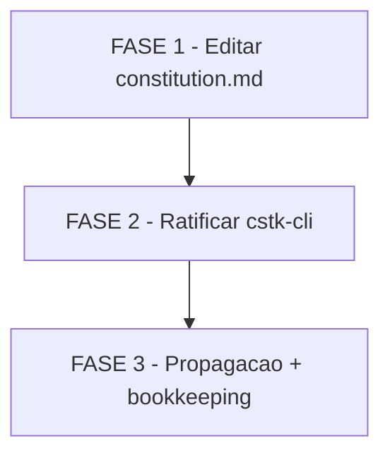

# Tarefas constitution-amend-optional-deps - Amendment 1.1.0

Escopo: aplicar emenda formal ao Principio II da constitution (bump 1.0.0 →
1.1.0, MINOR) adicionando subsecao "Optional dependencies with graceful
fallback"; ratificar retroativamente `jq` em `cli/lib/hooks.sh` da feature
`cstk-cli`; propagar bookkeeping downstream. Deriva de `spec.md`, `plan.md`,
`research.md`, `data-model.md`, `contracts/amendment-text.md` e `quickstart.md`
deste diretorio.

**Legenda de status:**
- `[ ]` Pendente
- `[~]` Em andamento
- `[x]` Concluido
- `[!]` Bloqueado

**Legenda de criticidade:**
- `[C]` Critico - Impacto em seguranca, integridade ou atomicidade
- `[A]` Alto - Funcionalidade essencial
- `[M]` Medio - Necessario mas sem urgencia imediata

---

## FASE 1 - Aplicar amendment em `docs/constitution.md`

### 1.1 Editar constitution e verificar invariantes `[A]`

Ref: `spec.md` §US-1 + §FR-001..006, `contracts/amendment-text.md` Insertion
Points 1-4, `research.md` Decisions 1-4

- [x] 1.1.1 Snapshot do bloco `**MUST:**` do Principio II (linhas entre `**MUST:**`
  e a primeira linha em branco seguinte) em tempfile — `awk` extrair para
  preparar verificacao SC-005
- [x] 1.1.2 Insertion Point 1: editar comentario HTML `<!-- Sync Impact Report -->`
  no topo de `docs/constitution.md` adicionando linha de bump 1.0.0 → 1.1.0
  conforme bloco literal em `contracts/amendment-text.md` §Insertion Point 1
- [x] 1.1.3 Insertion Point 2: inserir subsecao `#### Optional dependencies with
  graceful fallback (amendment 1.1.0)` entre o bloco `**MUST:**` existente do
  Principio II e o `**Rationale:**`, com texto literal conforme Insertion Point 2
  (inclui 3 condicoes (a)(b)(c) + bloco "O que NAO muda" + referencia ao jq/cstk-cli)
- [x] 1.1.4 Insertion Point 3: no `## Decision Framework` item 4, apos a frase
  existente sobre "Excecao a MUST ... exige amendment", adicionar a frase
  complementar sobre subsecoes de carve-out como mecanismo valido (texto literal
  em Insertion Point 3)
- [x] 1.1.5 Insertion Point 4: atualizar o Version footer — trocar
  `**Version**: 1.0.0 | **Ratified**: 2026-04-20 | **Last Amended**: 2026-04-20`
  para `**Version**: 1.1.0 | **Ratified**: 2026-04-20 | **Last Amended**: 2026-04-24`.
  APENAS `Version` e `Last Amended` mudam
- [x] 1.1.6 Verificacao SC-005: extrair novo bloco `**MUST:**` do Principio II
  para outro tempfile; rodar `diff <snapshot-antigo> <novo-bloco>`; esperado:
  saida vazia (byte-a-byte identico)
- [x] 1.1.7 Verificacao SC-006: na subsecao nova, `grep -c '^(a)\|^(b)\|^(c)'`
  deve retornar exatamente 3 — nao mais, nao menos
- [x] 1.1.8 Verificacao SC-004: `grep '^\*\*Version\*\*: 1.1.0' docs/constitution.md`
  retorna exatamente 1 linha; `grep 'Last Amended.*2026-04-24'` idem

---

## FASE 2 - Ratificar primeiro caso (`cstk-cli`)

### 2.1 Atualizar cstk-cli plan.md §Complexity Tracking `[A]`

Ref: `spec.md` §US-2 + §FR-007 + §FR-009 + §FR-010, `contracts/amendment-text.md`
§Edit A, `docs/specs/cstk-cli/plan.md` §Complexity Tracking

- [x] 2.1.1 Substituir sub-heading `### Exception: jq como dependencia opcional
  para merge de settings.json` por `### Optional-dep registry: jq em
  cli/lib/hooks.sh (conforme constitution 1.1.0)` em `docs/specs/cstk-cli/plan.md`
- [x] 2.1.2 Reescrever paragrafo de abertura: substituir o texto sobre "Violacao
  de Principio II ... `jq` esta explicitamente listada como banida..." pela
  demonstracao ponto-a-ponto das 3 condicoes (a)(b)(c) conforme Edit A do contract
- [x] 2.1.3 Atualizar a tabela no final da secao: primeira coluna muda de
  "Violacao" para "Caso registrado"; valor da celula correspondente ao `jq` muda
  para "Conforme constitution 1.1.0 §II (optional-deps carve-out)"
- [x] 2.1.4 Verificacao de remocao de texto obsoleto: `grep -n "Violacao.*Principio II"
  docs/specs/cstk-cli/plan.md` deve retornar zero matches apos a edicao
- [x] 2.1.5 Verificacao SC-002: re-analise mental do cstk-cli executando os 6
  passes do `/analyze` — confirmar que o finding D1 ("jq exception") NAO aparece
  mais como CRITICAL. Se aparecer como LOW/MEDIUM descrevendo apenas "documentado
  sob 1.1.0", aceitavel; se ainda aparecer como CRITICAL, debugar FR-010

---

## FASE 3 - Propagacao e bookkeeping

### 3.1 Fechar ciclo de governanca `[M]`

Ref: `spec.md` §US-3 + §FR-006, `constitution.md` §Governance (propagacao
obrigatoria MINOR), `quickstart.md` Scenarios 3 e 4

- [ ] 3.1.1 No Sync Impact Report (editado em 1.1.2), marcar o item
  "cstk-cli/plan.md §Complexity Tracking" como `RESOLVIDO` (ou remover da lista
  "artefatos que precisam atualizacao", documentando em linha separada que foi
  resolvido na mesma sessao)
- [ ] 3.1.2 Verificacao SC-003 (nao-regressao): para cada spec ativa com tasks
  pendentes — `docs/specs/cstk-cli/`, `docs/specs/shell-scripts-tests/`,
  `docs/specs/fix-validate-stderr-noise/` — confirmar via leitura do Constitution
  Check existente que nenhum principio que estava PASS em 1.0.0 passa a FAIL em
  1.1.0. Feature `constitution-amend-optional-deps` (esta propria) nao conta —
  seu plan ja refere 1.1.0
- [ ] 3.1.3 Decidir sobre entrada em `CHANGELOG.md`: adicionar linha sob
  UNRELEASED referenciando o amendment (ex: `docs: constitution amendment 1.1.0
  — optional deps carve-out`); OU documentar explicitamente a decisao de nao
  adicionar (amendments de governanca vs changelog de producto podem ter politicas
  diferentes)
- [ ] 3.1.4 Decidir sobre `CLAUDE.md`: avaliar se alguma instrucao do CLAUDE.md
  (particularmente `§Installed vs Source Drift` e `§Como testar scripts shell`)
  se beneficia de ponteiro explicito para a nova subsecao. Aplicar OU registrar
  decisao de nao alterar
- [ ] 3.1.5 Commit dos arquivos editados em commit unico referenciando esta
  spec: `docs/constitution.md` + `docs/specs/cstk-cli/plan.md` (+ opcionalmente
  `CHANGELOG.md` se 3.1.3 aplicou). Mensagem sugerida: `docs(constitution): 1.1.0
  — optional-deps carve-out (amend Principio II)`; body referencia
  `docs/specs/constitution-amend-optional-deps/`

---

## Matriz de Dependencias

Observacoes:
- Dependencias estritamente lineares. F2 nao pode acontecer antes de F1 porque
  referencia o amendment que precisa existir. F3 nao pode acontecer antes de F2
  porque o bookkeeping inclui marcar "cstk-cli/plan.md" como resolvido — se F2
  nao rodou, o item segue pendente corretamente.
- Commit de F3.1.5 cobre todos os arquivos editados nas 3 fases num unico
  commit, fechando a janela de inconsistencia mencionada em `plan.md` §Riscos.

## Resumo Quantitativo

| Fase | Tarefas | Subtarefas | Criticidade |
|------|---------|------------|-------------|
| 1 - Editar constitution | 1 | 8 | A |
| 2 - Ratificar cstk-cli | 1 | 5 | A |
| 3 - Propagacao | 1 | 5 | M |
| **Total** | **3** | **18** | - |

## Escopo Coberto

| Item | Descricao | Fase |
|------|-----------|------|
| US-1 | Maintainer amenda Principio II e bumpa versao (MVP) | 1 |
| US-2 | Primeiro caso concreto (jq/cstk-cli) ratificado | 2 |
| US-3 | Propagacao obrigatoria para features ativas e CLAUDE.md | 3 |
| FR-001..006 | Edicoes de constitution.md (texto, version, sync report) | 1 |
| FR-007 | Primeiro caso citado na constitution | 1.1.3 |
| FR-008 | Nota no Decision Framework item 4 | 1.1.4 |
| FR-009 | Re-run de /analyze em cstk-cli | 2.1.5 |
| FR-010 | Atualizacao de cstk-cli plan.md §Complexity Tracking | 2 |
| SC-001..007 | Todos os SCs verificados em subtarefas de verificacao e/ou scenarios do quickstart | 1, 2, 3 |

## Escopo Excluido

| Item | Descricao | Motivo |
|------|-----------|--------|
| Reabilitacao de `ripgpr`/`fd`/`bats` | Remover esses nomes do banimento nominal do Principio II | Scope creep — amendment 1.1.0 e carve-out conceitual, nao reabilita nominalmente. Cada reabilitacao exigiria amendment proprio. |
| Principio VI novo | Criar principio separado para "opcional com fallback" | MAJOR bump desnecessario; carve-out dentro do II mantem hierarquia e permite MINOR |
| Registry centralizado de casos | Arquivo-indice listando todas as deps opcionais registradas | Prematuro — ha 1 caso hoje; esperar 3+ para introduzir |
| Policy engine automatizado | Script que valida as 3 condicoes automaticamente | Fora de escopo — validacao por `/analyze` + disciplina humana e suficiente |
| Atualizacao forcada de CLAUDE.md | Exigir pointer da nova subsecao em CLAUDE.md | Discricao do mantenedor — 3.1.4 decide caso a caso |
| CHANGELOG.md obrigatorio | Exigir entrada em CHANGELOG | Politica de changelog pode diferir de amendment de governanca; 3.1.3 decide |
