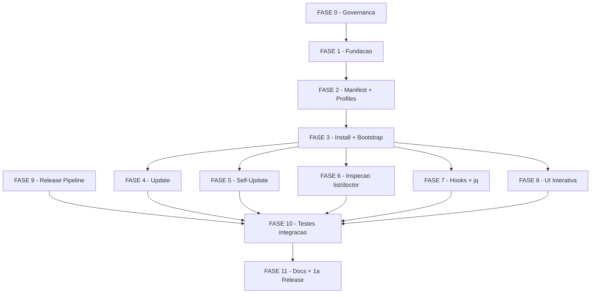

# Tarefas cstk-cli - CLI Claude Specs Toolkit

Escopo: implementacao da CLI `cstk` para instalar, atualizar e auditar skills
do toolkit em escopo global e de projeto, com self-update do proprio binario.
Deriva de `spec.md`, `plan.md`, `research.md`, `data-model.md`,
`contracts/cli-commands.md` e `quickstart.md` neste diretorio.

**Legenda de status:**
- `[ ]` Pendente
- `[~]` Em andamento
- `[x]` Concluido
- `[!]` Bloqueado

**Legenda de criticidade:**
- `[C]` Critico - Impacto em seguranca, integridade ou atomicidade
- `[A]` Alto - Funcionalidade essencial
- `[M]` Medio - Necessario mas sem urgencia imediata

---

## FASE 0 - Governanca e Exception Tracking

### 0.1 Registrar formalmente a excecao do `jq` `[A]`

Ref: `plan.md` §Complexity Tracking, `docs/constitution.md` §Principio II

> **Nota de execucao (2026-04-24)**: esta fase foi escrita antes da amendment
> 1.1.0. Durante o `/analyze` inicial, o finding D1 ("jq exception") foi
> classificado como CRITICAL por conflito com constitution §Decision Framework
> item 4 — excecao a MUST exige amendment, nao apenas documentacao em plan.md.
> A resolucao tomou caminho diferente do previsto nesta fase: criou-se a feature
> `constitution-amend-optional-deps` que emendou Principio II formalmente
> (1.0.0 → 1.1.0) com subsecao "Optional dependencies with graceful fallback".
> Em consequencia, todas as subtarefas abaixo foram resolvidas por outros
> artefatos.

- [x] 0.1.1 Revisar Principio II da constitution e confirmar que excecao fica em `plan.md` da feature (nao em emenda de constitution)
  → **Invertido**. Decisao final foi fazer amendment formal (`docs/specs/constitution-amend-optional-deps/`). Princípio II agora tem subsecao de carve-out; o caso `jq` e registrado em plan.md como demonstracao de conformidade, nao como excecao.
- [x] 0.1.2 Expandir secao "Constitution Exception" em `plan.md` com criterios de sunset explicitos (quando reavaliar)
  → **Satisfeita por reescrita**. Secao renomeada para "Optional-dep registry" na FASE 2 da amendment feature (commit 8b2ce2a). Em vez de "sunset" (amendment e permanente), o plan agora tem bloco "Limites deste registry — nao sao sunset — sao fronteiras" enumerando escopo e condicoes de revisao.
- [x] 0.1.3 Adicionar linha em `CHANGELOG.md` (UNRELEASED) sinalizando "dep opcional `jq` introduzida para merge de settings.json em hooks"
  → **Ja feito** via amendment feature FASE 3: entrada sob `[Unreleased] > Governance` em CHANGELOG.md documenta bump 1.0.0 → 1.1.0 e cita o `jq` em `cli/lib/hooks.sh` como primeiro caso concreto do carve-out.
- [x] 0.1.4 Confirmar que `cli/lib/hooks.sh` sera o UNICO arquivo com referencia a `jq`; documentar essa restricao em comentario no topo do arquivo quando for criado
  → **Formalizada estruturalmente**. Condicao (b) do carve-out 1.1.0 ("confinamento em um unico arquivo") e demonstracao em `plan.md` §Optional-dep registry. Comentario no topo do `cli/lib/hooks.sh` sera adicionado na subtarefa 7.1.1 quando o arquivo for criado (ja anotado la como "definir `detect_jq()` apenas nesse arquivo").

---

## FASE 1 - Fundacao (scaffold cli/ + libs utilitarias)

### 1.1 Scaffold do diretorio `cli/` `[A]`

Ref: `plan.md` §Project Structure, `research.md` Decision 1

- [x] 1.1.1 Criar estrutura `cli/cstk` (executavel principal) + `cli/lib/` + `cli/README.md` (dev-facing)
- [x] 1.1.2 Adicionar shebang `#!/bin/sh` + `set -eu` + constantes de exit codes (0..5) em `cstk`
- [x] 1.1.3 Implementar dispatch de subcommand (`install`, `update`, `self-update`, `list`, `doctor`, `help`, `--version`)
- [x] 1.1.4 Implementar `cstk --version` (le `~/.local/share/cstk/VERSION` ou `$CSTK_LIB/../VERSION`)
- [x] 1.1.5 Implementar `cstk --help` + `cstk help <command>` com texto curto apontando para docs completos
- [x] 1.1.6 Escrever `tests/cstk/test_cstk-main.sh` cobrindo dispatch, help, version, exit codes invalidos

### 1.2 Biblioteca utilitaria transversal `[A]`

Ref: `plan.md` §Project Structure, `research.md` Decisions 3, 7, 10

- [x] 1.2.1 `cli/lib/common.sh`: funcoes `log_info`/`log_warn`/`log_error` (stderr), detect TTY/color, sentinelas de exit code
- [x] 1.2.2 `cli/lib/compat.sh`: detecta `sha256sum` vs `shasum -a 256`; wrap `date -u +%Y-%m-%dT%H:%M:%SZ` portable
- [x] 1.2.3 `cli/lib/http.sh`: wrappers `curl` (-fsSL) com mapping de erros (timeout, offline, 404, 5xx)
- [x] 1.2.4 `cli/lib/lock.sh`: `mkdir` lock + `trap '... EXIT INT TERM'` cleanup + mensagem instrutiva para stale lock
- [x] 1.2.5 `cli/lib/tarball.sh`: download + extract em tempdir; integra `http.sh` + `sha256sum` via `compat.sh`
- [x] 1.2.6 `cli/lib/hash.sh`: `hash_dir()` via manifest canonico ordenado (research Decision 3 atualizada — `tar --sort` descartado por incompat. com BSD tar do macOS; manifest canonico e portavel)
- [x] 1.2.7 Escrever `tests/cstk/test_common.sh`, `test_compat.sh`, `test_http.sh`, `test_lock.sh`, `test_tarball.sh`, `test_hash.sh` (um por lib)

---

## FASE 2 - Catalogo, Manifest e Profiles

### 2.1 Camada de manifest `[A]`

Ref: `data-model.md` §Manifest, `spec.md` §FR-004

- [x] 2.1.1 `cli/lib/manifest.sh`: definir formato TSV v1 + constantes de paths (`~/.claude/skills/.cstk-manifest`, `./.claude/skills/.cstk-manifest`)
- [x] 2.1.2 Implementar `read_manifest` (awk -F'\t', skip header comment, yield skill\tversion\tsha\tinstalled_at)
- [x] 2.1.3 Implementar `write_manifest` com atomic replace (`mktemp` + `mv`)
- [x] 2.1.4 Implementar `upsert_entry <skill> <version> <sha> <iso-ts>` (idempotente)
- [x] 2.1.5 Implementar `remove_entry <skill>` (para --prune e doctor --fix)
- [x] 2.1.6 Implementar `detect_schema_version` — abortar com mensagem clara se header != v1 (preparacao para evolucao futura)
- [x] 2.1.7 Escrever `tests/cstk/test_manifest.sh`: fixtures para novo, upsert, remove, manifest corrompido, schema desconhecido
  → Adicional: implementadas tambem `manifest_default_path <scope>` (centraliza paths global/project) e `lookup_entry <path> <skill>` (essencial para update.sh em F4). 19 cenarios de teste no total.

### 2.2 Resolvedor de profiles `[A]`

Ref: `data-model.md` §Profile, `spec.md` §FR-009/009a/009b

- [x] 2.2.1 `cli/lib/profiles.sh`: parser de `catalog/profiles.txt` (linhas `profile:member`)
- [x] 2.2.2 Implementar `resolve_profile <name>` com expansao recursiva (profile pode referenciar outro profile)
- [x] 2.2.3 Deteccao de ciclo na expansao; abortar com exit 1 se tarball publicar catalog com ciclo
- [x] 2.2.4 Implementar `list_profiles` para uso no `--help` e modo interativo
- [x] 2.2.5 Escrever `tests/cstk/test_profiles.sh`: default `sdd`, cherry-pick union com profile, `all`, ciclo (fixture maliciosa)
  → DFS de cycle detection implementada em awk (3-coloring) ja que recursao em POSIX sh puro vaza variaveis entre frames. Cobertura: 13 cenarios (parse, list_profiles, resolve sdd/all, union cherry-pick, ciclos direto/indireto, diamante sem ciclo, profile/arquivo inexistentes, args invalidos).

---

## FASE 3 - Install + Bootstrap

### 3.1 Comando `cstk install` `[A]`

Ref: `contracts/cli-commands.md` §install, `spec.md` §FR-001/002/007/009, `quickstart.md` Scenario 1

- [x] 3.1.1 `cli/lib/install.sh`: parse argv (SKILL..., `--profile`, `--interactive`, `--scope`, `--dry-run`, `--yes`, `--from`)
- [x] 3.1.2 Resolver scope path (`~/.claude/skills/` vs `./.claude/skills/`); criar dir se nao existir (com confirmacao em project scope quando CWD parece nao ser projeto)
- [x] 3.1.3 Adquirir lock do escopo; exit 3 com mensagem instrutiva se falhar
- [x] 3.1.4 Resolver selecao final: union de SKILL explicito + `resolve_profile`
- [x] 3.1.5 Download do tarball da release alvo + verificacao SHA-256 (FR-010a) + extract em tempdir
- [x] 3.1.6 Para cada skill alvo: detectar estado (nao-existe / existe-nao-manifestado / existe-manifestado) e aplicar acao correspondente
- [x] 3.1.7 Preservar skills terceiras (existem em disco, ausentes do manifest e do catalog): log warn + skip (FR-007)
- [x] 3.1.8 Copiar skill alvo para destino; calcular source_sha256; upsert manifest
- [x] 3.1.9 Emitir summary em stderr com contagens (installed, updated, preserved, skipped, scope, toolkit_version) — FR-011
- [x] 3.1.10 Implementar modo dry-run: imprime plano com acoes por skill; zero writes no destino; retorna exit 0 (FR-012, SC-006)
- [x] 3.1.11 Escrever `tests/cstk/test_install.sh` cobrindo Scenario 1, preservacao third-party, dry-run vs real (SC-006)
  → Decisoes diferidas por dependencia de fase: (a) `--interactive` aceita flag mas retorna exit 2 com mensagem apontando FASE 8.1.5; (b) hooks de `language-*` em scope=project (FR-009b/c/d) ficam para FASE 7.2; (c) resolver "ultima release" via API GitHub fica para FASE 3.2 — install hoje exige `--from URL` (http/https/file) ou `$CSTK_RELEASE_URL`. (d) Re-install em skill ja manifestada vira "updated" sem deteccao de edit local — politica `--force`/`--keep` e exit 4 vivem em `update.sh` (FASE 4.1). 15 cenarios de teste (incluindo lock conflict exit 3 e checksum mismatch zero-writes).

### 3.2 Script de bootstrap `install.sh` `[A]`

Ref: `spec.md` §FR-005a, `quickstart.md` Scenario 1 (parte inicial)

- [x] 3.2.1 Criar `cli/install.sh` standalone (POSIX sh, `set -eu`); descobre ultima release via `curl` na API do GitHub
- [x] 3.2.2 Download do tarball + `.sha256`; validar checksum (FR-010a); abort sem escrita em mismatch
- [x] 3.2.3 Criar `~/.local/bin/` e `~/.local/share/cstk/` se nao existirem; copiar `cstk` e `cli/lib/*`
- [x] 3.2.4 Escrever `~/.local/share/cstk/VERSION` com a tag baixada
- [x] 3.2.5 Detectar se `~/.local/bin/` esta no PATH; se nao, imprimir instrucao de como adicionar (sem modificar shell rc automaticamente)
- [x] 3.2.6 Escrever `tests/cstk/test_bootstrap.sh` com fixture de release mock (offline, via `CSTK_RELEASE_URL`)
  → API GitHub (`releases/latest`) parseada com `grep` + `sed` (sem `jq`, mantendo o carve-out 1.1.0 confinado a `cli/lib/hooks.sh`). `CSTK_REPO`, `INSTALL_BIN`, `INSTALL_LIB` honrados como overrides para forks/testes. Tag inferida do filename quando `CSTK_RELEASE_URL` setado (skipa API). 8 cenarios de teste (incluindo PATH on/off, mismatch zero-writes, re-run upgrade, tarball sem cli/).

---

## FASE 4 - Update com politica de conflito

### 4.1 Comando `cstk update` `[A]`

Ref: `contracts/cli-commands.md` §update, `spec.md` §FR-003/008, `quickstart.md` Scenarios 2, 3

- [ ] 4.1.1 `cli/lib/update.sh`: parse argv (SKILL..., `--force`, `--keep`, `--prune`, `--from`, `--dry-run`, `--yes`)
- [ ] 4.1.2 Adquirir lock; reutilizar helper de `install.sh`
- [ ] 4.1.3 Download tarball + checksum da release alvo
- [ ] 4.1.4 Para cada skill do manifest (ou subset args): calcular hash atual via `hash_dir`
- [ ] 4.1.5 Comparar com `source_sha256` armazenado: iguais = clean; diferentes = edicao local
- [ ] 4.1.6 Politica em edicao local: sem flag = skip + collect para summary; `--force` = sobrescrever + upsert; `--keep` = skip silent
- [ ] 4.1.7 Para skills clean: se versao ou conteudo da release difere, atualizar; se nao, zero writes (SC-002)
- [ ] 4.1.8 Implementar `--prune`: detectar skills no manifest ausentes do catalog da release; listar + pedir confirmacao (a menos de `--yes`); remover dir + entry
- [ ] 4.1.9 Emitir summary com contagens + `next:` apontando `--force` se houver skip por edit
- [ ] 4.1.10 Exit 4 quando houver skip por edit local sem `--force`/`--keep` (sinal pra CI)
- [ ] 4.1.11 Escrever `tests/cstk/test_update.sh` cobrindo Scenario 2 (idempotencia SC-002), Scenario 3 (--force), --prune, detecao de renomeada-no-fonte

---

## FASE 5 - Self-Update atomico

### 5.1 Comando `cstk self-update` `[C]`

Ref: `contracts/cli-commands.md` §self-update, `spec.md` §FR-005/005a/006/006a/010a, `research.md` Decision 4, `quickstart.md` Scenarios 6, 7

- [ ] 5.1.1 `cli/lib/self-update.sh`: parse argv (`--check`, `--dry-run`, `--yes`); explicitamente NAO aceita `--scope`
- [ ] 5.1.2 Implementar `--check`: consulta latest release API, imprime `latest:<tag> current:<tag>` em stdout, exit 0 se iguais, exit 10 se update disponivel, exit 1 erro de rede
- [ ] 5.1.3 Detectar paths de instalacao: `$CSTK_BIN` ou `~/.local/bin/cstk`; `$CSTK_LIB` ou `~/.local/share/cstk/lib/`; validar que existem (senao mensagem clara apontando bootstrap — FR-005a)
- [ ] 5.1.4 Adquirir lock exclusivo de self-update em `<$CSTK_LIB>/../.self-update.lock` via `mkdir` (FR-006, previne dois self-updates concorrentes); exit 3 com mensagem clara se ja detido
- [ ] 5.1.5 Download tarball + `.sha256`; validar SHA-256 (FR-010a); abort sem escrita em mismatch
- [ ] 5.1.6 Stage novos arquivos em `$CSTK_LIB.new/` e `$CSTK_BIN.new` (dirs irmaos, mesmo filesystem) — sem tocar nos destinos ainda
- [ ] 5.1.6a Executar sequencia stage-and-rename coordenada (research Decision 4): (a) mover `$CSTK_LIB` → `$CSTK_LIB.old`; (b) mover `$CSTK_LIB.new` → `$CSTK_LIB`; (c) **commit point**: `mv -f $CSTK_BIN.new $CSTK_BIN`; (d) `rm -rf $CSTK_LIB.old`. Passos (a)-(c) sao renames atomicos POSIX.
- [ ] 5.1.6b Implementar rollback explicito: se (b) falha apos (a), restaurar `$CSTK_LIB.old` → `$CSTK_LIB`; se (c) falha apos (b), mover lib nova para lado + restaurar lib antiga para `$CSTK_LIB`. Abortar com mensagem que nenhum estado observavel mudou.
- [ ] 5.1.6c Implementar check bin-lib-match no boot de `cstk`: comparar VERSION embutido no script com `$CSTK_LIB/../VERSION`; se divergem, abortar com mensagem "self-update em progresso, tente novamente" (blinda a janela curta entre rename de lib e rename de bin — FR-006)
- [ ] 5.1.7 Atualizar `$CSTK_LIB/../VERSION` com a nova tag (escrita feita dentro do `$CSTK_LIB.new` antes do stage, para que surja atomicamente junto)
- [ ] 5.1.8 Garantir por design que self-update NUNCA le nem escreve manifests de skills (FR-006a); nao montar nenhum path para manifest neste codigo
- [ ] 5.1.9 Tratamento de erro: qualquer falha antes do passo (c) = zero impacto observavel na CLI instalada (FR-006, SC-004); liberar lock em todos os caminhos via `trap`
- [ ] 5.1.10 Emitir summary `from: X → Y ... next: cstk update`
- [ ] 5.1.11 Escrever `tests/cstk/test_self-update.sh` cobrindo Scenario 6 (happy), Scenario 7 (network drop mid-download), e cenario novo 7b (kill entre renames — ver quickstart)
- [ ] 5.1.12 Escrever teste dedicado de invariante: `stat` mtime do manifest antes e depois do self-update deve ser identico (FR-006a)
- [ ] 5.1.13 Escrever teste de invariante FR-006 (atomicidade par bin+lib): simular kill em cada um dos 4 pontos criticos (pos-download, pos-stage, entre rename lib e rename bin, pos-rename-bin); verificar que `cstk --version` retorna consistentemente ou versao antiga ou nova em cada caso, nunca output inconsistente

---

## FASE 6 - Comandos de inspecao

### 6.1 Comando `cstk list` `[M]`

Ref: `contracts/cli-commands.md` §list

- [ ] 6.1.1 `cli/lib/list.sh`: parse argv (`--scope`, `--format tsv|pretty`, `--available`)
- [ ] 6.1.2 Detectar TTY para default format (pretty em TTY, tsv em pipe)
- [ ] 6.1.3 Implementar listagem local: le manifest + calcula status por skill (clean/edited/missing-from-catalog)
- [ ] 6.1.4 Implementar `--available`: baixa catalog da ultima release (sem lock, sem escrita) e lista skills disponiveis
- [ ] 6.1.5 Formatador pretty (colunas alinhadas) e tsv (tab-separated)
- [ ] 6.1.6 Escrever `tests/cstk/test_list.sh`: TTY vs pipe, --available, --scope, output format

### 6.2 Comando `cstk doctor` `[M]`

Ref: `contracts/cli-commands.md` §doctor, `spec.md` §SC-007, `quickstart.md` Scenario 10

- [ ] 6.2.1 `cli/lib/doctor.sh`: parse argv (`--scope`, `--fix`)
- [ ] 6.2.2 Walk: para cada entry do manifest, verificar dir existe + hash; para cada dir em disco, verificar entry
- [ ] 6.2.3 Classificar: `OK`, `EDITED`, `MISSING` (entry sem dir), `ORPHAN` (dir sem entry)
- [ ] 6.2.4 Exit 1 em qualquer drift sem `--fix`; exit 0 se todo OK
- [ ] 6.2.5 Modo `--fix`: remover entries MISSING; recalcular source_sha256 de clean; NAO modificar conteudo de skills
- [ ] 6.2.6 Escrever `tests/cstk/test_doctor.sh` cobrindo Scenario 10 (os 4 tipos simultaneos de drift — SC-007)

---

## FASE 7 - Hooks e merge de settings.json

### 7.1 Deteccao de jq + fallback `[A]`

Ref: `spec.md` §FR-009d, `plan.md` §Constitution Exception, `quickstart.md` Scenarios 4, 5

- [ ] 7.1.1 `cli/lib/hooks.sh`: implementar `detect_jq()` via `command -v jq`
- [ ] 7.1.2 Com `jq`: implementar `merge_settings <target-json> <source-json>` preservando chaves pre-existentes nao-conflitantes (jq recursivo)
- [ ] 7.1.3 Sem `jq`: imprimir em stderr bloco formatado `# Hooks to merge manually into <path>:` + conteudo JSON + instrucao operacional
- [ ] 7.1.4 Contrato defensivo: `merge_settings` NUNCA executa sem `jq`; NUNCA sobrescreve arquivo existente com `>` simples — guardas com `test -f`
- [ ] 7.1.5 Escrever `tests/cstk/test_hooks.sh` cobrindo Scenarios 4 (jq presente) e 5 (jq ausente, settings.json pre-existente intocado)

### 7.2 Integracao hooks com install `[A]`

Ref: `spec.md` §FR-009b/009c/009d, `contracts/cli-commands.md` §install passo 6

- [ ] 7.2.1 Em `install.sh`, detectar quando perfil resolvido inclui `language-*` E `--scope=project`: invocar fluxo de hooks
- [ ] 7.2.2 Quando `--scope=global` com perfil `language-*`: skip hooks + reportar "omitted (global scope)" no summary (FR-009c)
- [ ] 7.2.3 Copiar apenas `hooks/` de language-related — `settings.json` da linguagem e passado a `merge_settings`, nao copiado cru
- [ ] 7.2.4 Summary reflete estado dos hooks: `merged` (jq), `paste-instructed` (sem jq), `omitted` (scope global)
- [ ] 7.2.5 Escrever `tests/cstk/test_hooks-integration.sh` cobrindo project vs global com perfil language-*

---

## FASE 8 - UI Interativa

### 8.1 Seletor numerado em TTY `[M]`

Ref: `spec.md` §FR-009 (modo interativo), `research.md` Decision 8, `quickstart.md` Scenarios 11, 12

- [ ] 8.1.1 `cli/lib/ui.sh`: implementar `require_tty()`; abortar com exit 2 e mensagem clara se nao-TTY (Scenario 12)
- [ ] 8.1.2 Listar perfis numerados + skills numeradas com offset; mostrar descricao curta de cada
- [ ] 8.1.3 Parser de input: numeros separados por espaco; re-digitar numero = toggle (remove do set)
- [ ] 8.1.4 Tela de confirmacao exibindo set final resolvido + `[y/N]`; qualquer entrada != `y`/`Y` aborta
- [ ] 8.1.5 Integrar com `install` (flag `--interactive`/`-i`) e `update` (mesma flag, lista somente itens do manifest)
- [ ] 8.1.6 Escrever `tests/cstk/test_ui.sh` cobrindo Scenario 11 (TTY + toggles) e Scenario 12 (pipe aborta)

---

## FASE 9 - Release Pipeline

### 9.1 Build deterministico do tarball `[A]`

Ref: `research.md` Decisions 5, 6, 10

- [ ] 9.1.1 Criar `scripts/build-release.sh` (POSIX sh) na raiz do repo; aceita `<version>` como arg
- [ ] 9.1.2 Montar diretorio `cstk-<version>/` em tempdir com layout `cli/` + `catalog/` + `CHANGELOG.md` conforme `research.md` Decision 6
- [ ] 9.1.3 Gerar `catalog/skills/` (espelho de `global/skills/`) e `catalog/language/{go,dotnet}/`; gerar `catalog/VERSION` e `catalog/profiles.txt` a partir de convencao de pastas
- [ ] 9.1.4 Empacotar com `tar --sort=name --owner=0 --group=0 --numeric-owner --mtime=@0 -czf cstk-<version>.tar.gz`
- [ ] 9.1.5 Gerar `cstk-<version>.tar.gz.sha256` com `sha256sum`
- [ ] 9.1.6 Escrever `tests/cstk/test_build-release.sh`: rodar o script duas vezes em sequencia; hashes dos tarballs devem ser identicos (determinismo verificavel)

### 9.2 Workflow GitHub Actions para release `[A]`

Ref: FR-010

- [ ] 9.2.1 Criar `.github/workflows/release.yml` triggered em `push tags 'v*'`
- [ ] 9.2.2 Job roda `./tests/run.sh` (toda a suite) como pre-requisito
- [ ] 9.2.3 Job roda `./scripts/build-release.sh <tag>` para gerar artefatos
- [ ] 9.2.4 Criar release GitHub via `gh release create` com upload de `cstk-<version>.tar.gz`, `.sha256` e `cli/install.sh` (como asset standalone para one-liner)
- [ ] 9.2.5 Documentar processo de release (tag → workflow → artefatos publicados) em `cli/README.md`

### 9.3 Cobertura de `cli/lib/*.sh` na suite existente `[M]`

Ref: CLAUDE.md §Como testar scripts shell

- [ ] 9.3.1 Ajustar `tests/run.sh --check-coverage` para incluir `cli/lib/**/*.sh` no sweep (adicional a `global/skills/**/scripts/*.sh`)
- [ ] 9.3.2 Atualizar CLAUDE.md documentando que a regra "um `.sh` = um `test_<nome>.sh`" agora cobre `cli/lib/` tambem
- [ ] 9.3.3 Rodar `tests/run.sh --check-coverage` localmente; corrigir orfaos se aparecerem

---

## FASE 10 - Testes de integracao (quickstart end-to-end)

### 10.1 Fixtures de release mock `[A]`

Ref: `plan.md` §Testabilidade de self-update em CI, `quickstart.md` Scenarios 6, 7

- [ ] 10.1.1 Criar diretorio `tests/cstk/fixtures/releases/` com 2 releases mock versionadas (ex: `v0.1.0/`, `v0.2.0/`) contendo tarball, `.sha256` e `install.sh`
- [ ] 10.1.2 Implementar override `CSTK_RELEASE_URL=file://...` para apontar CLI para fixture local em testes
- [ ] 10.1.3 Documentar format das fixtures em `tests/cstk/fixtures/README.md` para reprodutibilidade
- [ ] 10.1.4 Script helper `tests/cstk/fixtures/regen.sh` que reconstroi fixtures a partir de `catalog/` atual

### 10.2 Scenarios end-to-end do quickstart `[A]`

Ref: `quickstart.md` Scenarios 1-12, `spec.md` §SC-001..007

- [ ] 10.2.1 Scenario 1 (fresh global install — P1 baseline; SC-001 pode ser medido aqui)
- [ ] 10.2.2 Scenario 2 (idempotent update — zero writes; SC-002)
- [ ] 10.2.3 Scenario 3 (update com edit local — FR-008)
- [ ] 10.2.4 Scenario 4 (install project com jq)
- [ ] 10.2.5 Scenario 5 (install project sem jq — fallback)
- [ ] 10.2.6 Scenario 6 (self-update happy path; SC-004 baseline)
- [ ] 10.2.7 Scenario 7 (self-update com queda de rede; SC-004 deve passar)
- [ ] 10.2.7a Scenario 7b (kill em 4 pontos criticos; FR-006 atomicidade estrita)
- [ ] 10.2.8 Scenario 8 (lock concorrente)
- [ ] 10.2.9 Scenario 9 (dry-run fiel a execucao real — SC-006)
- [ ] 10.2.10 Scenario 10 (doctor detecta 4 tipos de drift — SC-007)
- [ ] 10.2.11 Scenario 11 (modo interativo com TTY)
- [ ] 10.2.12 Scenario 12 (interativo sem TTY — exit 2)
- [ ] 10.2.13 Verificacao byte-a-byte SC-003: apos `install` e apos `update` bem-sucedidos, rodar `diff -r <catalog-staged>/<skill> <installed>/<skill>` para cada skill com status clean (hash igual a source_sha256); falhar se qualquer diff for nao-vazio. Teste cobre arquivos texto; para binarios, usar `cmp`.

---

## FASE 11 - Documentacao + Primeira Release

### 11.1 Documentacao user-facing `[A]`

Ref: `spec.md` §SC-005 (novo usuario em 5min)

- [ ] 11.1.1 Adicionar secao "Instalacao via cstk" no `README.md` com one-liner de bootstrap e exemplos de `install`/`update`/`self-update`
- [ ] 11.1.2 Documentar perfis disponiveis e exemplos de `--scope project` no README
- [ ] 11.1.3 Adicionar entrada no `CHANGELOG.md` para a versao inicial do cstk (MINOR bump se alinhado com versao atual do toolkit; sincronizar com FASE 9 antes de gerar tag)
- [ ] 11.1.4 Atualizar `CLAUDE.md` §"Installed vs Source Drift": substituir guidance de `cp -r global/skills/ ~/.claude/skills/` por `cstk install` + `cstk update`; marcar o `cp -r` manual como deprecated
- [ ] 11.1.5 Atualizar `CLAUDE.md` §"Como testar scripts shell" apontando tambem para `tests/cstk/`

### 11.2 Primeira release publica `[A]`

Ref: `spec.md` §FR-005a, `quickstart.md` Scenario 1

- [ ] 11.2.1 Rodar `/analyze` para validar consistencia spec ↔ plan ↔ tasks (pre-release gate)
- [ ] 11.2.2 Verificar que toda subtarefa de tests/ passa em `tests/run.sh` local
- [ ] 11.2.3 Criar e pushar tag SemVer (ex: `v3.2.0`) disparando workflow da FASE 9
- [ ] 11.2.4 Validar artefatos publicados: tarball + `.sha256` + `install.sh` acessiveis via URL da release
- [ ] 11.2.5 Em maquina limpa (ou VM/container), executar one-liner de bootstrap; validar SC-005 (< 5min ate ter skill instalada)
- [ ] 11.2.6 Adicionar link para "latest release" no README; atualizar README com nota de versao

---

## Matriz de Dependencias

Observacoes:
- F0 e curta (governanca); pode rodar em paralelo com inicio de F1
- F9 (release pipeline) pode comecar em paralelo apos F3 ser funcional; so bloqueia F10 (testes precisam das fixtures)
- F4, F5, F6, F7, F8 sao paralelizaveis entre si apos F3

## Resumo Quantitativo

| Fase | Tarefas | Subtarefas | Criticidade |
|------|---------|------------|-------------|
| 0 - Governanca | 1 | 4 | A |
| 1 - Fundacao | 2 | 13 | A |
| 2 - Manifest + Profiles | 2 | 12 | A |
| 3 - Install + Bootstrap | 2 | 17 | A |
| 4 - Update | 1 | 11 | A |
| 5 - Self-Update | 1 | 16 | C |
| 6 - Inspecao | 2 | 12 | M |
| 7 - Hooks + jq | 2 | 10 | A |
| 8 - UI Interativa | 1 | 6 | M |
| 9 - Release Pipeline | 3 | 14 | A/M |
| 10 - Testes integracao | 2 | 18 | A |
| 11 - Docs + 1a Release | 2 | 11 | A |
| **Total** | **21** | **144** | - |

## Escopo Coberto

| Item | Descricao | Fase |
|------|-----------|------|
| US-1 | Instalacao inicial em escopo global (P1) | 3 |
| US-2 | Atualizacao de skills ja instaladas (P2) | 4 |
| US-3 | Instalacao em escopo de projeto (P3) | 3, 7 |
| US-4 | Self-update do proprio CLI (P4) | 5 |
| FR-001..015 | Todos os requisitos funcionais da spec | 1-8 |
| FR-005a | Bootstrap via one-liner | 3.2 |
| FR-006a | Self-update nao toca manifest | 5.1.8, 5.1.12 |
| FR-010a | SHA-256 obrigatorio em todo download | 3.1.5, 3.2.2, 4.1.3, 5.1.4 |
| SC-001..007 | Success criteria validados em testes integrados | 10 |
| Governance | Constitution Exception formalizada | 0 |
| Release pipeline | CI/CD para publicacao automatizada | 9 |
| Documentacao | README + CLAUDE.md + CHANGELOG atualizados | 11 |

## Escopo Excluido

| Item | Descricao | Motivo |
|------|-----------|--------|
| GPG signing | Assinatura GPG dos tarballs alem de SHA-256 | Decisao 10 do research: nao justificado para threat model atual; adicionavel depois sem breaking |
| Pin/downgrade de versao | Comando para fixar skills numa versao e prevenir auto-update | CHK036 marcado como Outstanding no checklist; pode virar feature futura |
| Homebrew tap | Instalacao via `brew install cstk` | Plan Decision 9: one-liner cobre mac+linux; tap opcional pode ser adicionado |
| Telemetria/analytics | Qualquer coleta de dados de uso | Constitution Principio IV (Zero coleta remota) — NON-NEGOTIABLE |
| Auto-check passivo | CLI verifica novas versoes em background | Clarificado como explicit-only (FR-005); alinhado com Principio IV |
| Merge JSON sem jq | Tentar mesclar settings.json em POSIX puro | Research Decision: rejeitado por risco de corrupcao; fallback e imprimir para paste manual |
| Uninstall | Comando `cstk uninstall <skill>` | Nao-essencial para MVP; pode ser adicionado apos 1a release |
| Multi-source | Suporte a fontes alternativas alem de GitHub Releases | FR-010 fixa GitHub Releases; extender depois via flag `--source` se demanda aparecer |
