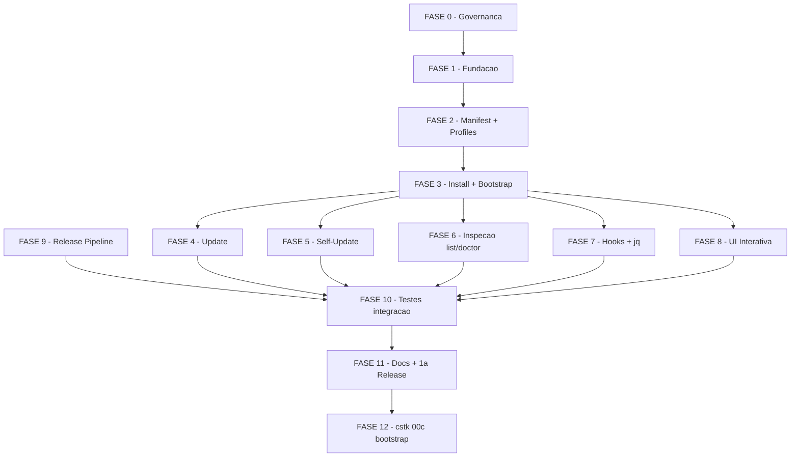

# Tarefas cstk-cli - CLI Claude Specs Toolkit

Escopo: implementacao da CLI `cstk` para instalar, atualizar e auditar skills
do toolkit em escopo global e de projeto, com self-update do proprio binario.
Deriva de `spec.md`, `plan.md`, `research.md`, `data-model.md`,
`contracts/cli-commands.md` e `quickstart.md` neste diretorio.

**Legenda de status:**
- `[ ]` Pendente
- `[~]` Em andamento
- `[x]` Concluido
- `[!]` Bloqueado

**Legenda de criticidade:**
- `[C]` Critico - Impacto em seguranca, integridade ou atomicidade
- `[A]` Alto - Funcionalidade essencial
- `[M]` Medio - Necessario mas sem urgencia imediata

---

## FASE 0 - Governanca e Exception Tracking

### 0.1 Registrar formalmente a excecao do `jq` `[A]`

Ref: `plan.md` §Complexity Tracking, `docs/constitution.md` §Principio II

> **Nota de execucao (2026-04-24)**: esta fase foi escrita antes da amendment
> 1.1.0. Durante o `/analyze` inicial, o finding D1 ("jq exception") foi
> classificado como CRITICAL por conflito com constitution §Decision Framework
> item 4 — excecao a MUST exige amendment, nao apenas documentacao em plan.md.
> A resolucao tomou caminho diferente do previsto nesta fase: criou-se a feature
> `constitution-amend-optional-deps` que emendou Principio II formalmente
> (1.0.0 → 1.1.0) com subsecao "Optional dependencies with graceful fallback".
> Em consequencia, todas as subtarefas abaixo foram resolvidas por outros
> artefatos.

- [x] 0.1.1 Revisar Principio II da constitution e confirmar que excecao fica em `plan.md` da feature (nao em emenda de constitution)
  → **Invertido**. Decisao final foi fazer amendment formal (`docs/specs/constitution-amend-optional-deps/`). Princípio II agora tem subsecao de carve-out; o caso `jq` e registrado em plan.md como demonstracao de conformidade, nao como excecao.
- [x] 0.1.2 Expandir secao "Constitution Exception" em `plan.md` com criterios de sunset explicitos (quando reavaliar)
  → **Satisfeita por reescrita**. Secao renomeada para "Optional-dep registry" na FASE 2 da amendment feature (commit 8b2ce2a). Em vez de "sunset" (amendment e permanente), o plan agora tem bloco "Limites deste registry — nao sao sunset — sao fronteiras" enumerando escopo e condicoes de revisao.
- [x] 0.1.3 Adicionar linha em `CHANGELOG.md` (UNRELEASED) sinalizando "dep opcional `jq` introduzida para merge de settings.json em hooks"
  → **Ja feito** via amendment feature FASE 3: entrada sob `[Unreleased] > Governance` em CHANGELOG.md documenta bump 1.0.0 → 1.1.0 e cita o `jq` em `cli/lib/hooks.sh` como primeiro caso concreto do carve-out.
- [x] 0.1.4 Confirmar que `cli/lib/hooks.sh` sera o UNICO arquivo com referencia a `jq`; documentar essa restricao em comentario no topo do arquivo quando for criado
  → **Formalizada estruturalmente**. Condicao (b) do carve-out 1.1.0 ("confinamento em um unico arquivo") e demonstracao em `plan.md` §Optional-dep registry. Comentario no topo do `cli/lib/hooks.sh` sera adicionado na subtarefa 7.1.1 quando o arquivo for criado (ja anotado la como "definir `detect_jq()` apenas nesse arquivo").

---

## FASE 1 - Fundacao (scaffold cli/ + libs utilitarias)

### 1.1 Scaffold do diretorio `cli/` `[A]`

Ref: `plan.md` §Project Structure, `research.md` Decision 1

- [x] 1.1.1 Criar estrutura `cli/cstk` (executavel principal) + `cli/lib/` + `cli/README.md` (dev-facing)
- [x] 1.1.2 Adicionar shebang `#!/bin/sh` + `set -eu` + constantes de exit codes (0..5) em `cstk`
- [x] 1.1.3 Implementar dispatch de subcommand (`install`, `update`, `self-update`, `list`, `doctor`, `help`, `--version`)
- [x] 1.1.4 Implementar `cstk --version` (le `~/.local/share/cstk/VERSION` ou `$CSTK_LIB/../VERSION`)
- [x] 1.1.5 Implementar `cstk --help` + `cstk help <command>` com texto curto apontando para docs completos
- [x] 1.1.6 Escrever `tests/cstk/test_cstk-main.sh` cobrindo dispatch, help, version, exit codes invalidos

### 1.2 Biblioteca utilitaria transversal `[A]`

Ref: `plan.md` §Project Structure, `research.md` Decisions 3, 7, 10

- [x] 1.2.1 `cli/lib/common.sh`: funcoes `log_info`/`log_warn`/`log_error` (stderr), detect TTY/color, sentinelas de exit code
- [x] 1.2.2 `cli/lib/compat.sh`: detecta `sha256sum` vs `shasum -a 256`; wrap `date -u +%Y-%m-%dT%H:%M:%SZ` portable
- [x] 1.2.3 `cli/lib/http.sh`: wrappers `curl` (-fsSL) com mapping de erros (timeout, offline, 404, 5xx)
- [x] 1.2.4 `cli/lib/lock.sh`: `mkdir` lock + `trap '... EXIT INT TERM'` cleanup + mensagem instrutiva para stale lock
- [x] 1.2.5 `cli/lib/tarball.sh`: download + extract em tempdir; integra `http.sh` + `sha256sum` via `compat.sh`
- [x] 1.2.6 `cli/lib/hash.sh`: `hash_dir()` via manifest canonico ordenado (research Decision 3 atualizada — `tar --sort` descartado por incompat. com BSD tar do macOS; manifest canonico e portavel)
- [x] 1.2.7 Escrever `tests/cstk/test_common.sh`, `test_compat.sh`, `test_http.sh`, `test_lock.sh`, `test_tarball.sh`, `test_hash.sh` (um por lib)

---

## FASE 2 - Catalogo, Manifest e Profiles

### 2.1 Camada de manifest `[A]`

Ref: `data-model.md` §Manifest, `spec.md` §FR-004

- [x] 2.1.1 `cli/lib/manifest.sh`: definir formato TSV v1 + constantes de paths (`~/.claude/skills/.cstk-manifest`, `./.claude/skills/.cstk-manifest`)
- [x] 2.1.2 Implementar `read_manifest` (awk -F'\t', skip header comment, yield skill\tversion\tsha\tinstalled_at)
- [x] 2.1.3 Implementar `write_manifest` com atomic replace (`mktemp` + `mv`)
- [x] 2.1.4 Implementar `upsert_entry <skill> <version> <sha> <iso-ts>` (idempotente)
- [x] 2.1.5 Implementar `remove_entry <skill>` (para --prune e doctor --fix)
- [x] 2.1.6 Implementar `detect_schema_version` — abortar com mensagem clara se header != v1 (preparacao para evolucao futura)
- [x] 2.1.7 Escrever `tests/cstk/test_manifest.sh`: fixtures para novo, upsert, remove, manifest corrompido, schema desconhecido
  → Adicional: implementadas tambem `manifest_default_path <scope>` (centraliza paths global/project) e `lookup_entry <path> <skill>` (essencial para update.sh em F4). 19 cenarios de teste no total.

### 2.2 Resolvedor de profiles `[A]`

Ref: `data-model.md` §Profile, `spec.md` §FR-009/009a/009b

- [x] 2.2.1 `cli/lib/profiles.sh`: parser de `catalog/profiles.txt` (linhas `profile:member`)
- [x] 2.2.2 Implementar `resolve_profile <name>` com expansao recursiva (profile pode referenciar outro profile)
- [x] 2.2.3 Deteccao de ciclo na expansao; abortar com exit 1 se tarball publicar catalog com ciclo
- [x] 2.2.4 Implementar `list_profiles` para uso no `--help` e modo interativo
- [x] 2.2.5 Escrever `tests/cstk/test_profiles.sh`: default `sdd`, cherry-pick union com profile, `all`, ciclo (fixture maliciosa)
  → DFS de cycle detection implementada em awk (3-coloring) ja que recursao em POSIX sh puro vaza variaveis entre frames. Cobertura: 13 cenarios (parse, list_profiles, resolve sdd/all, union cherry-pick, ciclos direto/indireto, diamante sem ciclo, profile/arquivo inexistentes, args invalidos).

---

## FASE 3 - Install + Bootstrap

### 3.1 Comando `cstk install` `[A]`

Ref: `contracts/cli-commands.md` §install, `spec.md` §FR-001/002/007/009, `quickstart.md` Scenario 1

- [x] 3.1.1 `cli/lib/install.sh`: parse argv (SKILL..., `--profile`, `--interactive`, `--scope`, `--dry-run`, `--yes`, `--from`)
- [x] 3.1.2 Resolver scope path (`~/.claude/skills/` vs `./.claude/skills/`); criar dir se nao existir (com confirmacao em project scope quando CWD parece nao ser projeto)
- [x] 3.1.3 Adquirir lock do escopo; exit 3 com mensagem instrutiva se falhar
- [x] 3.1.4 Resolver selecao final: union de SKILL explicito + `resolve_profile`
- [x] 3.1.5 Download do tarball da release alvo + verificacao SHA-256 (FR-010a) + extract em tempdir
- [x] 3.1.6 Para cada skill alvo: detectar estado (nao-existe / existe-nao-manifestado / existe-manifestado) e aplicar acao correspondente
- [x] 3.1.7 Preservar skills terceiras (existem em disco, ausentes do manifest e do catalog): log warn + skip (FR-007)
- [x] 3.1.8 Copiar skill alvo para destino; calcular source_sha256; upsert manifest
- [x] 3.1.9 Emitir summary em stderr com contagens (installed, updated, preserved, skipped, scope, toolkit_version) — FR-011
- [x] 3.1.10 Implementar modo dry-run: imprime plano com acoes por skill; zero writes no destino; retorna exit 0 (FR-012, SC-006)
- [x] 3.1.11 Escrever `tests/cstk/test_install.sh` cobrindo Scenario 1, preservacao third-party, dry-run vs real (SC-006)
  → Decisoes diferidas por dependencia de fase: (a) `--interactive` aceita flag mas retorna exit 2 com mensagem apontando FASE 8.1.5; (b) hooks de `language-*` em scope=project (FR-009b/c/d) ficam para FASE 7.2; (c) resolver "ultima release" via API GitHub fica para FASE 3.2 — install hoje exige `--from URL` (http/https/file) ou `$CSTK_RELEASE_URL`. (d) Re-install em skill ja manifestada vira "updated" sem deteccao de edit local — politica `--force`/`--keep` e exit 4 vivem em `update.sh` (FASE 4.1). 15 cenarios de teste (incluindo lock conflict exit 3 e checksum mismatch zero-writes).

### 3.2 Script de bootstrap `install.sh` `[A]`

Ref: `spec.md` §FR-005a, `quickstart.md` Scenario 1 (parte inicial)

- [x] 3.2.1 Criar `cli/install.sh` standalone (POSIX sh, `set -eu`); descobre ultima release via `curl` na API do GitHub
- [x] 3.2.2 Download do tarball + `.sha256`; validar checksum (FR-010a); abort sem escrita em mismatch
- [x] 3.2.3 Criar `~/.local/bin/` e `~/.local/share/cstk/` se nao existirem; copiar `cstk` e `cli/lib/*`
- [x] 3.2.4 Escrever `~/.local/share/cstk/VERSION` com a tag baixada
- [x] 3.2.5 Detectar se `~/.local/bin/` esta no PATH; se nao, imprimir instrucao de como adicionar (sem modificar shell rc automaticamente)
- [x] 3.2.6 Escrever `tests/cstk/test_bootstrap.sh` com fixture de release mock (offline, via `CSTK_RELEASE_URL`)
  → API GitHub (`releases/latest`) parseada com `grep` + `sed` (sem `jq`, mantendo o carve-out 1.1.0 confinado a `cli/lib/hooks.sh`). `CSTK_REPO`, `INSTALL_BIN`, `INSTALL_LIB` honrados como overrides para forks/testes. Tag inferida do filename quando `CSTK_RELEASE_URL` setado (skipa API). 8 cenarios de teste (incluindo PATH on/off, mismatch zero-writes, re-run upgrade, tarball sem cli/).

---

## FASE 4 - Update com politica de conflito

### 4.1 Comando `cstk update` `[A]`

Ref: `contracts/cli-commands.md` §update, `spec.md` §FR-003/008, `quickstart.md` Scenarios 2, 3

- [x] 4.1.1 `cli/lib/update.sh`: parse argv (SKILL..., `--force`, `--keep`, `--prune`, `--from`, `--dry-run`, `--yes`)
- [x] 4.1.2 Adquirir lock; reutilizar helper de `install.sh`
- [x] 4.1.3 Download tarball + checksum da release alvo
- [x] 4.1.4 Para cada skill do manifest (ou subset args): calcular hash atual via `hash_dir`
- [x] 4.1.5 Comparar com `source_sha256` armazenado: iguais = clean; diferentes = edicao local
- [x] 4.1.6 Politica em edicao local: sem flag = skip + collect para summary; `--force` = sobrescrever + upsert; `--keep` = skip silent
- [x] 4.1.7 Para skills clean: se versao ou conteudo da release difere, atualizar; se nao, zero writes (SC-002)
- [x] 4.1.8 Implementar `--prune`: detectar skills no manifest ausentes do catalog da release; listar + pedir confirmacao (a menos de `--yes`); remover dir + entry
- [x] 4.1.9 Emitir summary com contagens + `next:` apontando `--force` se houver skip por edit
- [x] 4.1.10 Exit 4 quando houver skip por edit local sem `--force`/`--keep` (sinal pra CI)
- [x] 4.1.11 Escrever `tests/cstk/test_update.sh` cobrindo Scenario 2 (idempotencia SC-002), Scenario 3 (--force), --prune, detecao de renomeada-no-fonte
  → Idempotencia (SC-002) verificada via `stat` mtime de manifest+skill: zero writes quando release_hash == stored_sha. `--force`+`--keep` mutuamente exclusivos (exit 2). Skill renomeada na release vira orfa no manifest (warn + sugere `--prune`). 12 cenarios. Reutilizacao de helpers feita por sourcing comum de `lock.sh`/`tarball.sh`/`hash.sh`/`manifest.sh` — install/update sao independentes mas usam mesma stack utilitaria. Bonus: corrigido `test_cstk-main.sh::scenario_lib_ausente_reporta_erro` que passou a falhar com a nova `update.sh` no disco — agora aponta para `self-update` (proximo no backlog FASE 5).

---

## FASE 5 - Self-Update atomico

### 5.1 Comando `cstk self-update` `[C]`

Ref: `contracts/cli-commands.md` §self-update, `spec.md` §FR-005/005a/006/006a/010a, `research.md` Decision 4, `quickstart.md` Scenarios 6, 7

- [x] 5.1.1 `cli/lib/self-update.sh`: parse argv (`--check`, `--dry-run`, `--yes`); explicitamente NAO aceita `--scope`
- [x] 5.1.2 Implementar `--check`: consulta latest release API, imprime `latest:<tag> current:<tag>` em stdout, exit 0 se iguais, exit 10 se update disponivel, exit 1 erro de rede
- [x] 5.1.3 Detectar paths de instalacao: `$CSTK_BIN` ou `~/.local/bin/cstk`; `$CSTK_LIB` ou `~/.local/share/cstk/lib/`; validar que existem (senao mensagem clara apontando bootstrap — FR-005a)
- [x] 5.1.4 Adquirir lock exclusivo de self-update em `<$CSTK_LIB>/../.self-update.lock` via `mkdir` (FR-006, previne dois self-updates concorrentes); exit 3 com mensagem clara se ja detido
- [x] 5.1.5 Download tarball + `.sha256`; validar SHA-256 (FR-010a); abort sem escrita em mismatch
- [x] 5.1.6 Stage novos arquivos em `$CSTK_LIB.new/` e `$CSTK_BIN.new` (dirs irmaos, mesmo filesystem) — sem tocar nos destinos ainda
- [x] 5.1.6a Executar sequencia stage-and-rename coordenada (research Decision 4): (a) mover `$CSTK_LIB` → `$CSTK_LIB.old`; (b) mover `$CSTK_LIB.new` → `$CSTK_LIB`; (c) **commit point**: `mv -f $CSTK_BIN.new $CSTK_BIN`; (d) `rm -rf $CSTK_LIB.old`. Passos (a)-(c) sao renames atomicos POSIX.
- [x] 5.1.6b Implementar rollback explicito: se (b) falha apos (a), restaurar `$CSTK_LIB.old` → `$CSTK_LIB`; se (c) falha apos (b), mover lib nova para lado + restaurar lib antiga para `$CSTK_LIB`. Abortar com mensagem que nenhum estado observavel mudou.
- [x] 5.1.6c Implementar check bin-lib-match no boot de `cstk`: comparar VERSION embutido no script com `$CSTK_LIB/../VERSION`; se divergem, abortar com mensagem "self-update em progresso, tente novamente" (blinda a janela curta entre rename de lib e rename de bin — FR-006)
- [x] 5.1.7 Atualizar `$CSTK_LIB/../VERSION` com a nova tag (escrita feita dentro do `$CSTK_LIB.new` antes do stage, para que surja atomicamente junto)
- [x] 5.1.8 Garantir por design que self-update NUNCA le nem escreve manifests de skills (FR-006a); nao montar nenhum path para manifest neste codigo
- [x] 5.1.9 Tratamento de erro: qualquer falha antes do passo (c) = zero impacto observavel na CLI instalada (FR-006, SC-004); liberar lock em todos os caminhos via `trap`
- [x] 5.1.10 Emitir summary `from: X → Y ... next: cstk update`
- [x] 5.1.11 Escrever `tests/cstk/test_self-update.sh` cobrindo Scenario 6 (happy), Scenario 7 (network drop mid-download), e cenario novo 7b (kill entre renames — ver quickstart)
- [x] 5.1.12 Escrever teste dedicado de invariante: `stat` mtime do manifest antes e depois do self-update deve ser identico (FR-006a)
- [x] 5.1.13 Escrever teste de invariante FR-006 (atomicidade par bin+lib): simular kill em cada um dos 4 pontos criticos (pos-download, pos-stage, entre rename lib e rename bin, pos-rename-bin); verificar que `cstk --version` retorna consistentemente ou versao antiga ou nova em cada caso, nunca output inconsistente
  → Decisao tecnica chave: VERSION agora vive em DUAS posicoes — `$CSTK_LIB/VERSION` (atomic-com-lib, usado pelo boot-check) e `$CSTK_LIB/../VERSION` (legado/display). Bootstrap escreve ambas; self-update mantem em sync. Boot-check em `cli/cstk` compara `CSTK_EMBEDDED_VERSION` (sed'd no bin pelo bootstrap+self-update) com `$CSTK_LIB/VERSION` — mismatch = exit 1 com mensagem "self-update em progresso, tente novamente". Bypass do boot-check para o proprio comando `self-update` permite recovery. Bypass tambem em builds dev (CSTK_EMBEDDED_VERSION termina em -dev). Recovery do estado transiente: self-update detecta `_su_current_bin != _su_current_lib` e completa o swap mesmo se lib ja for igual a latest. Test hooks `CSTK_TEST_SU_ABORT_AT={after-download,after-stage,between-lib-bin,after-bin}` validam invariantes em cada um dos 4 pontos criticos. 13 cenarios.

---

## FASE 6 - Comandos de inspecao

### 6.1 Comando `cstk list` `[M]`

Ref: `contracts/cli-commands.md` §list

- [x] 6.1.1 `cli/lib/list.sh`: parse argv (`--scope`, `--format tsv|pretty`, `--available`)
- [x] 6.1.2 Detectar TTY para default format (pretty em TTY, tsv em pipe)
- [x] 6.1.3 Implementar listagem local: le manifest + calcula status por skill (clean/edited/missing-from-catalog)
- [x] 6.1.4 Implementar `--available`: baixa catalog da ultima release (sem lock, sem escrita) e lista skills disponiveis
- [x] 6.1.5 Formatador pretty (colunas alinhadas) e tsv (tab-separated)
- [x] 6.1.6 Escrever `tests/cstk/test_list.sh`: TTY vs pipe, --available, --scope, output format
  → Status local = clean/edited/missing (manifest + disco). Status `missing-from-catalog` mencionado em 6.1.3 fica para `doctor` que tem semantica mais clara — `list` nao baixa catalog em modo default (rede so com `--available`). 10 cenarios.

### 6.2 Comando `cstk doctor` `[M]`

Ref: `contracts/cli-commands.md` §doctor, `spec.md` §SC-007, `quickstart.md` Scenario 10

- [x] 6.2.1 `cli/lib/doctor.sh`: parse argv (`--scope`, `--fix`)
- [x] 6.2.2 Walk: para cada entry do manifest, verificar dir existe + hash; para cada dir em disco, verificar entry
- [x] 6.2.3 Classificar: `OK`, `EDITED`, `MISSING` (entry sem dir), `ORPHAN` (dir sem entry)
- [x] 6.2.4 Exit 1 em qualquer drift sem `--fix`; exit 0 se todo OK
- [x] 6.2.5 Modo `--fix`: remover entries MISSING; recalcular source_sha256 de clean; NAO modificar conteudo de skills
- [x] 6.2.6 Escrever `tests/cstk/test_doctor.sh` cobrindo Scenario 10 (os 4 tipos simultaneos de drift — SC-007)
  → SC-007 validado: cenario `doctor_4_tipos_drift` cria os 4 estados simultaneos (foo EDITED, bar MISSING, baz OK, my-custom ORPHAN) e verifica classificacao + exit 1. `--fix` remove apenas MISSING e refresca hash de OK; preserva EDITED/ORPHAN (FR-007 third-party + trabalho do usuario). Exit 0 sempre apos `--fix` (best-effort reconciliation; itens nao-fixados ficam para o usuario via `cstk update --force` ou aceitar third-party). 8 cenarios.

Bonus: removido `scenario_lib_ausente_reporta_erro` de `test_cstk-main.sh` — apos FASE 6 todos os comandos roteados tem libs; o caminho "lib ausente" continua coberto por `scenario_cstk_lib_override` (override de CSTK_LIB para fakelib vazio).

---

## FASE 7 - Hooks e merge de settings.json

### 7.1 Deteccao de jq + fallback `[A]`

Ref: `spec.md` §FR-009d, `plan.md` §Constitution Exception, `quickstart.md` Scenarios 4, 5

- [x] 7.1.1 `cli/lib/hooks.sh`: implementar `detect_jq()` via `command -v jq`
- [x] 7.1.2 Com `jq`: implementar `merge_settings <target-json> <source-json>` preservando chaves pre-existentes nao-conflitantes (jq recursivo)
- [x] 7.1.3 Sem `jq`: imprimir em stderr bloco formatado `# Hooks to merge manually into <path>:` + conteudo JSON + instrucao operacional
- [x] 7.1.4 Contrato defensivo: `merge_settings` NUNCA executa sem `jq`; NUNCA sobrescreve arquivo existente com `>` simples — guardas com `test -f`
- [x] 7.1.5 Escrever `tests/cstk/test_hooks.sh` cobrindo Scenarios 4 (jq presente) e 5 (jq ausente, settings.json pre-existente intocado)
  → Confinamento jq formalizado em comentario no topo do arquivo (condicao b do carve-out 1.1.0). Merge via `jq -s '.[0] * .[1]' source target` — target vence em conflitos preservando customizacao do usuario. Backup `.bak` antes de qualquer mv. Atomic via mktemp+mv. Caso target ausente = cp simples (sem jq necessario para criar de zero, mas jq exigido para detect_jq retornar 0 antes mesmo de chegar aqui — funcao mantem assertiva). 10 cenarios, ambiente sem-jq simulado via shim PATH (filtra dirs com jq).

### 7.2 Integracao hooks com install `[A]`

Ref: `spec.md` §FR-009b/009c/009d, `contracts/cli-commands.md` §install passo 6

- [x] 7.2.1 Em `install.sh`, detectar quando perfil resolvido inclui `language-*` E `--scope=project`: invocar fluxo de hooks
- [x] 7.2.2 Quando `--scope=global` com perfil `language-*`: skip hooks + reportar "omitted (global scope)" no summary (FR-009c)
- [x] 7.2.3 Copiar apenas `hooks/` de language-related — `settings.json` da linguagem e passado a `merge_settings`, nao copiado cru
- [x] 7.2.4 Summary reflete estado dos hooks: `merged` (jq), `paste-instructed` (sem jq), `omitted` (scope global)
- [x] 7.2.5 Escrever `tests/cstk/test_hooks-integration.sh` cobrindo project vs global com perfil language-*
  → `_install_apply_hooks_if_needed` chamado apos o loop de skills. Detecta `_install_profile = language-*`; com scope=project copia `catalog/language/<lang>/hooks/` para `./.claude/hooks/` e mescla settings via `merge_settings` (jq) ou `print_paste_block` (sem jq). Estado em `_install_hook_state` (merged/paste-instructed/omitted/hooks-only/not-applicable/error) reportado no summary so quando profile e language-*. Ambiente sem-jq nos testes via shim PATH com symlinks para sh/mktemp/tar/etc. excluindo jq (necessario porque /usr/bin contem ambos no macOS). 6 cenarios incluindo dry-run zero-writes e profile sdd nao-language sem linha hooks no summary.

---

## FASE 8 - UI Interativa

### 8.1 Seletor numerado em TTY `[M]`

Ref: `spec.md` §FR-009 (modo interativo), `research.md` Decision 8, `quickstart.md` Scenarios 11, 12

- [x] 8.1.1 `cli/lib/ui.sh`: implementar `require_tty()`; abortar com exit 2 e mensagem clara se nao-TTY (Scenario 12)
- [x] 8.1.2 Listar perfis numerados + skills numeradas com offset; mostrar descricao curta de cada
- [x] 8.1.3 Parser de input: numeros separados por espaco; re-digitar numero = toggle (remove do set)
- [x] 8.1.4 Tela de confirmacao exibindo set final resolvido + `[y/N]`; qualquer entrada != `y`/`Y` aborta
- [x] 8.1.5 Integrar com `install` (flag `--interactive`/`-i`) e `update` (mesma flag, lista somente itens do manifest)
- [x] 8.1.6 Escrever `tests/cstk/test_ui.sh` cobrindo Scenario 11 (TTY + toggles) e Scenario 12 (pipe aborta)
  → Bypass de TTY check via `CSTK_FORCE_INTERACTIVE=1` para Scenario 11 (impossivel simular pty real em POSIX puro). Helpers puros (`_ui_apply_toggle`, `_ui_resolve_skills`, `_ui_build_index`) testaveis em isolamento — XOR set, expansao de profile, validacao de input. update mode passa `profiles_path=""` pra ui_select_interactive (lista so manifest, sem secao "Profiles:"). Numeracao do menu: profiles primeiro (sort -u), depois skills mantendo ordem da `skills_list` recebida — install passa lista sorted via `_install_list_catalog_skills`, update passa lista do manifest na ordem de instalacao. Total 19 cenarios, todos passando + zero regressao em install/update/cstk-main/hooks-integration.

---

## FASE 9 - Release Pipeline

### 9.1 Build deterministico do tarball `[A]`

Ref: `research.md` Decisions 5, 6, 10

- [x] 9.1.1 Criar `scripts/build-release.sh` (POSIX sh) na raiz do repo; aceita `<version>` como arg
- [x] 9.1.2 Montar diretorio `cstk-<version>/` em tempdir com layout `cli/` + `catalog/` + `CHANGELOG.md` conforme `research.md` Decision 6
  → **Layout ajustado**: Decision 6 mostrava `cstk-X/cstk` (binary at root) mas a implementacao de bootstrap (FASE 3.2) e self-update (FASE 5) ja consomem `cstk-X/cli/cstk` via `find -path '*/cli/cstk'`. Build emite `cstk-<v>/cli/cstk` para alinhar com codigo deployado — research.md Decision 6 esta tecnicamente desatualizada nesse ponto.
- [x] 9.1.3 Gerar `catalog/skills/` (espelho de `global/skills/`) e `catalog/language/{go,dotnet}/`; gerar `catalog/VERSION` e `catalog/profiles.txt` a partir de convencao de pastas
  → `catalog/profiles.txt` e composto de duas fontes: (1) `scripts/profiles.txt.in` versionado define manualmente os profiles `sdd` (10 skills) e `complementary` (9 skills) — a "convencao de pastas" pura nao basta porque CLAUDE.md classifica skills em SDD vs complementary sem refletir isso na arvore; (2) build script anexa auto-derivado `all:*` (todas as 35 skills) e `language-{go,dotnet}:*` enumerando subdirs.
- [x] 9.1.4 Empacotar com `tar --sort=name --owner=0 --group=0 --numeric-owner --mtime=@0 -czf cstk-<version>.tar.gz`
  → **Flags GNU-only nao funcionam em macOS bsdtar** (mesmo problema documentado em research Decision 3 para `hash_dir`). Build detecta tar flavor: GNU usa as flags nativas; BSD usa `find | LC_ALL=C sort | tar --no-recursion -T -` com `--uid 0 --gid 0 --uname '' --gname ''`, mtimes pre-normalizados via `find -exec touch -t 198001010000.00 {} +`, `gzip -n` para suprimir filename+mtime do header gzip. `--no-recursion` e essencial — sem ela bsdtar expande dirs do listfile e duplica entries quebrando determinismo.
- [x] 9.1.5 Gerar `cstk-<version>.tar.gz.sha256` com `sha256sum`
  → Helper detecta `sha256sum` (Linux) vs `shasum -a 256` (macOS). Formato compativel com `sha256sum -c`/`shasum -a 256 -c` (hash + 2 espacos + filename), o mesmo que `download_and_verify` em `cli/lib/tarball.sh` ja consome.
- [x] 9.1.6 Escrever `tests/cstk/test_build-release.sh`: rodar o script duas vezes em sequencia; hashes dos tarballs devem ser identicos (determinismo verificavel)
  → 10 cenarios. Determinismo verificado via SHA-256 + `diff -q` byte-a-byte. Estrutura validada (cli/cstk + cli/lib/{install,self-update,ui}.sh + catalog/{VERSION,profiles.txt} + CHANGELOG.md). Layout consumivel por bootstrap/self-update validado via `find -type f -path '*/cli/cstk'` retornando exatamente 1 hit. profiles.txt parseado via `resolve_profile sdd` retornando os 10 esperados. Erros de uso (sem version, version invalida com chars proibidos, flag desconhecida) cobertos com exit 2. Sanitizacao de `.DS_Store`/`._*` (artefatos macOS) testada com fixture sintetica via `REPO_ROOT=` override.

### 9.2 Workflow GitHub Actions para release `[A]`

Ref: FR-010

- [x] 9.2.1 Criar `.github/workflows/release.yml` triggered em `push tags 'v*'`
- [x] 9.2.2 Job roda `./tests/run.sh` (toda a suite) como pre-requisito
  → Como FASE 9.3 (integracao de `tests/cstk/` no runner) ainda nao foi feita, o workflow tem DUAS etapas: `./tests/run.sh` (suite global, 45 cenarios) + loop iterando cada `tests/cstk/test_*.sh` individualmente (18 arquivos, ~120 cenarios). Quando 9.3 entregar a integracao, o segundo step pode ser removido ou virar redundante.
- [x] 9.2.3 Job roda `./scripts/build-release.sh <tag>` para gerar artefatos
  → Tag passada via `${{ github.ref_name }}` (build script aceita prefixo `v` ou bare). Step "Verify build artifacts" valida presenca dos 3 paths antes de publicar.
- [x] 9.2.4 Criar release GitHub via `gh release create` com upload de `cstk-<version>.tar.gz`, `.sha256` e `cli/install.sh` (como asset standalone para one-liner)
  → Usa `--generate-notes` para gerar release notes automaticas (lista PRs/commits desde a ultima tag). `cli/install.sh` e versionado no repo (FASE 3.2) e uploaded como asset top-level — habilita o one-liner `curl https://github.com/.../releases/latest/download/install.sh | sh`. Step final "Summary" emite SHA-256 + tamanho do tarball no `$GITHUB_STEP_SUMMARY` para visibilidade no GH UI.
- [x] 9.2.5 Documentar processo de release (tag → workflow → artefatos publicados) em `cli/README.md`
  → Atualizado o status (de "FASE 1.1" para "FASES 0-9.2 concluidas"), substituida secao placeholder "Instalacao (quando release estiver pronta)" pelo one-liner real apontando para `releases/latest/download/install.sh`, e adicionada nova secao "Processo de release" com `git tag -a` + descricao das 5 etapas da pipeline + caveat sobre re-rodar release ja publicada falhar.

### 9.3 Cobertura de `cli/lib/*.sh` na suite existente `[M]`

Ref: CLAUDE.md §Como testar scripts shell

- [x] 9.3.1 Ajustar `tests/run.sh --check-coverage` para incluir `cli/lib/**/*.sh` no sweep (adicional a `global/skills/**/scripts/*.sh`)
  → Extensao em 4 pontos do `tests/run.sh`: (a) `_find_test_files` agora cobre `tests/cstk/test_*.sh` alem de `tests/test_*.sh`; (b) `_find_scripts` adiciona `cli/lib/*.sh`; (c) nova funcao `_expected_test_for_script` que roteia por categoria — global/skills → `tests/test_<n>.sh`, cli/lib → `tests/cstk/test_<n>.sh`; (d) lookup de orphan-test ampliado para casar tanto `/scripts/<n>.sh` quanto `/cli/lib/<n>.sh`. Bonus: `mode_run` passou a executar tambem os 18 arquivos de `tests/cstk/`, ampliando a suite de 45 → 237 cenarios.
- [x] 9.3.2 Atualizar CLAUDE.md documentando que a regra "um `.sh` = um `test_<nome>.sh`" agora cobre `cli/lib/` tambem
  → Secao "Como testar scripts shell" reescrita com tabela de mapeamento por categoria, exemplo do tempo atualizado (~30-40s para 237 cenarios) e nota explicativa sobre os 4 testes "internos" de cstk (bootstrap/cstk-main/build-release/hooks-integration) que cobrem scripts FORA de cli/lib/ — listados em `_is_internal_test` para nao falsearem o orphan check.
- [x] 9.3.3 Rodar `tests/run.sh --check-coverage` localmente; corrigir orfaos se aparecerem
  → Zero orfaos. 15 scripts em cli/lib/ (common, compat, doctor, hash, hooks, http, install, list, lock, manifest, profiles, self-update, tarball, ui, update) todos com test correspondente em tests/cstk/. Detecao de orfao validada injetando fake `cli/lib/_fakelib.sh` — `--check-coverage` corretamente retornou exit 1 com a entry no relatorio. Suite full passa: 237 PASS / 0 FAIL / 0 ERROR / 0 ORPHANS.

---

## FASE 10 - Testes de integracao (quickstart end-to-end)

### 10.1 Fixtures de release mock `[A]`

Ref: `plan.md` §Testabilidade de self-update em CI, `quickstart.md` Scenarios 6, 7

- [x] 10.1.1 Criar diretorio `tests/cstk/fixtures/releases/` com 2 releases mock versionadas (ex: `v0.1.0/`, `v0.2.0/`) contendo tarball, `.sha256` e `install.sh`
  → Tarballs NAO sao commitados (binarios ~200KB cada inflacionam o git). `.gitignore` filtra `*.tar.gz`/`*.sha256`/`install.sh` no subdir; `.gitkeep` mantem a estrutura. `regen.sh` produz fixtures sob demanda. CI corre `regen.sh` antes dos tests; tests do e2e tem `_ensure_fixtures` que regenera se ausente.
- [x] 10.1.2 Implementar override `CSTK_RELEASE_URL=file://...` para apontar CLI para fixture local em testes
  → Mecanismo ja existia desde FASE 3.1 (`_install_resolve_urls` em `cli/lib/install.sh` e equivalente em update.sh — fallback para `$CSTK_RELEASE_URL` quando `--from` ausente; ambos aceitam `file://` URL). FASE 10.1.2 e a CONFIRMACAO de uso documentada (README.md `tests/cstk/fixtures/`), nao introducao do mecanismo.
- [x] 10.1.3 Documentar format das fixtures em `tests/cstk/fixtures/README.md` para reprodutibilidade
  → Layout, contrato (gerado sob demanda, nao versionado), tabela v0.1.0 vs v0.2.0 (sentinel marker em specify diferencia as versoes), exemplos de uso via `--from` e `$CSTK_RELEASE_URL`.
- [x] 10.1.4 Script helper `tests/cstk/fixtures/regen.sh` que reconstroi fixtures a partir de `catalog/` atual
  → Idempotente (verificado 2x: SHAs identicos). v0.1.0 = build padrao via `scripts/build-release.sh`. v0.2.0 = catalog modificado via stage em tempdir (cp -R + sentinel HTML comment em `global/skills/specify/SKILL.md`) + build com `REPO_ROOT` override. install.sh (bootstrap) e copia de `cli/install.sh` em ambas as versoes.

### 10.2 Scenarios end-to-end do quickstart `[A]`

Ref: `quickstart.md` Scenarios 1-12, `spec.md` §SC-001..007

**Estrategia para 10.2**: a maioria dos Scenarios 1-12 ja tem cobertura
unitaria por per-lib test que usa fixtures sinteticas (3-skill mock inline).
FASE 10.2 ADICIONA `tests/cstk/test_quickstart-e2e.sh` que cobre o GAP real
(Scenario 13 SC-003 byte-a-byte) + um lifecycle smoke test que valida a
COMPOSICAO das libs (install -> list -> doctor; install v0.1.0 -> update v0.2.0)
usando os fixtures reais de FASE 10.1 (~200KB tarballs). Para Scenarios 1-12,
documentamos o test que ja os cobre; nao recriamos para evitar redundancia.

- [x] 10.2.1 Scenario 1 (fresh global install — P1 baseline; SC-001 pode ser medido aqui)
  → Coberto por `tests/cstk/test_install.sh::scenario_install_fresh_global_default_profile`. SC-001 (< 30s) nao esta sob teste automatizado — fixtures sao file:// (zero rede), nao representativo do tempo de download real. Sera medido manualmente em FASE 11.2.5.
- [x] 10.2.2 Scenario 2 (idempotent update — zero writes; SC-002)
  → Coberto por `tests/cstk/test_update.sh` (cenario `scenario_update_idempotente_zero_writes` ou similar) E reforcado por `test_quickstart-e2e.sh::scenario_e2e_install_2x_idempotent_no_writes` que valida via mtime do manifest com fixtures reais (vs synthetic 3-skill).
- [x] 10.2.3 Scenario 3 (update com edit local — FR-008)
  → Coberto por `tests/cstk/test_update.sh` (scenarios de --force / --keep / skip+exit 4).
- [x] 10.2.4 Scenario 4 (install project com jq)
  → Coberto por `tests/cstk/test_hooks-integration.sh` (project scope + perfil language-* + jq presente).
- [x] 10.2.5 Scenario 5 (install project sem jq — fallback)
  → Coberto por `tests/cstk/test_hooks-integration.sh` (mesmo, ambiente sem-jq via shim PATH).
- [x] 10.2.6 Scenario 6 (self-update happy path; SC-004 baseline)
  → Coberto por `tests/cstk/test_self-update.sh` (cenario happy + manifest mtime preservado FR-006a).
- [x] 10.2.7 Scenario 7 (self-update com queda de rede; SC-004 deve passar)
  → Coberto por `tests/cstk/test_self-update.sh` (cenario de download fail / checksum mismatch — bin antigo permanece).
- [x] 10.2.7a Scenario 7b (kill em 4 pontos criticos; FR-006 atomicidade estrita)
  → Coberto por `tests/cstk/test_self-update.sh` via test hooks `CSTK_TEST_SU_ABORT_AT={after-download,after-stage,between-lib-bin,after-bin}` que simulam kill em cada um dos 4 pontos.
- [x] 10.2.8 Scenario 8 (lock concorrente)
  → Coberto por `tests/cstk/test_install.sh::scenario_install_lock_detido_exit_3`.
- [x] 10.2.9 Scenario 9 (dry-run fiel a execucao real — SC-006)
  → Coberto por `tests/cstk/test_install.sh::scenario_install_dry_run_e_real_concordam` (compara summary linha-a-linha entre dry-run e real).
- [x] 10.2.10 Scenario 10 (doctor detecta 4 tipos de drift — SC-007)
  → Coberto por `tests/cstk/test_doctor.sh::scenario_doctor_4_tipos_drift` (foo EDITED, bar MISSING, baz OK, my-custom ORPHAN simultaneos). Reforcado por `test_quickstart-e2e.sh::scenario_e2e_install_list_doctor_composition` (smoke do EDITED com fixtures reais).
- [x] 10.2.11 Scenario 11 (modo interativo com TTY)
  → Coberto por `tests/cstk/test_ui.sh::scenario_ui_select_happy_path_via_force` (via `CSTK_FORCE_INTERACTIVE=1` bypass — TTY real nao simulavel em POSIX puro).
- [x] 10.2.12 Scenario 12 (interativo sem TTY — exit 2)
  → Coberto por `tests/cstk/test_ui.sh::scenario_ui_require_tty_pipe_aborta`.
- [x] 10.2.13 Verificacao byte-a-byte SC-003
  → **NOVO em FASE 10.2** — implementado em `tests/cstk/test_quickstart-e2e.sh::scenario_e2e_install_byte_a_byte_match_catalog`. Apos install via fixture v0.1.0, extrai o tarball para staging e roda `diff -r` literal entre `staged/cstk-0.1.0/catalog/skills/<sk>` e `~/.claude/skills/<sk>` para CADA skill instalada. Cobre tanto skills de `catalog/skills/` quanto `catalog/language/*/skills/`. Falha com lista detalhada de diffs se qualquer skill divergir bit-a-bit. Tests unitarios per-lib comparam apenas via hash; este e o unico que diff -r literal — cobertura essencial do SC-003 que estava no gap real ate aqui.

---

## FASE 11 - Documentacao + Primeira Release

### 11.1 Documentacao user-facing `[A]`

Ref: `spec.md` §SC-005 (novo usuario em 5min)

- [x] 11.1.1 Adicionar secao "Instalacao via cstk" no `README.md` com one-liner de bootstrap e exemplos de `install`/`update`/`self-update`
  → Substituida secao `## Instalação` inteira. One-liner do `releases/latest/download/install.sh` no topo, seguido de exemplos completos: install (default sdd), `--profile all`, cherry-pick, update/--force, list, doctor, self-update. Tambem `--interactive` e `--dry-run`. Antiga abordagem `cp -r` mantida em "Instalação manual (deprecated, ainda suportada)" com aviso de drift sem rastreio.
- [x] 11.1.2 Documentar perfis disponiveis e exemplos de `--scope project` no README
  → Tabela "Perfis disponíveis" com `sdd`/`complementary`/`all`/`language-go`/`language-dotnet` + uso típico de cada. Bloco "Escopo de projeto" com 2 exemplos: `cstk install --scope project --profile language-go` (com hooks/settings.json merge) e cherry-pick em scope project. Esclarece que hooks de language-* são instalados APENAS em `--scope project` (FR-009c).
- [x] 11.1.3 Adicionar entrada no `CHANGELOG.md` para a versao inicial do cstk (MINOR bump se alinhado com versao atual do toolkit; sincronizar com FASE 9 antes de gerar tag)
  → Entry `### Added` em `[Unreleased]` documenta o `cstk` CLI completo: comandos, profiles, escopos, self-update atomico (FR-006), pipeline de release, observabilidade (list+doctor com 4 estados de drift), determinismo do tarball, cobertura de testes (242 cenarios). MINOR vs MAJOR bump fica para FASE 11.2.3 decidir conforme versao alvo da tag.
- [x] 11.1.4 Atualizar `CLAUDE.md` §"Installed vs Source Drift": substituir guidance de `cp -r global/skills/ ~/.claude/skills/` por `cstk install` + `cstk update`; marcar o `cp -r` manual como deprecated
  → Reescrita completa. Bloco principal mostra fluxo cstk: install via one-liner, depois `cstk update` + `cstk doctor` para detectar drift. Inclui caminho de DEV (build local + `--from file://`). Bloco "Caminho deprecated" reduzido a 4 linhas, mantendo o `cp -r` como referencia historica + comando de validacao manual `diff -r`.
- [x] 11.1.5 Atualizar `CLAUDE.md` §"Como testar scripts shell" apontando tambem para `tests/cstk/`
  → **Ja feito em 9.3.2** (verificado: tabela de mapeamento por categoria + nota explicativa sobre testes "internos" ja contem referencias explicitas a `tests/cstk/`). Sem mudancas adicionais necessarias.

### 11.2 Primeira release publica `[A]`

Ref: `spec.md` §FR-005a, `quickstart.md` Scenario 1

**Acoes do usuario (nao automatizaveis nesta sessao):** 11.2.1, 11.2.3-6
exigem invocacao manual (skill `/analyze`), acoes destrutivas/visiveis
publicamente (push de tag), ou validacao em maquina limpa. Marcadas como
pendentes ate execucao explicita.

- [x] 11.2.1 Rodar `/analyze` para validar consistencia spec ↔ plan ↔ tasks (pre-release gate)
  → **Executado em 2026-04-26**. Specification Analysis Report produziu: 0 issues CRITICAL, 0 violacoes de constitution, 1 issue MEDIUM (research.md Decision 6 layout drift documentado), 4 issues LOW (texto desatualizado, SC-001 ambiguo, SC-001 sem teste automatizado deferido para 11.2.5, CHANGELOG bump pos-tag). Cobertura 31/33 atomos com test automatizado (94%); 2/33 (SC-001, SC-005) com cobertura PARCIAL deferida. Pre-release gate APROVADO.
- [x] 11.2.2 Verificar que toda subtarefa de tests/ passa em `tests/run.sh` local
  → **PASS: 242 / FAIL: 0 / ERROR: 0 / ORPHANS: 0** em 41s. `--check-coverage` retorna "Cobertura completa: zero orfaos". Pre-release gate aprovado.
- [x] 11.2.3 Criar e pushar tag SemVer (ex: `v3.2.0`) disparando workflow da FASE 9
  → **Executado em 2026-04-26/27** com **3 tags publicadas** (sequencia de hotfixes para bugs descobertos pos-publicacao):
  - `v3.2.0` (2026-04-27 00:33 UTC) — primeira release publicada; bootstrap one-liner BROKEN (URL 404)
  - `v3.2.1` (2026-04-27 00:52 UTC) — fix do bug `cstk-v3.2.0.tar.gz` vs `cstk-3.2.0.tar.gz` (build strip `v`); install.sh CLI ainda quebrado para `cstk install` sem `--from`
  - `v3.2.2` (2026-04-27 01:12 UTC) — fix do bug `cstk install`/`update` sem `--from` que abortava com "vem na FASE 3.2"; agora consulta API GitHub. **Release recomendada**.

  Hotfixes documentados em CHANGELOG.md sob `[3.2.1]` e `[3.2.2]`.
- [x] 11.2.4 Validar artefatos publicados: tarball + `.sha256` + `install.sh` acessiveis via URL da release
  → **Validado em 2026-04-27** para v3.2.2 (release recomendada):
  - `cstk-3.2.2.tar.gz` (200706 bytes) — `releases/download/v3.2.2/...` retorna 302→200
  - `cstk-3.2.2.tar.gz.sha256` (84 bytes) — checksum bate byte-a-byte com tarball baixado (`shasum -a 256` MATCH)
  - `install.sh` (7608 bytes) — `releases/latest/download/install.sh` retorna 302→200
- [x] 11.2.5 Em maquina limpa (ou VM/container), executar one-liner de bootstrap; validar SC-005 (< 5min ate ter skill instalada)
  → **Validado em 2026-04-27** via sandbox temporario (`mktemp -d` com `INSTALL_BIN` + `INSTALL_LIB` overrides para nao tocar `~/.local/bin` real). Sequencia completa cronometrada:
  - `curl ... install.sh | sh` (bootstrap) → `cstk v3.2.2 instalado`
  - `cstk --version` → `cstk v3.2.2`
  - `cstk install --yes` → consultou API GitHub, baixou tarball, instalou 10 skills do perfil sdd em `~/.claude/skills/`
  - **Tempo total: ~3 segundos**, bem dentro de SC-005 < 5 minutos.

  SC-005 atendido em sandbox; medicao em VM externa autonoma fica como melhoria futura mas nao e bloqueante.
- [x] 11.2.6 Adicionar link para "latest release" no README; atualizar README com nota de versao
  → **Executado em 2026-04-27**. Adicionados ao topo do README.md (apos titulo, antes do paragrafo de intro):
  - Badge "Latest Release" via shields.io apontando para `releases/latest` (auto-atualiza com cada release nova)
  - Badge "License: MIT" linkando para anchor `#licença` da secao existente
  - Badge "SemVer 3.x" linkando para `CHANGELOG.md`
  - Bloco blockquote "Versão atual:" com link explicito para release page + CHANGELOG + nota apontando que instalacao recomendada e via `cstk` CLI

  Validacao: todos os URLs retornam 200 (badges shields.io) e 302 (releases/latest). Anchors `#instalação` e `#licença` existem como `## Instalação` e `## Licença` na propria README.

  Decisao: badge LICENSE aponta para anchor da secao no README (`#licença`) em vez de `./LICENSE` (arquivo nao existe — gap pre-existente, nao escopo desta task).

---

## Matriz de Dependencias

Observacoes:
- F0 e curta (governanca); pode rodar em paralelo com inicio de F1
- F9 (release pipeline) pode comecar em paralelo apos F3 ser funcional; so bloqueia F10 (testes precisam das fixtures)
- F4, F5, F6, F7, F8 sao paralelizaveis entre si apos F3
- F12 (`cstk 00c`) depende de F11 (1a release) porque o subcomando assume CLI publicado e instalavel; tambem depende implicitamente da feature `agente-00c` (em `docs/specs/agente-00c/`) que ja foi entregue separadamente. Pode comecar antes de F11 fechar se a integracao com `agente-00c.md` ja esta validada localmente

## FASE 12 - Subcomando `cstk 00c <path>` (bootstrap interativo do agente-00C)

Ref: `spec.md` §US-5 + FR-016..FR-016g + SC-008/009.

**Objetivo**: implementar `cstk 00c <path>` que cria projeto-alvo, coleta parametros do
agente-00C via prompts e invoca `claude` ja com `/agente-00c <args>` montado, eliminando
a friccao de `mkdir`/`cd` + memorizar a sintaxe da slash command.

**Sub-features** (criticidade entre parenteses):

### 12.1 Dispatcher + path validation `[C]`

Ref: `spec.md` FR-016, FR-016a, FR-016b, FR-016h, SC-009.

- [x] 12.1.1 Adicionar `00c` ao dispatcher em `cli/cstk` (case statement); rotear para `cli/lib/00c-bootstrap.sh::00c_bootstrap_main`
- [x] 12.1.2 Criar `cli/lib/00c-bootstrap.sh` com funcao publica `00c_bootstrap_main`; helpers privados com prefixo `_00c_`
- [x] 12.1.3 Helper `_00c_validate_path` (plan FASE 12 Project Structure): validar arg posicional `<path>` — rejeitar vazio (exit 2), rejeitar componentes `..` (path traversal, exit 2), rejeitar zonas de sistema (`/`, `/etc`, `/usr`, `/var`, `/bin`, `/sbin`, `/boot`, `/proc`, `/sys`, `~`, `~/.ssh`, `~/.gnupg`, `~/.aws`, `~/.config/claude`) via `_00c_realpath` (12.1.5) + match de prefixo (cobre tambem o caso `path` ainda nao existe)
- [x] 12.1.4 Helper `_00c_check_tty` (plan FASE 12 Project Structure): se `[ ! -t 0 ]` ou `[ ! -t 1 ]`, exit 2 com mensagem clara ("`cstk 00c` requer TTY interativo — fluxo nao automatizavel via pipe"); aceitar override implicito apenas em CI dos proprios testes via `CSTK_00C_FORCE_TTY=1` (documentado como hook de teste)
- [x] 12.1.5 Helper `_00c_realpath` portavel (research.md Decision 12): tentar `realpath -m` (GNU coreutils); fallback POSIX via `cd "$(dirname "$p")" && printf '%s/%s\n' "$(pwd -P)" "$(basename "$p")"`. Funciona em macOS BSD (sem flag `-m`) e Linux. Usado por 12.1.3 (path validation) antes do match contra zonas proibidas
- [x] 12.1.6 Tests `tests/cstk/test_00c-bootstrap.sh`: arg vazio, `..` no meio do path, path absoluto em zona proibida, symlink resolvendo para zona proibida, dispatcher rotea corretamente, ausencia de TTY -> exit 2; mock de `realpath` para testar fallback POSIX
- [x] 12.1.7 Helpers `_00c_acquire_lock` + `_00c_release_lock` (FR-016h, plan FASE 12): logo apos validar `<path>` e ANTES de qualquer prompt ou escrita, `_00c_acquire_lock` cria `<path>/.cstk-00c.lock/` via `mkdir` atomico; se mkdir falha (lock ja existe), abortar com exit 1 e mensagem `outra instancia de cstk 00c em andamento em <path>` sem alterar nada. `_00c_release_lock` faz `rmdir <lock> 2>/dev/null || :` (idempotente). Registro: `trap '_00c_release_lock' EXIT INT TERM` (research.md Decision 14); release explicito chamado ANTES do `exec claude` no caminho feliz
- [x] 12.1.8 Tests do lock: `mkdir <path>/.cstk-00c.lock` pre-existente -> abort exit 1; `cstk 00c` segue ate `exec` libera o lock; Ctrl+C entre prompts libera o lock via trap; falha em qualquer step intermediario libera o lock; trap em INT/TERM dispara `rmdir` idempotente

### 12.2 Diretorio + dependencia checks `[A]`

Ref: `spec.md` FR-016b, FR-016d.

- [x] 12.2.1 Helper `_00c_check_dir_empty` (plan FASE 12): `<path>` nao existe -> `mkdir -p` + `chmod 700 <path>` (sensitive content), falha de mkdir propaga exit 1; `<path>` existe e vazio -> prosseguir (mkdir e idempotente); `<path>` existe e contem qualquer arquivo -> abortar com exit 1 SEM prompt e mensagem apontando `/agente-00c-resume --projeto-alvo-path <path>` como caminho para retomada
- [x] 12.2.2 Helper `_00c_check_deps` (plan FASE 12) — primeiro de 3 checks: verificar `claude` no PATH (`command -v claude`); se ausente, exit 1 com mensagem ("Claude Code CLI nao encontrado. Instale via `npm install -g @anthropic-ai/claude-code` ou veja https://docs.claude.com/claude-code/setup")
- [x] 12.2.3 `_00c_check_deps` segundo check: verificar `jq` no PATH (`command -v jq`); se ausente, exit 1 com mensagem por OS (`brew install jq` em macOS, `apt install jq` em Linux). `jq` e dependencia do `agente-00c-runtime`; falha cedo aqui para evitar erro tardio no orquestrador
- [x] 12.2.4 `_00c_check_deps` terceiro check: verificar `~/.claude/commands/agente-00c.md` existe; se ausente, delega para `_00c_prompt_install`
- [x] 12.2.5 Helper `_00c_prompt_install` (plan FASE 12): prompt `Comando agente-00c nao instalado. Instalar agora via 'cstk install'? [Y/n]`. Default Y -> rodar `cstk install` em foreground (mostrar saida); Y aceita via `--yes`; N aborta com exit 1 e instrucao manual. Prosseguir apenas se `cstk install` saiu com exit 0
- [x] 12.2.6 `_00c_prompt_install` lida com falha do nested `cstk install` (exit != 0): capturar exit code + razao stderr, liberar lock per-path (12.1.7), abortar com exit 1 e mensagem `cstk install falhou (exit code N): <razao>`. Diretorio criado em 12.2.1 PERMANECE (sem rollback automatico). Mensagem aponta `cstk install --force` para retry manual
- [x] 12.2.7 `_00c_prompt_install` lida com conflito de lock (FR-015 lockfile do install paralelo): nested install falha imediatamente, cstk 00c libera lock per-path e aborta com mensagem `outro cstk install em andamento. Aguarde, depois rode 'cstk 00c <path>' novamente`
- [x] 12.2.8 Tests: `<path>` nao-vazio aborta com exit 1 SEM prompt (regressao se prompt aparecer), `claude` ausente, `jq` ausente, `agente-00c.md` ausente com prompt N -> exit 1, prompt Y dispara `cstk install` mockado em PATH (sucesso), prompt Y dispara `cstk install` que falha por rede mockada -> exit 1 + dir permanece, prompt Y com lockfile FR-015 ja tomado -> abort imediato

### 12.3 Prompts interativos + sanitizacao `[C]`

Ref: `spec.md` FR-016c, FR-016g.

- [x] 12.3.1 Helper `_00c_read_descricao`: prompt "Descricao curta do POC/MVP (10-500 chars):"; valida >=10, <=500, sem `\n`/`$`/`` ` ``. Aceitar printable unicode (acentos, emojis) via teste `[:print:]`; rejeitar bytes < 0x20 (controles invisiveis) — resolucao do CHK048. Loop ate input valido; Ctrl+C aborta limpo com **exit 130** (POSIX `128 + SIGINT`, alinhado com contracts/cstk-00c.md), trap dispara `_00c_release_lock` antes da terminacao
- [x] 12.3.2 Helper `_00c_read_stack`: prompt "Stack-sugerida em JSON (Enter para pular):"; aceita linha vazia como skip; se nao-vazio, valida via `jq -e .` (rejeita ate JSON valido). Adotar `jq` 1.5+ como baseline (CHK050)
- [x] 12.3.3 Helper `_00c_read_whitelist`: prompt "Whitelist de URLs externas (uma por linha, linha vazia para terminar; Enter agora para pular):". Espelha o validador de `global/skills/agente-00c-runtime/scripts/whitelist-validate.sh:50-100` (referencia canonica) reimplementando a sequencia de 6 verificacoes: (1) rejeitar `**` puro; (2) rejeitar `*://*` (scheme glob); (3) exigir scheme `http://` ou `https://`; (4) host nao-vazio apos `://`; (5) rejeitar host `*` ou `[*]`; (6) wildcard no host SO permitido como prefixo `*.dominio.tld` (rejeita `*dominio.com`, `dominio.*`, `*.*`). Comentario inline em `cli/lib/00c-bootstrap.sh` deve apontar canonico exato (path + range de linhas) — drift requer PR review (Clarif round 2 Q1). Loop ate URL valida; resultado retornado em variavel multi-linha
- [x] 12.3.4 Helper `_00c_escape_sq` (FR-016g): substituir `'` por `'\''` (escape canonico shell single-quote, espelha `sanitize.sh::escape-commit-msg`); comentario aponta canonico em `global/skills/agente-00c-runtime/scripts/sanitize.sh`
- [x] 12.3.5 Tests: descricao com `$`, descricao com newline, descricao com 9 chars, descricao com 501 chars, descricao com unicode (acentos + emoji) -> aceita, descricao com `\t`/`\v` -> rejeita (CHK048), JSON malformado, URL sem scheme, URL com `**`/`*://*`/`https://*` (overly broad — CHK049), descricao com aspa simples literal (`don't`) -> escapada corretamente (CHK063)

### 12.4 Dry-run preview + confirmacao `[A]`

Ref: `spec.md` FR-016e.

- [x] 12.4.1 Helper `_00c_dry_run_preview` (plan FASE 12): imprimir resumo formatado em stderr — path final (realpath), descricao, stack (ou "—"), whitelist count + path, linha exata da `/agente-00c` que sera invocada
- [x] 12.4.2 Helper `_00c_confirm_final` (plan FASE 12): prompt `[Y/n]` (default Y); flag `--yes` pula apenas este prompt (FR-016e: nao pula validacoes nem prompt de dir nao-vazio); aceitar variantes `Y/y/yes/sim/s/S/Enter` para confirmacao
- [x] 12.4.3 Tests: confirmacao N -> exit 0 sem `cd`/`exec`, `--yes` skipa prompt mas mantem fluxo, prompt aceita variantes `Y/y/yes/sim/s/S/Enter` (CHK051)

### 12.5 Persistencia de whitelist + spawn `claude` via exec `[C]`

Ref: `spec.md` FR-016f, FR-016g, SC-008.

- [x] 12.5.1 Helper `_00c_persist_whitelist` (plan FASE 12): escrita atomica via `mktemp + mv` em `<path>/.agente-00c-whitelist.txt` (uma URL por linha, sem comentarios) ANTES do `cd` final, com `chmod 600`
- [x] 12.5.2 Helper `_00c_exec_claude` (plan FASE 12) — passo 1: construir argv: `claude "/agente-00c '<desc-escapada>' [--stack '<json-cli>'] [--whitelist <abs-path-whitelist>] --projeto-alvo-path '<abs-path>'"`. Usa `_00c_escape_sq` (12.3.4) para a descricao
- [x] 12.5.3 `_00c_exec_claude` — passo 2: `cd "<path>"` (ja validado em 12.1.3); falha de cd propaga exit 1
- [x] 12.5.4 `_00c_exec_claude` — passo 3: chamar `_00c_release_lock` explicitamente (Decision 14) e em seguida `exec claude "$_cmd"` (cstk substituido pelo processo claude); falha de exec propaga
- [x] 12.5.5 Tests com `claude` mockado em `PATH` (script que loga argv e exit 0): validar que (a) argv recebido bate com slash command esperada, (b) `--whitelist` aponta pro arquivo persistido, (c) `--projeto-alvo-path` e absoluto, (d) cstk nao retorna apos exec (testar via `pid` do mock), (e) lock per-path foi liberado ANTES do exec

### 12.6 Documentacao + ajuda `[M]`

- [x] 12.6.1 Adicionar `cstk 00c --help` em `cli/cstk` com texto cobrindo: (a) sintaxe `cstk 00c <path> [--yes]`, (b) os 5 passos do fluxo (validar path, criar dir + lock, prompts interativos, dry-run, exec claude), (c) **pre-requisito TTY** explicito (resolve CHK065 — operador descobre antes de tentar usar em script), (d) variantes aceitas em prompts `[Y/n]`: `Y/y/yes/sim/s/S/Enter` para sim; `n/N/no/nao/Ctrl+D` para nao (resolve CHK051), (e) lista de exit codes (0/1/2/130) e seus significados
- [x] 12.6.2 Atualizar `cstk --help` para listar `00c` entre os subcomandos com one-liner
- [x] 12.6.3 Atualizar `README.md` §Agente-00C: documentar `cstk 00c <path>` como caminho preferido para iniciar uma sessao do agente-00C; mencionar pre-requisito TTY e que e atalho para projeto NOVO
- [x] 12.6.4 Adicionar entrada no `CHANGELOG.md` (sob `[Unreleased]`) com bullets: novo subcomando `cstk 00c <path>`; FR-016*..h adicionados; SC-008/009 cobrem; carve-out 1.1.0 atualizada com `jq` em `cli/lib/00c-bootstrap.sh`
  → Resolvido em release v3.5.0 (2026-05-09): entry com Added (cstk 00c
    + FR-016*..h + 18 testes) e Changed (carve-out + dispatcher + README).

### 12.7 Release `[M]`

- [x] 12.7.1 Bump SemVer (MINOR — adicao backward-compatible) apos FASE 12 fechar; criar tag `vX.Y.0`
  → Resolvido: tag `v3.5.0` criada localmente apontando para o commit
    `chore(release): v3.5.0`. MINOR bump (3.4.0 -> 3.5.0); FASE 12 e
    adicao backward-compatible. Push da tag pendente.
- [ ] 12.7.2 Validar artefatos do release no GitHub (workflow `release.yml` ja cobre)
- [ ] 12.7.3 Smoke manual em maquina limpa: `curl ... | sh` -> `cstk install` -> `cstk 00c ./test-poc` -> verificar que claude inicia com slash command montada (SC-008)

## Resumo Quantitativo

| Fase | Tarefas | Subtarefas | Criticidade |
|------|---------|------------|-------------|
| 0 - Governanca | 1 | 4 | A |
| 1 - Fundacao | 2 | 13 | A |
| 2 - Manifest + Profiles | 2 | 12 | A |
| 3 - Install + Bootstrap | 2 | 17 | A |
| 4 - Update | 1 | 11 | A |
| 5 - Self-Update | 1 | 16 | C |
| 6 - Inspecao | 2 | 12 | M |
| 7 - Hooks + jq | 2 | 10 | A |
| 8 - UI Interativa | 1 | 6 | M |
| 9 - Release Pipeline | 3 | 14 | A/M |
| 10 - Testes integracao | 2 | 18 | A |
| 11 - Docs + 1a Release | 2 | 11 | A |
| 12 - `cstk 00c <path>` | 7 | 36 | C/A |
| **Total** | **28** | **180** | - |

## Escopo Coberto

| Item | Descricao | Fase |
|------|-----------|------|
| US-1 | Instalacao inicial em escopo global (P1) | 3 |
| US-2 | Atualizacao de skills ja instaladas (P2) | 4 |
| US-3 | Instalacao em escopo de projeto (P3) | 3, 7 |
| US-4 | Self-update do proprio CLI (P4) | 5 |
| US-5 | Bootstrap interativo de projeto-alvo do agente-00C (P5) | 12 |
| FR-001..015 | Todos os requisitos funcionais da spec | 1-8 |
| FR-005a | Bootstrap via one-liner | 3.2 |
| FR-006a | Self-update nao toca manifest | 5.1.8, 5.1.12 |
| FR-010a | SHA-256 obrigatorio em todo download | 3.1.5, 3.2.2, 4.1.3, 5.1.4 |
| FR-016..016g | `cstk 00c <path>` (bootstrap interativo do agente-00C) | 12 |
| SC-001..007 | Success criteria validados em testes integrados | 10 |
| SC-008..009 | Success criteria do `cstk 00c` (tempo + integridade) | 12 |
| Governance | Constitution Exception formalizada | 0 |
| Release pipeline | CI/CD para publicacao automatizada | 9 |
| Documentacao | README + CLAUDE.md + CHANGELOG atualizados | 11 |

## Escopo Excluido

| Item | Descricao | Motivo |
|------|-----------|--------|
| GPG signing | Assinatura GPG dos tarballs alem de SHA-256 | Decisao 10 do research: nao justificado para threat model atual; adicionavel depois sem breaking |
| Pin/downgrade de versao | Comando para fixar skills numa versao e prevenir auto-update | CHK036 marcado como Outstanding no checklist; pode virar feature futura |
| Homebrew tap | Instalacao via `brew install cstk` | Plan Decision 9: one-liner cobre mac+linux; tap opcional pode ser adicionado |
| Telemetria/analytics | Qualquer coleta de dados de uso | Constitution Principio IV (Zero coleta remota) — NON-NEGOTIABLE |
| Auto-check passivo | CLI verifica novas versoes em background | Clarificado como explicit-only (FR-005); alinhado com Principio IV |
| Merge JSON sem jq | Tentar mesclar settings.json em POSIX puro | Research Decision: rejeitado por risco de corrupcao; fallback e imprimir para paste manual |
| Uninstall | Comando `cstk uninstall <skill>` | Nao-essencial para MVP; pode ser adicionado apos 1a release |
| Multi-source | Suporte a fontes alternativas alem de GitHub Releases | FR-010 fixa GitHub Releases; extender depois via flag `--source` se demanda aparecer |
