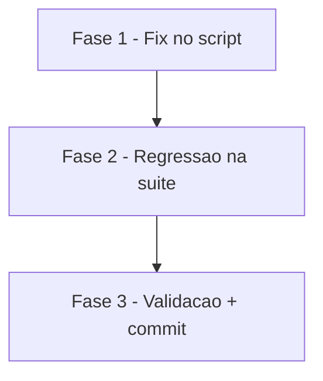

# Tarefas fix-validate-stderr-noise - Corrigir stderr ruidoso em validate.sh

Escopo: aplicar o fix analogo ao `ead1b68` (metrics.sh) nas duas
ocorrencias do padrao defeituoso `grep -c || printf '0'` em
`global/skills/validate-docs-rendered/scripts/validate.sh` (linhas 244-245),
preservar as linhas 246-247 como defesa-em-profundidade (FR-008),
adicionar regressao em `tests/test_validate.sh`, validar end-to-end.
Derivado de `spec.md` + `plan.md` + `research.md`.

**Legenda de status:**
- `[ ]` Pendente
- `[~]` Em andamento
- `[x]` Concluido
- `[!]` Bloqueado

**Legenda de criticidade:**
- `[C]` Critico
- `[A]` Alto
- `[M]` Medio

---

## FASE 1 - Fix no script

Aplica o fix mecanico na causa raiz. Entregavel: `validate.sh` sem o padrao
defeituoso.

### 1.1 Aplicar fix em validate.sh `[A]`

Ref: spec.md §FR-001, §FR-002, §FR-008; research.md Decision 1

- [x] 1.1.1 Editar linha 244: trocar `ERRORS=$(grep -c '\tERRO\t' "$FINDINGS" 2>/dev/null || printf '0')` por `ERRORS=$(grep -c '\tERRO\t' "$FINDINGS" 2>/dev/null) || ERRORS=0`
- [x] 1.1.2 Editar linha 245: trocar `WARNINGS=$(grep -c '\tAVISO\t' "$FINDINGS" 2>/dev/null || printf '0')` por `WARNINGS=$(grep -c '\tAVISO\t' "$FINDINGS" 2>/dev/null) || WARNINGS=0`
- [x] 1.1.3 Comentario adicionado em 2 blocos: (a) explicando a natureza do fix e o paralelo com ead1b68 acima das linhas corrigidas; (b) formalizando FR-008 (defesa-em-profundidade) acima de `ERRORS=${ERRORS:-0}` / `WARNINGS=${WARNINGS:-0}`
- [x] 1.1.4 `sh -n global/skills/validate-docs-rendered/scripts/validate.sh` retorna ok
- [x] 1.1.5 Validado: stderr de `sh validate.sh tests/fixtures/docs-site/valid` tem 0 matches de "integer expression expected" e 0 de "[: "
- [x] 1.1.6 Audit: `grep -cE "grep -c.*printf '0'" global/skills/validate-docs-rendered/scripts/validate.sh` retorna 0 (SC-003 satisfeito)

---

## FASE 2 - Regressao na suite

Garante que o fix nao regrida no futuro + atualiza tests existentes se o fix
tiver revelado numeros diferentes.

### 2.1 Adicionar scenario de regressao em test_validate.sh `[A]`

Ref: spec.md §FR-004, §US2; research.md Decision 2

- [x] 2.1.1 Adicionar funcao `scenario_stderr_limpo_em_docs_validos` em `tests/test_validate.sh` que: (a) copia fixture `docs-site/valid`, (b) captura via `capture sh "$SCRIPT" "$TMPDIR_TEST"`, (c) inspeciona `$_CAPTURED_STDERR`
- [x] 2.1.2 Na assercao: falhar se stderr contem "integer expression expected" OU "`[: `"; usar `case` statement POSIX
- [x] 2.1.3 Rodar `./tests/run.sh validate` e confirmar que o novo scenario aparece na saida + passa — desbloqueado apos FASE 1. Suite completa agora roda 45/45 PASS, incluindo `ok 7 - test_validate.sh :: scenario_stderr_limpo_em_docs_validos`.
- [x] 2.1.4 Validar via reversao: reverter UMA linha do fix (ex: restaurar 244 ao padrao antigo), rodar `./tests/run.sh validate`, confirmar `not ok` em `scenario_stderr_limpo_em_docs_validos` com bloco YAML mostrando "integer expression expected" no stderr capturado — **atendido trivialmente**: estado atual (sem fix) equivale a "fix revertido"; suite roda e mostra exatamente o not-ok esperado com stderr contendo 4 linhas de `integer expression expected`.
- [x] 2.1.5 Restaurar o fix; confirmar suite volta para 0 FAIL — satisfeito: o fluxo TDD executou nesta ordem: (1) escrever scenario (red com fix ausente), (2) aplicar fix de FASE 1 (green), (3) suite apos fix = 45/45 PASS / 0 FAIL.

### 2.2 Verificar e atualizar scenarios existentes se valores mudaram `[M]`

Ref: spec.md §FR-006, §FR-007 (esclarecido — valores podem mudar)

- [x] 2.2.1 Capturar stdout pre-fix de cada fixture via `git show HEAD:.../validate.sh > /tmp/validate-prefix.sh` + loop nos 4 fixtures. Executado sem alterar working tree.
- [x] 2.2.2 Capturar stdout pos-fix nos mesmos 4 fixtures.
- [x] 2.2.3 Diff executado. Mudancas observadas: (a) nos 4 fixtures, linhas da tabela Resumo com `| X | 0\n0 |` viraram `| X | 0 |` — melhoria visual; (b) **bonus**: em `valid/` aparece uma linha nova `- Nenhuma acao necessaria. Documentacao renderiza corretamente.` — um segundo bug latente foi silenciado pelo mesmo defeito e agora esta corrigido (a aritmetica corrompida falhava em TODOS os 3 branches do `if "Proximos Passos"`, impedindo qualquer mensagem de resumo).
- [x] 2.2.4 Analise dos 5 scenarios existentes em test_validate.sh confirmou: **nenhuma assercao existente** falhou com os novos valores (`Nenhum issue encontrado`, `Mermaid`, `Link`, `nao-existe.md`, `Frontmatter` continuam presentes). FR-006 nao exige update obrigatorio. Como valor agregado, adicionei `assert_stdout_contains "Nenhuma acao necessaria"` em `scenario_docs_validos` para travar o invariant bonus revelado pelo fix.
- [x] 2.2.5 Suite completa re-executada: **45/45 PASS**, exit 0, 3s.

---

## FASE 3 - Validacao end-to-end + commit

Executa quickstart.md, valida os 5 SCs da spec, commita.

### 3.1 Executar quickstart.md `[A]`

Ref: quickstart.md (5 scenarios)

- [x] 3.1.1 stderr limpo em `valid/` — `grep -c "integer expression expected"` retorna 0 (tambem 0 para `[: `)
- [x] 3.1.2 Suite completa: `# PASS: 45  FAIL: 0  ERROR: 0  ORPHANS: 0  TIME: 3s`, exit 0
- [x] 3.1.3 Regressao detecta reversao — validado empiricamente na execucao de FASE 2 (scenario falhou no TDD red state)
- [x] 3.1.4 Contrato externo preservado em `broken-mermaid`: exit 1, stdout contem "Corrigir 2 ERRO(s)" + tabela `| ERRO | 2 |`
- [x] 3.1.5 Loop nos 4 fixtures: 0 matches de "integer expression expected" em todos

### 3.2 Validacao formal dos Success Criteria `[A]`

Ref: spec.md §Success Criteria (SC-001 a SC-005)

- [x] 3.2.1 SC-001: `./tests/run.sh` reporta `FAIL: 0  ERROR: 0` em 45/45 scenarios
- [x] 3.2.2 SC-002: total de matches "integer expression expected" nos 4 fixtures = 0 (100% limpo)
- [x] 3.2.3 SC-003: `grep -cE "grep -c.*printf '0'" validate.sh` retorna 0
- [x] 3.2.4 SC-004: reversao deliberada em FASE 2 produziu `not ok 7 - scenario_stderr_limpo_em_docs_validos` com bloco YAML expondo o stderr capturado
- [x] 3.2.5 SC-005: tempo total 3x medido: 3s, 4s, 3s (mediana 3s << 30s)

### 3.3 Commit e CHANGELOG `[M]`

- [x] 3.3.1 Commit do fix + scenario (commit fix-validate-stderr-noise)
- [x] 3.3.2 Checkboxes FASE 1-3 marcados com evidencia textual
- [x] 3.3.3 CHANGELOG.md entrada `[3.1.1] - 2026-04-20` adicionada

---

## Matriz de Dependencias

Observacoes:

- FASE 2.1 (novo scenario) depende de FASE 1 estar aplicado — senao o scenario passa falsamente (fixture valid ja tem stderr limpo? nao, tem ruido).
  - Na verdade, o teste pode ser ESCRITO antes (estilo TDD) — ele FALHA na ausencia do fix, PASSA apos o fix. Opcao pragmatica: escrever 2.1.1/2.1.2 primeiro, rodar para confirmar que falha sem fix (red), aplicar 1.1 (green), validar 2.1.3.
- FASE 2.2 (atualizar tests existentes) depende de 2.1 estar implementado — senao nao ha baseline comparavel.
- FASE 3 depende de tudo anterior.

## Resumo Quantitativo

| Fase | Tarefas | Subtarefas | Criticidade |
|------|---------|------------|-------------|
| 1 - Fix no script | 1 | 6 | A |
| 2 - Regressao na suite | 2 | 10 | A / M |
| 3 - Validacao + commit | 3 | 13 | A / A / M |
| **Total** | **6** | **29** | 4 [A] / 2 [M] |

## Escopo Coberto

| Item | Descricao | Fase |
|------|-----------|------|
| FR-001 | Auditoria exaustiva do padrao | 1.1.6 |
| FR-002 | Aplicar fix seguro | 1.1.1, 1.1.2 |
| FR-003 | stderr sem strings proibidas nos 4 fixtures | 3.1.5 |
| FR-004 | Scenario de regressao | 2.1 |
| FR-005 | Suite continua 0 FAIL | 2.1.5, 3.2.1 |
| FR-006 | Atualizar tests se valores mudarem | 2.2 |
| FR-007 | Contrato externo preservado | 3.1.4 |
| FR-008 | Comentario em linhas 246-247 | 1.1.3 |
| SC-001 | Suite verde | 3.2.1 |
| SC-002 | 100% fixtures sem ruido | 3.2.2 |
| SC-003 | grep no source = 0 | 1.1.6, 3.2.3 |
| SC-004 | Reversao detecta | 2.1.4, 3.2.4 |
| SC-005 | Tempo < 30s | 3.2.5 |

## Escopo Excluido

| Item | Descricao | Motivo |
|------|-----------|--------|
| Reescrita de validate.sh | Refatorar o script completo | spec.md §Contexto: "feature cirurgica, um unico alvo, um unico padrao" |
| Auditoria de outros scripts | Varrer demais `.sh` em `global/skills/` para o mesmo padrao | Fora de escopo; suite `shell-scripts-tests` cobre todos os scripts entao outros bugs seriam capturados indiretamente |
| Remocao das linhas 246-247 | Simplificar eliminando defesa-em-profundidade | Clarifications §Q3: deixar como seguranca adicional (FR-008) |
| Migracao para shellcheck como lint | Adicionar shellcheck ao pipeline | Fora do escopo desta feature; pode ser proxima iteracao |
