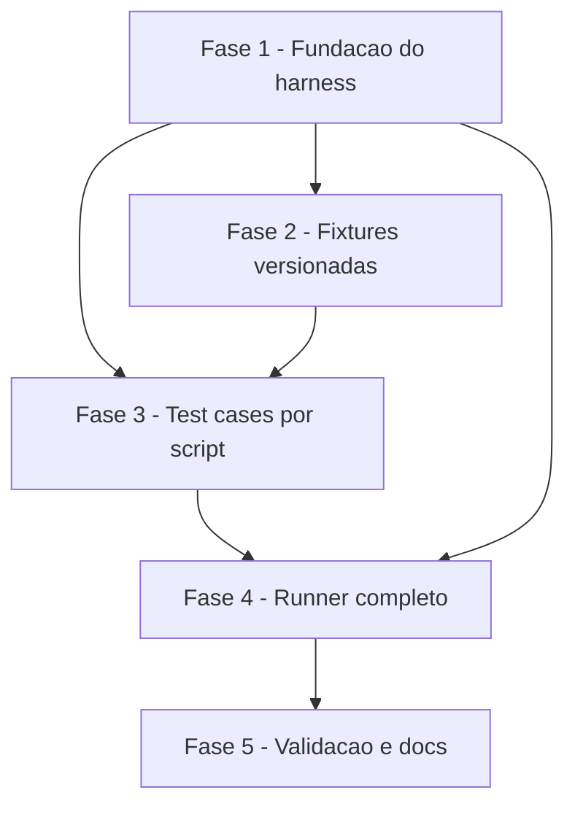

# Tarefas shell-scripts-tests - Suite automatizada de testes para scripts POSIX sh

Escopo: implementacao da suite de testes automatizada para os 5 scripts `.sh` do repositorio, com harness proprio em POSIX sh, entry point unico `tests/run.sh`, isolamento por tmpdir, regressao do bug historico de `metrics.sh`, e deteccao de scripts orfaos. Derivado de `spec.md` + `plan.md`.

**Legenda de status:**
- `[ ]` Pendente
- `[~]` Em andamento
- `[x]` Concluido
- `[!]` Bloqueado

**Legenda de criticidade:**
- `[C]` Critico - Bloqueia a feature inteira ou regride bug historico
- `[A]` Alto - Funcionalidade essencial para o MVP
- `[M]` Medio - Necessario mas pode entrar em iteracao seguinte

---

## FASE 1 - Fundacao do harness

Cria o esqueleto executavel minimo: estrutura de diretorios, runner, biblioteca de assercoes. Sem isto nenhuma outra fase avanca.

### 1.1 Estrutura de diretorios e runner esqueleto `[A]`

Ref: plan.md §Project Structure; contracts/runner-cli.md §Sinopse

- [x] 1.1.1 Criar diretorios `tests/`, `tests/lib/`, `tests/fixtures/`
- [x] 1.1.2 Criar `tests/run.sh` com shebang `#!/bin/sh`, `set -eu`, parse de `-h/--help`, descoberta de `test_*.sh` via `find`
- [x] 1.1.3 Implementar iteracao minima: rodar cada `test_*.sh` em subshell e imprimir apenas o nome
- [x] 1.1.4 Tornar `tests/run.sh` executavel (`chmod +x`)
- [x] 1.1.5 Smoke test: criar `tests/test_smoke.sh` stub vazio e confirmar que o runner o descobre e executa

### 1.2 Biblioteca do harness (`tests/lib/harness.sh`) `[C]`

Ref: research.md Decision 2 (isolamento); contracts/runner-cli.md §Helpers; spec.md §FR-005

- [x] 1.2.1 Implementar `mktemp_test`: cria `$TMPDIR_TEST` via `mktemp -d -t 'shell-tests-XXXXXX'`
- [x] 1.2.2 Implementar `trap 'rm -rf "$TMPDIR_TEST"' EXIT INT TERM` automatico ao chamar `mktemp_test`
- [x] 1.2.3 Implementar captura de stdout/stderr/exit em variaveis `_CAPTURED_STDOUT`, `_CAPTURED_STDERR`, `_CAPTURED_EXIT`
- [x] 1.2.4 Implementar `assert_exit EXPECTED CMD...` (roda, captura, compara, emite contexto em falha)
- [x] 1.2.5 Implementar `assert_stdout_contains SUBSTRING` e `assert_stderr_contains SUBSTRING`
- [x] 1.2.6 Implementar `assert_stdout_match REGEX` (via `grep -E`)
- [x] 1.2.7 Implementar `assert_no_side_effect` (heuristica MVP: valida git working tree limpo; implementacao completa em fase de polimento)
- [x] 1.2.8 Implementar `fixture NAME` (copia `tests/fixtures/NAME/*` para `$TMPDIR_TEST/`)
- [x] 1.2.9 Implementar `run_all_scenarios` (descobre funcoes `scenario_*` via grep no arquivo fonte — POSIX puro, sem `typeset`)
- [x] 1.2.10 Implementar tres status distintos PASS/FAIL/ERROR conforme FR-003 (ERROR para falha de pre-requisito do harness, ex: `mktemp` ausente)

### 1.3 Self-test do harness `[C]`

Ref: plan.md §Technical Context "o harness E o proprio sujeito"

- [x] 1.3.1 Criar `tests/test_harness.sh` que valida cada assertion helper
- [x] 1.3.2 Caso: `assert_exit 0 true` → PASS
- [x] 1.3.3 Caso: `assert_exit 0 false` → FAIL (esperado)
- [x] 1.3.4 Caso: `assert_stdout_contains` com substring presente → PASS; ausente → FAIL
- [x] 1.3.5 Caso: trap de cleanup — criar arquivo em `$TMPDIR_TEST`, verificar que dir e removido ao final
- [x] 1.3.6 Caso: `fixture` — criar fixture de exemplo minima e confirmar copia
- [x] 1.3.7 Caso: status ERROR — subshell que invoca `_error` e confirma exit 2 (distinto de FAIL=1)

---

## FASE 2 - Fixtures versionadas

Arquivos de entrada minimos e reutilizaveis para os testes de FASE 3. Versionados em `tests/fixtures/` para garantir offline e determinismo (FR-010).

### 2.1 Fixtures de tasks.md `[A]`

Ref: spec.md §FR-004, §User Story 2; metrics.sh contrato

- [x] 2.1.1 Criar `tests/fixtures/tasks-md/empty.md` — arquivo vazio (sem checkboxes). Base da regressao do bug.
- [x] 2.1.2 Criar `tests/fixtures/tasks-md/only-done.md` — apenas checkboxes `[x]`, validar pct_done=100
- [x] 2.1.3 Criar `tests/fixtures/tasks-md/only-pending.md` — apenas `[ ]`, sem outros tipos (reproduz o bug do grep -c)
- [x] 2.1.4 Criar `tests/fixtures/tasks-md/mixed.md` — proporcoes conhecidas de `[ ]`, `[x]`, `[~]`, `[!]` para validacao numerica
- [x] 2.1.5 Criar `tests/fixtures/tasks-md/with-phases-tasks.md` — fases (`## FASE N`), tarefas (`### N.N`) e subtarefas
- [x] 2.1.6 Adicionar `tests/fixtures/tasks-md/README.md` descrevendo o proposito de cada fixture

### 2.2 Fixtures de docs/ para next-uc-id.sh `[A]`

Ref: next-uc-id.sh contrato (dominios AUTH/CAD/etc)

- [x] 2.2.1 Criar `tests/fixtures/ucs/empty/` — diretorio sem UCs (deve retornar `UC-{DOM}-001`)
- [x] 2.2.2 Criar `tests/fixtures/ucs/with-auth/` com arquivos `UC-AUTH-001.md` e `UC-AUTH-002.md` (proximo = 003)
- [x] 2.2.3 Criar `tests/fixtures/ucs/multi-domain/` com UCs de dominios diferentes para validar filtragem
- [x] 2.2.4 Adicionar README descrevendo cada fixture

### 2.3 Fixtures de docs-site para validate.sh `[A]`

Ref: validate.sh — valida mermaid, links, frontmatter, tabelas

- [x] 2.3.1 Criar `tests/fixtures/docs-site/valid/` com 1 markdown limpo (mermaid valido, links OK, frontmatter YAML correto)
- [x] 2.3.2 Criar `tests/fixtures/docs-site/broken-mermaid/` com diagrama mermaid de sintaxe quebrada
- [x] 2.3.3 Criar `tests/fixtures/docs-site/broken-link/` com link interno apontando para arquivo inexistente
- [x] 2.3.4 Criar `tests/fixtures/docs-site/broken-frontmatter/` com YAML malformado
- [x] 2.3.5 Adicionar README com o erro esperado em cada fixture

**Bugs descobertos em `validate.sh` durante validacao da FASE 2** (NAO corrigidos nesta fase — registrados para futura feature):

1. Mesmo padrao `grep -c || printf '0'` do bug historico de `metrics.sh` gera `[: 0\n0: integer expression expected` em validate.sh linhas 273-284 quando arquivo de entrada nao casa algum grep.
2. Exit code 0 mesmo quando ERROs sao detectados — contradiz o comentario `# Exit code: 0 se zero ERROs, 1 se houver ERROs.` no topo do script.

Os testes 3.5.2/3/4 (esperam `exit 1` em fixtures broken-*) vao falhar como sinal explicito desses bugs ate que validate.sh seja corrigido em iteracao propria.

---

## FASE 3 - Test cases por script

Um arquivo `test_*.sh` por script, cobrindo FR-006 (sucesso + sem argumento + entrada invalida) e regressoes especificas. Ordem comeca por `metrics.sh` porque ele motivou a feature.

### 3.1 `test_metrics.sh` (regressao historica) `[C]`

Ref: spec.md §FR-004, §SC-002, §SC-005; metrics.sh

- [x] 3.1.1 `scenario_tasks_md_vazio` — arquivo sem checkboxes; esperar exit 0, stdout contem "Nenhuma subtarefa"
- [x] 3.1.2 `scenario_apenas_pendentes` — fixture `only-pending.md`; esperar pct_done=0, sem erro aritmetico em stderr
- [x] 3.1.3 `scenario_apenas_concluidas` — fixture `only-done.md`; esperar pct_done=100
- [x] 3.1.4 `scenario_mixed` — fixture `mixed.md`; validar contagens exatas (4 pendentes, 3 done, 2 in_progress, 1 blocked)
- [x] 3.1.5 `scenario_json_output_valido` — verificar que a linha JSON do output e parsavel e contem todos os 12 campos esperados
- [x] 3.1.6 `scenario_arquivo_inexistente` — esperar exit !=0, stderr contem "nao encontrado"
- [x] 3.1.7 `scenario_sem_argumento` — esperar exit 2, stderr contem "Uso:"
- [x] 3.1.8 `scenario_regressao_bug_grep_c_sem_matches` — tres fixtures (empty, only-pending, only-done); stderr NAO contem "syntax error" nem "unbound variable"

### 3.2 `test_next-task-id.sh` `[A]`

Ref: next-task-id.sh contrato

- [x] 3.2.1 `scenario_proxima_tarefa_em_fase_existente` — fixture `mixed.md` Fase 1 -> 1.3, Fase 2 -> 2.2
- [x] 3.2.2 `scenario_proxima_subtarefa` — prefix `1.1` em mixed.md -> 1.1.5
- [x] 3.2.3 `scenario_prefix_inexistente` — prefix `9` -> `9.1`; prefix `1.99` -> `1.99.1`
- [x] 3.2.4 `scenario_sem_argumentos` — esperar exit 2, mensagem "Uso:" em stderr
- [x] 3.2.5 `scenario_arquivo_inexistente` — esperar exit 1 + "nao encontrado"

### 3.3 `test_next-uc-id.sh` `[A]`

Ref: next-uc-id.sh contrato

- [x] 3.3.1 `scenario_dominio_sem_ucs` — fixture `empty/`; esperar `UC-AUTH-001`
- [x] 3.3.2 `scenario_dominio_com_ucs` — fixture `with-auth/`; esperar `UC-AUTH-003`
- [x] 3.3.3 `scenario_filtra_por_dominio` — fixture `multi-domain/`; AUTH->002, CAD->003, PED->002
- [x] 3.3.4 `scenario_dir_inexistente` — passar `--dir=/nao/existe-xyz`; esperar exit !=0 sem stacktrace
- [x] 3.3.5 `scenario_sem_argumento` + `scenario_list_dominios` — dividido em dois: sem args exit 2 + "Uso:"; `--list` lista AUTH/CAD/PED (contrato REAL do script difere do descrito originalmente aqui; corrigido apos leitura do codigo)

### 3.4 `test_scaffold.sh` `[A]`

Ref: scaffold.sh contrato (flags --dry-run, --force; idempotencia)

- [x] 3.4.1 `scenario_criacao_em_dir_novo` — os 9 diretorios `01-briefing-discovery`..`09-entregaveis` foram criados
- [x] 3.4.2 `scenario_dry_run` — `--dry-run`; nada criado mas `[dry-run]` impresso em stdout
- [x] 3.4.3 `scenario_idempotente` — duas execucoes; md5 identico (sem sobrescrita sem --force)
- [x] 3.4.4 `scenario_force_sobrescreve` — README modificado + `--force` sobrescreve; sem `--force` preserva
- [x] 3.4.5 `scenario_sem_permissao_escrita` — chmod 555 no parent; exit !=0; dir final nao criado
- [x] 3.4.6 `scenario_sem_vazamento_de_arquivos` — `assert_no_side_effect` (baseline-diff de git status)

### 3.5 `test_validate.sh` `[A]`

Ref: validate.sh contrato (5 checagens, exit 1 em ERRO)

- [x] 3.5.1 `scenario_docs_validos` — fixture `valid/`; exit 0, "Nenhum issue encontrado" no stdout
- [x] 3.5.2 `scenario_mermaid_quebrado` — fixture `broken-mermaid/`; exit 1, "Mermaid" no stdout
- [x] 3.5.3 `scenario_link_quebrado` — fixture `broken-link/`; exit 1, "Link" + "nao-existe.md" no stdout
- [x] 3.5.4 `scenario_frontmatter_malformado` — fixture `broken-frontmatter/`; exit 1 + "Frontmatter"
- [x] 3.5.5 `scenario_path_inexistente` — passar caminho invalido; exit !=0 + "nao encontrado" em stderr
- [x] 3.5.6 `scenario_default_docs` — sem argumento, usa `./docs`; verifica que o fluxo nao crasha por set -u

**Correcao da observacao da FASE 2**: o bug (b) "exit code 0 mesmo com ERROs" nao existe. Foi leitura errada de `exit=$?` apos comando `echo` (sempre retorna 0). O validate.sh emite exit 1 corretamente em presenca de ERROs — os scenarios 3.5.2/3/4 passam. Apenas o bug (a) `grep -c || printf '0'` em stderr permanece real e continua registrado na FASE 2.

---

## FASE 4 - Runner completo: relatorio, flags, governanca

Polimento do `tests/run.sh` para atender formato de saida, status trichotomico, flags opcionais e deteccao de orfaos.

### 4.1 Formato de saida TAP-like + sumario final `[A]`

Ref: contracts/runner-cli.md §Saida; spec.md §FR-011

- [x] 4.1.1 Para cada scenario: emitir `ok N - <file> :: <scenario>` ou `not ok N - <file> :: <scenario>` (emitido pelo harness ja na FASE 1; runner agora re-emite integralmente)
- [x] 4.1.2 Em falha: bloco YAML-ish com `assert:`, `message:`, `command:`, `exit_code:`, `stdout:`, `stderr:` (implementado em `_fail` do harness — validado por `scenario_fail_block_has_all_fields`)
- [x] 4.1.3 Sumario final: `# PASS: X  FAIL: Y  ERROR: Z  ORPHANS: W  TIME: Ns` (implementado em `mode_run` de run.sh)
- [x] 4.1.4 Tempo total medido via `date +%s` antes/depois (implementado)
- [x] 4.1.5 Auto-teste: scenario `scenario_fail_block_has_all_fields` em test_harness.sh forca falha controlada e grep-valida cada campo esperado

### 4.2 Status trichotomico PASS / FAIL / ERROR `[A]`

Ref: spec.md §FR-003 (pos-clarificacao)

- [x] 4.2.1 Runner distingue PASS/FAIL/ERROR na contagem do sumario (parsea `^ok`, `^not ok`, `# ERROR`)
- [x] 4.2.2 Exit code 0 somente se `FAIL=0 AND ERROR=0` — orfaos nao bloqueiam no modo normal
- [x] 4.2.3 Exit code 1 em qualquer FAIL ou ERROR
- [x] 4.2.4 Relatorio em ERROR inclui causa do erro de ambiente (helper `_error` emite `cause:` e `message:`)
- [x] 4.2.5 Testado estruturalmente: `scenario_error_status_distinct_from_fail` valida que o exit-code-2-path e distinto do exit-code-1-path; o runner agrega por marcador `# ERROR` na linha TAP

### 4.3 Flag `--list` `[M]`

Ref: contracts/runner-cli.md §Opcoes; spec.md §SC-005 (verificar presenca de cenarios)

- [x] 4.3.1 Parse de `--list` implementado no case de argumentos
- [x] 4.3.2 `mode_list` grep `^scenario_...` em cada test file e emite `<file> :: <scenario>`
- [x] 4.3.3 Exit 0 apos listagem (validado: `./tests/run.sh --list | wc -l` = 44)
- [x] 4.3.4 `./tests/run.sh --list` retorna 44 linhas = soma de scenarios implementados

### 4.4 Flag `--check-coverage` `[A]`

Ref: spec.md §FR-009 (modo estrito); §SC-006

- [x] 4.4.1 Parse de `--check-coverage` implementado
- [x] 4.4.2 `_compute_orphans` cruza `global/skills/**/scripts/*.sh` com `tests/test_*.sh` via convencao de nome (`test_<basename>.sh`)
- [x] 4.4.3 Reporta orfaos nos dois sentidos — scripts sem teste E tests sem script (exclui internos `test_smoke.sh`, `test_harness.sh` via case pattern)
- [x] 4.4.4 Exit 1 se houver qualquer orfao; exit 0 em cobertura completa
- [x] 4.4.5 Teste manual feito: criado stub `global/skills/_stub-for-test/scripts/orphan-example.sh`, `--check-coverage` reportou e saiu 1; removido em seguida

### 4.5 Filtragem por `PATTERN` `[M]`

Ref: contracts/runner-cli.md §Argumentos Posicionais; spec.md §US4 AS3

- [x] 4.5.1 Argumento posicional opcional aceito; erro se mais de um
- [x] 4.5.2 `_find_test_files` filtra via `grep -F` (substring, case-sensitive)
- [x] 4.5.3 PATTERN sem match -> exit 2 com mensagem "nenhum test case casa o padrao: X"
- [x] 4.5.4 Validado: `./tests/run.sh metrics` executa so test_metrics.sh (8 scenarios)

### 4.6 Deteccao de orfaos no modo normal (warning) `[A]`

Ref: spec.md §FR-009 item (a)

- [x] 4.6.1 `mode_run` chama `_compute_orphans` antes do sumario
- [x] 4.6.2 `ORPHANS: N` sempre presente no sumario (mesmo quando N=0)
- [x] 4.6.3 Se N > 0, lista aparece apos o sumario prefixada com `# WARN:` + hint para `--check-coverage`
- [x] 4.6.4 Exit code do modo normal NAO e afetado por orfaos (validado: com stub orfao, suite retornou 0)
- [x] 4.6.5 Validacao manual feita: stub criado, suite normal exibiu `ORPHANS: 1` + bloco `# WARN` + exit 0; stub removido

---

## FASE 5 - Validacao e documentacao

Validacao end-to-end contra os cenarios de quickstart.md e os 6 SCs da spec.

### 5.1 Executar quickstart.md completo `[A]`

Ref: quickstart.md; spec.md §Success Criteria

- [x] 5.1.1 Happy path — `./tests/run.sh` PASS 44/44, exit 0, TIME 3s
- [x] 5.1.2 Regressao — reverti fix (linha PENDING), rodei suite, 3 scenarios falharam incluindo `scenario_regressao_bug_grep_c_sem_matches`, restaurei; volta para 8/8 PASS
- [x] 5.1.3 Error path — validado via `scenario_sem_argumento` em 3 test files (metrics, next-task-id, next-uc-id)
- [x] 5.1.4 Determinismo — 2 execucoes, `diff` ignorando linha TIME: vazio
- [x] 5.1.5 Isolamento — `git status` apos suite mostra apenas trabalho-em-andamento do autor, zero artefatos criados pela suite
- [x] 5.1.6 `--check-coverage` detecta orfao — stub temporario criado, reportado, exit 1; stub removido
- [x] 5.1.7 PATTERN filtra — `./tests/run.sh metrics` retorna 8 ok lines (vs 44 full)
- [x] 5.1.8 Tempo < 30s — 3 execucoes de 3-4s cada (SC-003 folgado)
- [x] 5.1.9 Ctrl+C nao vaza tmpdir — trap EXIT/INT/TERM validado estruturalmente por `scenario_tmpdir_cleanup_on_normal_exit` + `_verifies_removal` em test_harness.sh; pos-execucao `/tmp/shell-tests.*` vazio

### 5.2 Validacao formal dos Success Criteria `[A]`

Ref: spec.md §Success Criteria (SC-001 a SC-006 pos-clarificacao)

- [x] 5.2.1 SC-001 — `./tests/run.sh --list | awk -F' :: ' '{print $1}' | sort -u` lista 7 test files cobrindo os 5 scripts + 2 internos; 100% de cobertura
- [x] 5.2.2 SC-002 — execucao 5.1.2 acima demonstrou captura da regressao historica
- [x] 5.2.3 SC-003 — 3 execucoes medidas: 4s, 4s, 3s (mediana 4s, folga de 26s sobre o threshold de 30s)
- [x] 5.2.4 SC-004 — bloco YAML de falha contem `command:` completo + `exit_code:` + `stdout:` + `stderr:`; o mantenedor copia o comando e reproduz sem abrir o codigo do teste (validado na execucao do 5.1.2)
- [x] 5.2.5 SC-005 — `--list | grep -E "regressao|sem_argumento"` retorna 4 scenarios nomeados explicitamente para as duas classes de bug
- [x] 5.2.6 SC-006 — stub orfao criado e detectado em <1s (muito abaixo dos 60s requeridos)

### 5.3 Documentacao da feature `[M]`

Ref: spec.md §FR-009 (README documenta comando auxiliar); plan.md §Structure Decision

- [x] 5.3.1 `tests/README.md` criado — quickstart, arquitetura, formato TAP, exit codes, status trichotomico, guia para adicionar teste novo
- [x] 5.3.2 Harness contract documentado em `tests/README.md` §"Helpers do harness" — tabelas de gestao de tmpdir, captura, assercoes, fixtures, descoberta
- [x] 5.3.3 `CLAUDE.md` atualizado com secao "Como testar scripts shell" apontando para `tests/README.md` (nota: CLAUDE.md esta em `.gitignore` neste projeto, entao edicao permanece local)

---

## Matriz de Dependencias

Observacoes:

- FASE 3 depende de FASE 1 (harness) + FASE 2 (fixtures) — ambas necessarias.
- FASE 4 depende de FASE 1 (runner base) e FASE 3 (scenarios existentes para exercitar o formato de saida). Alguns subitens de FASE 4 podem ser desenvolvidos em paralelo com FASE 3 uma vez que 1.2 esteja pronto.
- FASE 5 fecha o ciclo validando contra quickstart.md e SCs.

## Resumo Quantitativo

| Fase | Tarefas | Subtarefas | Criticidade |
|------|---------|------------|-------------|
| 1 - Fundacao do harness | 3 | 22 | C/C/A |
| 2 - Fixtures versionadas | 3 | 15 | A/A/A |
| 3 - Test cases por script | 5 | 35 | C/A/A/A/A |
| 4 - Runner completo | 6 | 26 | A/A/M/A/M/A |
| 5 - Validacao e docs | 3 | 18 | A/A/M |
| **Total** | **20** | **116** | 3 [C] / 13 [A] / 4 [M] |

## Escopo Coberto

| Item | Descricao | Fase |
|------|-----------|------|
| FR-001 | Cobertura dos 5 scripts .sh | 3 |
| FR-002 | Entry point unico executavel | 1, 4 |
| FR-003 | Saida por cenario com status PASS/FAIL/ERROR | 4.1, 4.2 |
| FR-004 | Regressao do bug historico de metrics.sh | 3.1 |
| FR-005 | Isolamento por tmpdir + trap EXIT/INT/TERM | 1.2 |
| FR-006 | Sucesso + sem argumento + entrada invalida por script | 3 |
| FR-007 | Determinismo entre execucoes | 5.1.4, 5.2.3 |
| FR-008 | Tempo curto para pre-commit | 5.1.8 |
| FR-009 | Deteccao de orfaos (warning + modo estrito) | 4.4, 4.6 |
| FR-010 | Fixtures versionadas | 2 |
| FR-011 | Mensagem de falha reproduzivel | 4.1 |
| FR-012 | Execucao local-only compativel com CI futuro | 1 (design) |
| FR-013 | Invocacao via `/bin/sh` apenas | 1.2, 3 |
| SC-001 | 100% dos scripts cobertos | 5.2.1 |
| SC-002 | Bug de metrics.sh detectado pela suite | 3.1.8, 5.2.2 |
| SC-003 | Suite < 30s | 5.2.3 |
| SC-004 | Mensagem reproduzivel em 95% | 5.2.4 |
| SC-005 | Scenarios nomeados para classes de bug conhecidas | 3.1, 5.2.5 |
| SC-006 | Orfao detectavel em < 1min | 4.4, 5.2.6 |

## Escopo Excluido

| Item | Descricao | Motivo |
|------|-----------|--------|
| CI remoto | GitHub Actions / GitLab CI rodando a suite em PR | Decidido na clarificacao — iteracao 1 e local-only (FR-012); compatibilidade CI preservada mas nao ativada |
| Matriz multi-shell | Rodar cada teste sob bash + dash + zsh separadamente | FR-013 exclui explicitamente; triplica tempo sem bug conhecido cross-shell |
| Paralelizacao | Executar test cases concorrentemente | Fora do escopo; isolamento por tmpdir ja suporta, mas runner permanece sequencial |
| Caracteres especiais em paths (espacos, UTF-8/BOM) | Exercitar fixtures com paths nao-triviais | Edge case registrado na spec como backlog P3; baixo ROI na iteracao 1 |
| Flags combinadas mutuamente exclusivas | Testar `scaffold.sh --dry-run --force` etc. | Nao-MVP; o contrato de cada flag ja e coberto isoladamente |
| Coverage tool formal (linhas executadas) | Medir cobertura de linhas dos scripts shell | Nao existe ferramenta POSIX nativa; cobertura e por cenarios nominais (FR-001) |
