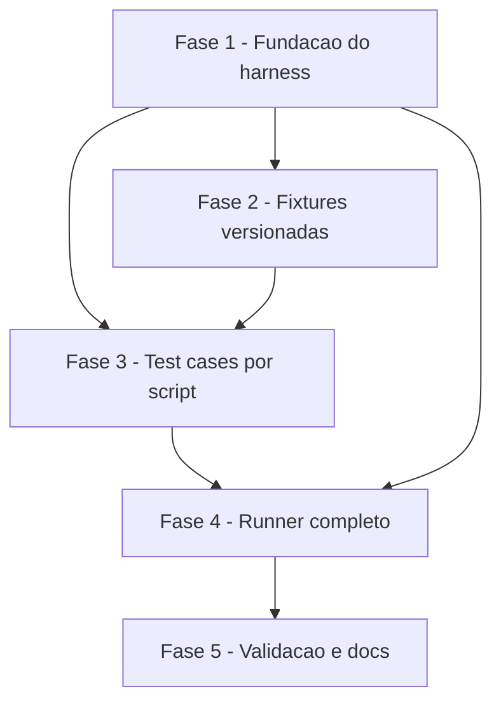

# Tarefas shell-scripts-tests - Suite automatizada de testes para scripts POSIX sh

Escopo: implementacao da suite de testes automatizada para os 5 scripts `.sh` do repositorio, com harness proprio em POSIX sh, entry point unico `tests/run.sh`, isolamento por tmpdir, regressao do bug historico de `metrics.sh`, e deteccao de scripts orfaos. Derivado de `spec.md` + `plan.md`.

**Legenda de status:**
- `[ ]` Pendente
- `[~]` Em andamento
- `[x]` Concluido
- `[!]` Bloqueado

**Legenda de criticidade:**
- `[C]` Critico - Bloqueia a feature inteira ou regride bug historico
- `[A]` Alto - Funcionalidade essencial para o MVP
- `[M]` Medio - Necessario mas pode entrar em iteracao seguinte

---

## FASE 1 - Fundacao do harness

Cria o esqueleto executavel minimo: estrutura de diretorios, runner, biblioteca de assercoes. Sem isto nenhuma outra fase avanca.

### 1.1 Estrutura de diretorios e runner esqueleto `[A]`

Ref: plan.md §Project Structure; contracts/runner-cli.md §Sinopse

- [ ] 1.1.1 Criar diretorios `tests/`, `tests/lib/`, `tests/fixtures/`
- [ ] 1.1.2 Criar `tests/run.sh` com shebang `#!/bin/sh`, `set -eu`, parse de `-h/--help`, descoberta de `test_*.sh` via `find`
- [ ] 1.1.3 Implementar iteracao minima: rodar cada `test_*.sh` em subshell e imprimir apenas o nome
- [ ] 1.1.4 Tornar `tests/run.sh` executavel (`chmod +x`)
- [ ] 1.1.5 Smoke test: criar `tests/test_smoke.sh` stub vazio e confirmar que o runner o descobre e executa

### 1.2 Biblioteca do harness (`tests/lib/harness.sh`) `[C]`

Ref: research.md Decision 2 (isolamento); contracts/runner-cli.md §Helpers; spec.md §FR-005

- [ ] 1.2.1 Implementar `mktemp_test`: cria `$TMPDIR_TEST` via `mktemp -d -t 'shell-tests-XXXXXX'`
- [ ] 1.2.2 Implementar `trap 'rm -rf "$TMPDIR_TEST"' EXIT INT TERM` automatico ao chamar `mktemp_test`
- [ ] 1.2.3 Implementar captura de stdout/stderr/exit em variaveis `_CAPTURED_STDOUT`, `_CAPTURED_STDERR`, `_CAPTURED_EXIT`
- [ ] 1.2.4 Implementar `assert_exit EXPECTED CMD...` (roda, captura, compara, emite contexto em falha)
- [ ] 1.2.5 Implementar `assert_stdout_contains SUBSTRING` e `assert_stderr_contains SUBSTRING`
- [ ] 1.2.6 Implementar `assert_stdout_match REGEX` (via `grep -E`)
- [ ] 1.2.7 Implementar `assert_no_side_effect` (compara `find` do repo antes/depois, ignorando `$TMPDIR_TEST`)
- [ ] 1.2.8 Implementar `fixture NAME` (copia `tests/fixtures/NAME/*` para `$TMPDIR_TEST/`)
- [ ] 1.2.9 Implementar `run_all_scenarios` (descobre funcoes `scenario_*` no escopo corrente e executa cada uma isolada)
- [ ] 1.2.10 Implementar tres status distintos PASS/FAIL/ERROR conforme FR-003 (ERROR para falha de pre-requisito do harness, ex: `mktemp` ausente)

### 1.3 Self-test do harness `[C]`

Ref: plan.md §Technical Context "o harness E o proprio sujeito"

- [ ] 1.3.1 Criar `tests/test_harness.sh` que valida cada assertion helper
- [ ] 1.3.2 Caso: `assert_exit 0 true` → PASS
- [ ] 1.3.3 Caso: `assert_exit 0 false` → FAIL (esperado)
- [ ] 1.3.4 Caso: `assert_stdout_contains` com substring presente → PASS; ausente → FAIL
- [ ] 1.3.5 Caso: trap de cleanup — criar arquivo em `$TMPDIR_TEST`, verificar que dir e removido ao final
- [ ] 1.3.6 Caso: `fixture` — criar fixture de exemplo minima e confirmar copia
- [ ] 1.3.7 Caso: status ERROR — simular `mktemp` indisponivel via `PATH=` e confirmar ERROR distinto de FAIL

---

## FASE 2 - Fixtures versionadas

Arquivos de entrada minimos e reutilizaveis para os testes de FASE 3. Versionados em `tests/fixtures/` para garantir offline e determinismo (FR-010).

### 2.1 Fixtures de tasks.md `[A]`

Ref: spec.md §FR-004, §User Story 2; metrics.sh contrato

- [ ] 2.1.1 Criar `tests/fixtures/tasks-md/empty.md` — arquivo vazio (sem checkboxes). Base da regressao do bug.
- [ ] 2.1.2 Criar `tests/fixtures/tasks-md/only-done.md` — apenas checkboxes `[x]`, validar pct_done=100
- [ ] 2.1.3 Criar `tests/fixtures/tasks-md/only-pending.md` — apenas `[ ]`, sem outros tipos (reproduz o bug do grep -c)
- [ ] 2.1.4 Criar `tests/fixtures/tasks-md/mixed.md` — proporcoes conhecidas de `[ ]`, `[x]`, `[~]`, `[!]` para validacao numerica
- [ ] 2.1.5 Criar `tests/fixtures/tasks-md/with-phases-tasks.md` — fases (`## FASE N`), tarefas (`### N.N`) e subtarefas
- [ ] 2.1.6 Adicionar `tests/fixtures/tasks-md/README.md` descrevendo o proposito de cada fixture

### 2.2 Fixtures de docs/ para next-uc-id.sh `[A]`

Ref: next-uc-id.sh contrato (dominios AUTH/CAD/etc)

- [ ] 2.2.1 Criar `tests/fixtures/ucs/empty/` — diretorio sem UCs (deve retornar `UC-{DOM}-001`)
- [ ] 2.2.2 Criar `tests/fixtures/ucs/with-auth/` com arquivos `UC-AUTH-001.md` e `UC-AUTH-002.md` (proximo = 003)
- [ ] 2.2.3 Criar `tests/fixtures/ucs/multi-domain/` com UCs de dominios diferentes para validar filtragem
- [ ] 2.2.4 Adicionar README descrevendo cada fixture

### 2.3 Fixtures de docs-site para validate.sh `[A]`

Ref: validate.sh — valida mermaid, links, frontmatter, tabelas

- [ ] 2.3.1 Criar `tests/fixtures/docs-site/valid/` com 1 markdown limpo (mermaid valido, links OK, frontmatter YAML correto)
- [ ] 2.3.2 Criar `tests/fixtures/docs-site/broken-mermaid/` com diagrama mermaid de sintaxe quebrada
- [ ] 2.3.3 Criar `tests/fixtures/docs-site/broken-link/` com link interno apontando para arquivo inexistente
- [ ] 2.3.4 Criar `tests/fixtures/docs-site/broken-frontmatter/` com YAML malformado
- [ ] 2.3.5 Adicionar README com o erro esperado em cada fixture

---

## FASE 3 - Test cases por script

Um arquivo `test_*.sh` por script, cobrindo FR-006 (sucesso + sem argumento + entrada invalida) e regressoes especificas. Ordem comeca por `metrics.sh` porque ele motivou a feature.

### 3.1 `test_metrics.sh` (regressao historica) `[C]`

Ref: spec.md §FR-004, §SC-002, §SC-005; metrics.sh

- [ ] 3.1.1 `scenario_tasks_md_vazio` — arquivo sem checkboxes; esperar exit 0, stdout contem "Nenhuma subtarefa"
- [ ] 3.1.2 `scenario_apenas_pendentes` — fixture `only-pending.md`; esperar pct_done=0, sem erro aritmetico em stderr
- [ ] 3.1.3 `scenario_apenas_concluidas` — fixture `only-done.md`; esperar pct_done=100
- [ ] 3.1.4 `scenario_mixed` — fixture `mixed.md`; validar contagens exatas (4 pendentes, 6 done, etc.)
- [ ] 3.1.5 `scenario_json_output_valido` — verificar que a linha JSON do output e parsavel e contem todos os campos esperados
- [ ] 3.1.6 `scenario_arquivo_inexistente` — esperar exit !=0, stderr contem "nao encontrado"
- [ ] 3.1.7 `scenario_sem_argumento` — esperar exit 2, stderr contem "Uso:"
- [ ] 3.1.8 Regressao dedicada: executar com fixture `only-pending.md` e assertar que stderr NAO contem "syntax error in expression" (o sintoma exato do bug historico)

### 3.2 `test_next-task-id.sh` `[A]`

Ref: next-task-id.sh contrato

- [ ] 3.2.1 `scenario_proxima_tarefa_em_fase_existente` — fixture `with-phases-tasks.md` Fase 1; esperar `1.{N+1}`
- [ ] 3.2.2 `scenario_proxima_subtarefa` — prefix `1.2` em fixture com subtarefas; esperar `1.2.{N+1}`
- [ ] 3.2.3 `scenario_prefix_inexistente` — prefix `9` em fixture sem Fase 9; esperar `9.1`
- [ ] 3.2.4 `scenario_sem_argumentos` — esperar exit 2, mensagem de uso em stderr
- [ ] 3.2.5 `scenario_arquivo_inexistente` — esperar exit !=0 com mensagem clara

### 3.3 `test_next-uc-id.sh` `[A]`

Ref: next-uc-id.sh contrato

- [ ] 3.3.1 `scenario_dominio_sem_ucs` — fixture `empty/`; esperar `UC-AUTH-001`
- [ ] 3.3.2 `scenario_dominio_com_ucs` — fixture `with-auth/`; esperar `UC-AUTH-003`
- [ ] 3.3.3 `scenario_filtra_por_dominio` — fixture `multi-domain/`; passar `CAD`, nao confundir com `AUTH`
- [ ] 3.3.4 `scenario_dir_inexistente` — passar `--dir=/nao/existe`; esperar exit !=0 sem stacktrace
- [ ] 3.3.5 `scenario_sem_argumentos` — listar dominios existentes, exit 0 (comportamento documentado)

### 3.4 `test_scaffold.sh` `[A]`

Ref: scaffold.sh contrato (flags --dry-run, --force; idempotencia)

- [ ] 3.4.1 `scenario_criacao_em_dir_novo` — em `$TMPDIR_TEST` vazio; verificar que os 9 diretorios `01-briefing-discovery`..`09-entregaveis` foram criados
- [ ] 3.4.2 `scenario_dry_run` — `--dry-run`; verificar que nada foi criado mas o plano foi impresso em stdout
- [ ] 3.4.3 `scenario_idempotente` — rodar duas vezes seguidas; segunda execucao nao deve quebrar nem sobrescrever
- [ ] 3.4.4 `scenario_force_sobrescreve` — criar README modificado e rodar com `--force`; verificar sobrescrita
- [ ] 3.4.5 `scenario_sem_permissao_escrita` — `chmod -w` no dir; esperar exit !=0 com mensagem clara
- [ ] 3.4.6 Validacao de isolamento: `assert_no_side_effect` apos cada scenario

### 3.5 `test_validate.sh` `[A]`

Ref: validate.sh contrato (5 checagens, exit 1 em ERRO)

- [ ] 3.5.1 `scenario_docs_validos` — fixture `valid/`; esperar exit 0, stdout sem "ERROR"
- [ ] 3.5.2 `scenario_mermaid_quebrado` — fixture `broken-mermaid/`; esperar exit 1, mensagem sobre mermaid
- [ ] 3.5.3 `scenario_link_quebrado` — fixture `broken-link/`; esperar exit 1, mensagem apontando o arquivo
- [ ] 3.5.4 `scenario_frontmatter_malformado` — fixture `broken-frontmatter/`; esperar exit 1
- [ ] 3.5.5 `scenario_path_inexistente` — passar caminho invalido; esperar exit !=0 com mensagem clara
- [ ] 3.5.6 `scenario_default_docs` — sem argumento, usa `./docs`; verificar comportamento default nao quebra

---

## FASE 4 - Runner completo: relatorio, flags, governanca

Polimento do `tests/run.sh` para atender formato de saida, status trichotomico, flags opcionais e deteccao de orfaos.

### 4.1 Formato de saida TAP-like + sumario final `[A]`

Ref: contracts/runner-cli.md §Saida; spec.md §FR-011

- [ ] 4.1.1 Para cada scenario: emitir `ok N - <file> :: <scenario>` ou `not ok N - <file> :: <scenario>`
- [ ] 4.1.2 Em falha: emitir bloco YAML-ish com `command:`, `exit_code:`, `expected_exit:`, `stdout:`, `stderr:`
- [ ] 4.1.3 Sumario final: `# PASS: X  FAIL: Y  ERROR: Z  ORPHANS: W  TIME: Ns`
- [ ] 4.1.4 Tempo total medido via `date +%s` antes/depois
- [ ] 4.1.5 Auto-teste: forcar FAIL em um scenario do `test_harness.sh` e validar que o bloco YAML contem todos os campos obrigatorios

### 4.2 Status trichotomico PASS / FAIL / ERROR `[A]`

Ref: spec.md §FR-003 (pos-clarificacao)

- [ ] 4.2.1 Runner distingue os tres estados na contagem do sumario
- [ ] 4.2.2 Exit code 0 somente se `FAIL=0 AND ERROR=0` (orfaos nao bloqueiam)
- [ ] 4.2.3 Exit code 1 em qualquer FAIL ou ERROR
- [ ] 4.2.4 Relatorio em ERROR inclui causa do erro de ambiente (FR-011 atualizado)
- [ ] 4.2.5 Teste: cenario que simula `awk` ausente → reportado como ERROR, nao FAIL

### 4.3 Flag `--list` `[M]`

Ref: contracts/runner-cli.md §Opcoes; spec.md §SC-005 (verificar presenca de cenarios)

- [ ] 4.3.1 Implementar parse de `--list`
- [ ] 4.3.2 Em `--list`: nao executa, apenas imprime `<file> :: <scenario>` linha por linha
- [ ] 4.3.3 Exit 0 apos listagem
- [ ] 4.3.4 Teste: validar que `--list | wc -l` >= numero de scenarios implementados

### 4.4 Flag `--check-coverage` `[A]`

Ref: spec.md §FR-009 (modo estrito); §SC-006

- [ ] 4.4.1 Implementar parse de `--check-coverage`
- [ ] 4.4.2 Cruzar lista de `global/skills/**/scripts/*.sh` com `tests/test_*.sh` via convencao de nome
- [ ] 4.4.3 Reportar orfaos (script sem teste) E testes sem script (teste orfao apontando para arquivo removido)
- [ ] 4.4.4 Exit 1 se houver qualquer um dos dois tipos de orfao; exit 0 caso contrario
- [ ] 4.4.5 Teste manual: criar stub `global/skills/x/scripts/foo.sh` sem `test_foo.sh`, rodar `--check-coverage`, verificar exit 1; remover stub

### 4.5 Filtragem por `PATTERN` `[M]`

Ref: contracts/runner-cli.md §Argumentos Posicionais; spec.md §US4 AS3

- [ ] 4.5.1 Aceitar argumento posicional opcional que filtra caminhos dos test cases
- [ ] 4.5.2 Executar apenas os test cases cujo caminho contem o PATTERN
- [ ] 4.5.3 Se PATTERN nao casa nenhum test case: exit 2 com mensagem "nenhum teste casou o padrao"
- [ ] 4.5.4 Teste: `tests/run.sh metrics` deve rodar so `test_metrics.sh`

### 4.6 Deteccao de orfaos no modo normal (warning) `[A]`

Ref: spec.md §FR-009 item (a)

- [ ] 4.6.1 Em cada execucao normal, computar orfaos no final (antes do sumario)
- [ ] 4.6.2 Incluir contagem `ORPHANS: N` no sumario mesmo quando N=0 (consistencia)
- [ ] 4.6.3 Se N > 0: listar os scripts orfaos apos o sumario, prefixados com `# WARN:`
- [ ] 4.6.4 Exit code NAO e afetado por orfaos no modo normal
- [ ] 4.6.5 Teste: criar orfao temporario, rodar suite normal, confirmar warning + exit 0

---

## FASE 5 - Validacao e documentacao

Validacao end-to-end contra os cenarios de quickstart.md e os 6 SCs da spec.

### 5.1 Executar quickstart.md completo `[A]`

Ref: quickstart.md; spec.md §Success Criteria

- [ ] 5.1.1 Scenario 1: happy path — suite verde em repo limpo
- [ ] 5.1.2 Scenario 2: regressao — reverter fix de metrics.sh, confirmar FAIL, restaurar
- [ ] 5.1.3 Scenario 3: error path — argumento faltando
- [ ] 5.1.4 Scenario 4: determinismo — duas execucoes, diff vazio (exceto TIME)
- [ ] 5.1.5 Scenario 5: isolamento — `git status` limpo apos rodar suite
- [ ] 5.1.6 Scenario 6: `--check-coverage` detecta orfao
- [ ] 5.1.7 Scenario 7: PATTERN filtra subconjunto
- [ ] 5.1.8 Scenario 8: tempo total < 30s (SC-003)
- [ ] 5.1.9 Scenario 9: Ctrl+C nao vaza tmpdir (validar com `ls /tmp/shell-tests-*`)

### 5.2 Validacao formal dos Success Criteria `[A]`

Ref: spec.md §Success Criteria (SC-001 a SC-006 pos-clarificacao)

- [ ] 5.2.1 SC-001: confirmar 100% dos 5 scripts tem ao menos um scenario via `tests/run.sh --list | awk` contagem
- [ ] 5.2.2 SC-002: reverter fix de `metrics.sh`, rodar suite, confirmar FAIL em scenario especifico, restaurar
- [ ] 5.2.3 SC-003: medir tempo real 3x e confirmar mediana < 30s
- [ ] 5.2.4 SC-004: para 3 falhas diferentes, pegar apenas a saida do runner e reproduzir manualmente sem abrir o codigo do teste
- [ ] 5.2.5 SC-005 (pos-clarificacao): confirmar que `tests/run.sh --list` contem scenarios nomeados para as duas classes de bug (grep -c sem matches, argumento ausente sem mensagem)
- [ ] 5.2.6 SC-006: criar script novo sem teste, cronometrar tempo ate `--check-coverage` detectar (< 1min)

### 5.3 Documentacao da feature `[M]`

Ref: spec.md §FR-009 (README documenta comando auxiliar); plan.md §Structure Decision

- [ ] 5.3.1 Criar `tests/README.md` com: quickstart de uso, lista de flags, convencao de nome de test case, como adicionar teste para script novo
- [ ] 5.3.2 Documentar o contrato do harness (helpers disponiveis) para quem vai escrever novos `test_*.sh`
- [ ] 5.3.3 Atualizar o `CLAUDE.md` do repositorio com secao curta sobre "Como testar scripts shell" apontando para `tests/README.md`

---

## Matriz de Dependencias

Observacoes:

- FASE 3 depende de FASE 1 (harness) + FASE 2 (fixtures) — ambas necessarias.
- FASE 4 depende de FASE 1 (runner base) e FASE 3 (scenarios existentes para exercitar o formato de saida). Alguns subitens de FASE 4 podem ser desenvolvidos em paralelo com FASE 3 uma vez que 1.2 esteja pronto.
- FASE 5 fecha o ciclo validando contra quickstart.md e SCs.

## Resumo Quantitativo

| Fase | Tarefas | Subtarefas | Criticidade |
|------|---------|------------|-------------|
| 1 - Fundacao do harness | 3 | 22 | C/C/A |
| 2 - Fixtures versionadas | 3 | 15 | A/A/A |
| 3 - Test cases por script | 5 | 35 | C/A/A/A/A |
| 4 - Runner completo | 6 | 26 | A/A/M/A/M/A |
| 5 - Validacao e docs | 3 | 18 | A/A/M |
| **Total** | **20** | **116** | 3 [C] / 13 [A] / 4 [M] |

## Escopo Coberto

| Item | Descricao | Fase |
|------|-----------|------|
| FR-001 | Cobertura dos 5 scripts .sh | 3 |
| FR-002 | Entry point unico executavel | 1, 4 |
| FR-003 | Saida por cenario com status PASS/FAIL/ERROR | 4.1, 4.2 |
| FR-004 | Regressao do bug historico de metrics.sh | 3.1 |
| FR-005 | Isolamento por tmpdir + trap EXIT/INT/TERM | 1.2 |
| FR-006 | Sucesso + sem argumento + entrada invalida por script | 3 |
| FR-007 | Determinismo entre execucoes | 5.1.4, 5.2.3 |
| FR-008 | Tempo curto para pre-commit | 5.1.8 |
| FR-009 | Deteccao de orfaos (warning + modo estrito) | 4.4, 4.6 |
| FR-010 | Fixtures versionadas | 2 |
| FR-011 | Mensagem de falha reproduzivel | 4.1 |
| FR-012 | Execucao local-only compativel com CI futuro | 1 (design) |
| FR-013 | Invocacao via `/bin/sh` apenas | 1.2, 3 |
| SC-001 | 100% dos scripts cobertos | 5.2.1 |
| SC-002 | Bug de metrics.sh detectado pela suite | 3.1.8, 5.2.2 |
| SC-003 | Suite < 30s | 5.2.3 |
| SC-004 | Mensagem reproduzivel em 95% | 5.2.4 |
| SC-005 | Scenarios nomeados para classes de bug conhecidas | 3.1, 5.2.5 |
| SC-006 | Orfao detectavel em < 1min | 4.4, 5.2.6 |

## Escopo Excluido

| Item | Descricao | Motivo |
|------|-----------|--------|
| CI remoto | GitHub Actions / GitLab CI rodando a suite em PR | Decidido na clarificacao — iteracao 1 e local-only (FR-012); compatibilidade CI preservada mas nao ativada |
| Matriz multi-shell | Rodar cada teste sob bash + dash + zsh separadamente | FR-013 exclui explicitamente; triplica tempo sem bug conhecido cross-shell |
| Paralelizacao | Executar test cases concorrentemente | Fora do escopo; isolamento por tmpdir ja suporta, mas runner permanece sequencial |
| Caracteres especiais em paths (espacos, UTF-8/BOM) | Exercitar fixtures com paths nao-triviais | Edge case registrado na spec como backlog P3; baixo ROI na iteracao 1 |
| Flags combinadas mutuamente exclusivas | Testar `scaffold.sh --dry-run --force` etc. | Nao-MVP; o contrato de cada flag ja e coberto isoladamente |
| Coverage tool formal (linhas executadas) | Medir cobertura de linhas dos scripts shell | Nao existe ferramenta POSIX nativa; cobertura e por cenarios nominais (FR-001) |
