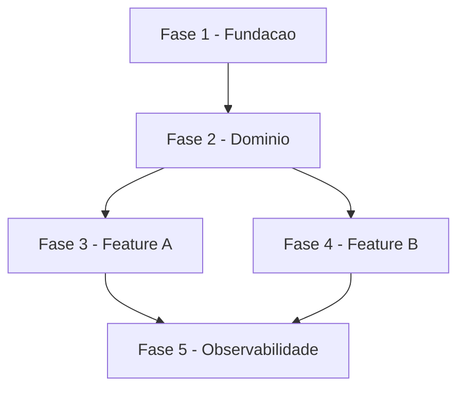

# Skill: Criar Backlog de Tarefas

Crie um documento de backlog de tarefas tecnicas seguindo o padrao estruturado abaixo.

## Pre-requisitos

**Recomendado (fluxo SDD)**: `plan.md` e `spec.md` ja existentes em
`docs/specs/{feature}/`. Com eles, o backlog se liga a fases tecnicas claras.

**Alternativa standalone**: descricao textual do escopo ou lista de features.
Neste caso, salva em `docs/tasks-{nome-escopo}.md`.

## Proximos passos

1. `/analyze` — validar consistencia entre spec, plan e tasks
2. `/execute-task {id}` — comecar execucao pela primeira tarefa critica
3. `/review-task` — acompanhar progresso conforme tarefas sao concluidas

## Argumentos

$ARGUMENTS

## Instrucoes

Analise o argumento fornecido. Ele pode ser:
1. **Descricao do escopo**: Uma descricao textual do que o MVP/projeto deve cobrir
2. **Documento de referencia**: Um arquivo existente com requisitos, casos de uso ou especificacoes
3. **Lista de funcionalidades**: Lista de features/modulos a serem organizados em tarefas

### Deteccao de Origem (Spec vs Standalone)

**ANTES de iniciar**, determine se o argumento se origina de uma especificacao:

1. **Verifique se o argumento referencia um arquivo em `docs/specs/`** (ex: `docs/specs/foo/spec.md`)
2. **Verifique se o argumento menciona o nome de uma spec existente** — liste `docs/specs/*/spec.md` com Glob
3. **Se o contexto da conversa indica que uma spec foi criada/usada recentemente**, considere-a como origem

**Se originado de uma spec** (`docs/specs/{spec-name}/spec.md`):
- Salvar em: `docs/specs/{spec-name}/tasks.md`
- Usar o conteudo da spec como documento de referencia principal

**Se chamado de forma isolada** (sem spec associada):
- Manter o comportamento padrao: `docs/tasks-{nome-escopo}.md`

### Fluxo de Criacao

```
1. ANALISE       Entender escopo, requisitos e documentacao existente
     |
2. ESTRUTURA     Definir fases, dependencias e caminho critico
     |
3. DECOMPOSICAO  Quebrar em tarefas e subtarefas tecnicas
     |
4. PRIORIZACAO   Classificar criticidade e ordenar execucao
     |
5. GERACAO       Produzir documento no formato padrao
     |
6. VALIDACAO     Verificar completude e consistencia
```

---

## Padrao do Documento

### Estrutura Obrigatoria

O documento DEVE conter todas as secoes abaixo, nesta ordem:

1. **Cabecalho** com titulo, escopo e legendas
2. **Fases** numeradas sequencialmente (FASE 1, FASE 2, ...)
3. **Tarefas** dentro de cada fase (numeracao hierarquica: 1.1, 1.2, ...)
4. **Subtarefas** como checkboxes (numeracao: 1.1.1, 1.1.2, ...)
5. **Matriz de Dependencias** (diagrama ASCII ou Mermaid)
6. **Resumo Quantitativo** (tabela com totais por fase)
7. **Cobertura** (o que esta incluido e excluido do escopo)

### Template Completo

Ver `templates/tasks.md` (mesmo diretorio desta skill). Estrutura:

- Cabecalho com escopo + legendas de status e criticidade
- Fases numeradas (FASE 1, FASE 2, ...)
- Tarefas com numeracao hierarquica (1.1, 1.2, ...) e tag `[C]`/`[A]`/`[M]`
- Subtarefas como checkboxes numerados (1.1.1, 1.1.2, ...)
- Matriz de Dependencias (Mermaid flowchart)
- Resumo Quantitativo, Escopo Coberto, Escopo Excluido

---

## Regras de Decomposicao

### Nomenclatura

| Nivel | Formato | Exemplo |
|-------|---------|---------|
| Fase | `FASE {N} - {Nome}` | `FASE 1 - Fundacao e Infraestrutura` |
| Tarefa | `{N}.{M} {Nome} [{Criticidade}]` | `1.1 Setup do Projeto [A]` |
| Subtarefa | `{N}.{M}.{K} {Descricao}` | `1.1.1 Criar solution com estrutura hexagonal` |

### Granularidade

| Nivel | Criterio | Tamanho Ideal |
|-------|----------|---------------|
| Fase | Agrupamento logico por dominio ou camada | 3-8 tarefas |
| Tarefa | Entregavel coeso e independente | 3-15 subtarefas |
| Subtarefa | Acao atomica executavel em 1-4 horas | 1 checkbox |

### Principios

1. **Cada subtarefa deve ser atomica**: uma acao clara e verificavel
2. **Cada tarefa deve ser coesa**: subtarefas relacionadas ao mesmo entregavel
3. **Cada fase deve ser sequenciavel**: dependencias claras entre fases
4. **Criticidade herda para baixo**: subtarefas herdam criticidade da tarefa pai
5. **Referencia a documentacao**: vincular tarefas a UCs, ADRs ou specs quando existirem
6. **Testes sao subtarefas**: toda tarefa de implementacao deve ter subtarefa de teste

### Classificacao de Criticidade

| Nivel | Criterio | Quando Usar |
|-------|----------|-------------|
| `[C]` Critico | Impacto financeiro, regulatorio ou de seguranca | Operacoes monetarias, compliance, SLAs |
| `[A]` Alto | Funcionalidade core sem a qual o sistema nao opera | APIs principais, integracao, persistencia |
| `[M]` Medio | Necessario mas pode ser adiado sem impacto imediato | Dashboards, relatorios, cache, observabilidade |

### Organizacao de Fases

Fases devem seguir ordem logica de construcao. Os exemplos abaixo sao
ilustrativos — adaptar a estrutura as camadas reais do projeto:

```
Exemplo para projeto com backend + persistencia + frontend:

FASE 1 - Fundacao (infra, setup, CI/CD, migrations iniciais)
FASE 2 - Dominio (entidades, regras, contratos)
FASE 3 - Backend (persistencia, servicos, handlers/endpoints)
FASE 4 - Integracao (mensageria, storage, clientes externos)
FASE 5 - Frontend (tipos, chamadas API, componentes, paginas)
FASE 6 - Testes e Qualidade (unit, integracao, lint, review)
FASE 7 - Observabilidade (logs, metricas, dashboards, alertas)

Exemplo para biblioteca/CLI:

FASE 1 - Fundacao (estrutura do projeto, build, CI)
FASE 2 - Dominio (tipos, interfaces publicas)
FASE 3 - Implementacao (funcionalidades core)
FASE 4 - Testes (unit, contract, property-based)
FASE 5 - Documentacao e release
```

**Para projetos multi-modulo**: Use Agent para ler documentacao de multiplos
modulos/servicos em paralelo ao analisar o escopo. Isso economiza tempo ao
gerar tarefas que cruzam fronteiras.

### Matriz de Dependencias

Use formato Mermaid ou ASCII para expressar dependencias:



---

## Checklist de Qualidade

Antes de finalizar o documento, verifique:

- [ ] Todas as fases tem pelo menos 1 tarefa
- [ ] Todas as tarefas tem pelo menos 3 subtarefas
- [ ] Todas as tarefas tem tag de criticidade `[C]`, `[A]` ou `[M]`
- [ ] Subtarefas de teste existem para tarefas de implementacao
- [ ] Numeracao hierarquica esta consistente (sem saltos)
- [ ] Matriz de dependencias reflete ordem real de execucao
- [ ] Resumo quantitativo bate com contagem real
- [ ] Escopo coberto e excluido estao documentados
- [ ] Referencias a documentacao existente estao corretas

---

## Saida Esperada

1. **Detecte a origem** — verifique se o argumento vem de uma spec em `docs/specs/`
2. **Analise o escopo** fornecido nos argumentos
3. **Leia documentacao existente** no projeto (UCs, ADRs, specs, DER) para extrair requisitos
4. **Proponha a estrutura de fases** ao usuario antes de detalhar
5. **Gere o documento completo** no formato padrao
6. **Salve o arquivo** no caminho correto:
   - Se originado de spec: `docs/specs/{spec-name}/tasks.md`
   - Se standalone: `docs/tasks-{nome-escopo}.md`
   - Ou caminho sugerido pelo usuario (override manual sempre prevalece)

### Pergunte ao usuario se necessario:

- Se ha documentacao de referencia para consultar
- Escopo que deve ser incluido/excluido
- Preferencia de granularidade (mais ou menos subtarefas)

### Configuracao

`config.json` (mesmo diretorio desta skill) pode customizar:
- `criticality_levels` — tags customizadas alem de [C]/[A]/[M]
- `output_paths.spec_derived` e `output_paths.standalone` — onde salvar
- `phase_prefix` — default "FASE", pode ser "PHASE", "STAGE", etc.
- `subtask_granularity_hours` — janela esperada de esforco por subtarefa

Se config.json ausente, usar defaults documentados no template.

### Scripts auxiliares

- `scripts/next-task-id.sh` — calcula proximo ID hierarquico dentro de uma
  fase ou tarefa em um tasks.md existente (util para append deterministico):
  ```bash
  bash skills/create-tasks/scripts/next-task-id.sh 1 tasks.md     # → 1.3
  bash skills/create-tasks/scripts/next-task-id.sh 1.2 tasks.md   # → 1.2.4
  ```

---

## Gotchas

### Deteccao de origem e OBRIGATORIA antes de escolher o path de salvamento

Se a chamada veio de uma spec em `docs/specs/{name}/`, o `tasks.md` vai em `docs/specs/{name}/tasks.md`, NAO em `docs/tasks-*.md`. Criar o arquivo fora do diretorio da spec quebra a composicao SDD — as skills downstream (analyze, execute-task) nao encontram o backlog.

### Toda tarefa de implementacao precisa de subtarefa de teste

Decomposicao sem teste e incompleta. Se a tarefa e "Implementar endpoint X", deve haver uma subtarefa "Escrever testes de integracao para endpoint X". A skill checa isso — nao relaxe.

### Criticidade `[C]/[A]/[M]` em TODAS as tarefas

Tarefa sem criticidade nao permite priorizacao pelo `/review-task`. `[C]` nao e "critico em geral" — e "impacto financeiro/regulatorio/SLA direto". `[A]` e funcionalidade core sem a qual o sistema nao opera. `[M]` e o resto.

### Granularidade: subtarefa = 1-4 horas de trabalho atomico

Subtarefa gigante (multi-dia) e tarefa disfarcada. Se aparece "1.2.1 Implementar autenticacao OAuth2 completa", decomponha mais: setup do provider, handlers de callback, validacao de token, logout, cada um vira subtarefa separada.

### Referenciar documentacao existente (UCs, ADRs, specs) em Ref:

Tarefa orfa sem `Ref:` dificulta entender contexto quando alguem executa semanas depois. Se existe `UC-XXX`, `ADR-YYY` ou spec que origina a tarefa, referencie explicitamente.

### Matriz de dependencias deve refletir ordem REAL de execucao

Diagrama Mermaid desenhado "como deveria ser" mas que contradiz a ordem das fases (ex: Fase 5 depende de Fase 7) indica que a estrutura esta errada. Revisite a ordenacao antes de publicar.

### Nao confundir "escopo excluido" com "fora do MVP"

Escopo excluido = explicitamente NAO faz parte deste backlog (documentar porque). Fora do MVP = pode fazer parte no futuro mas fora desta rodada. Sao colunas diferentes do relatorio final.