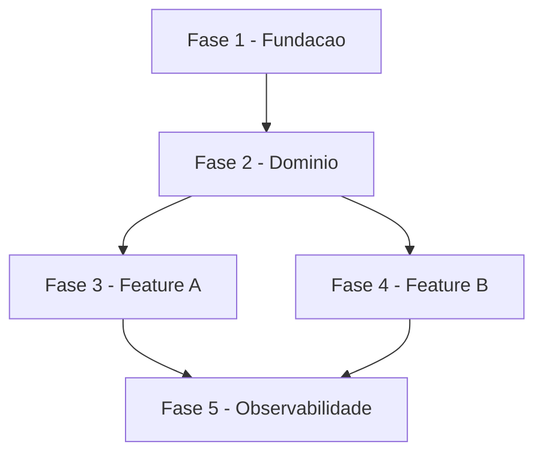

# Skill: Criar Backlog de Tarefas

Crie um documento de backlog de tarefas tecnicas seguindo o padrao estruturado abaixo.

## Argumentos

$ARGUMENTS

## Instrucoes

Analise o argumento fornecido. Ele pode ser:
1. **Descricao do escopo**: Uma descricao textual do que o MVP/projeto deve cobrir
2. **Documento de referencia**: Um arquivo existente com requisitos, casos de uso ou especificacoes
3. **Lista de funcionalidades**: Lista de features/modulos a serem organizados em tarefas

### Deteccao de Origem (Spec vs Standalone)

**ANTES de iniciar**, determine se o argumento se origina de uma especificacao:

1. **Verifique se o argumento referencia um arquivo em `docs/specs/`** (ex: `docs/specs/foo/spec.md`)
2. **Verifique se o argumento menciona o nome de uma spec existente** — liste `docs/specs/*/spec.md` com Glob
3. **Se o contexto da conversa indica que uma spec foi criada/usada recentemente**, considere-a como origem

**Se originado de uma spec** (`docs/specs/{spec-name}/spec.md`):
- Salvar em: `docs/specs/{spec-name}/tasks.md`
- Usar o conteudo da spec como documento de referencia principal

**Se chamado de forma isolada** (sem spec associada):
- Manter o comportamento padrao: `docs/tasks-{nome-escopo}.md`

### Fluxo de Criacao

```
1. ANALISE       Entender escopo, requisitos e documentacao existente
     |
2. ESTRUTURA     Definir fases, dependencias e caminho critico
     |
3. DECOMPOSICAO  Quebrar em tarefas e subtarefas tecnicas
     |
4. PRIORIZACAO   Classificar criticidade e ordenar execucao
     |
5. GERACAO       Produzir documento no formato padrao
     |
6. VALIDACAO     Verificar completude e consistencia
```

---

## Padrao do Documento

### Estrutura Obrigatoria

O documento DEVE conter todas as secoes abaixo, nesta ordem:

1. **Cabecalho** com titulo, escopo e legendas
2. **Fases** numeradas sequencialmente (FASE 1, FASE 2, ...)
3. **Tarefas** dentro de cada fase (numeracao hierarquica: 1.1, 1.2, ...)
4. **Subtarefas** como checkboxes (numeracao: 1.1.1, 1.1.2, ...)
5. **Matriz de Dependencias** (diagrama ASCII ou Mermaid)
6. **Resumo Quantitativo** (tabela com totais por fase)
7. **Cobertura** (o que esta incluido e excluido do escopo)

### Template Completo

```markdown
# Tarefas {Nome do Projeto} - {Escopo}

Escopo: {Descricao concisa do que este backlog cobre}

**Legenda de status:**
- `[ ]` Pendente
- `[~]` Em andamento
- `[x]` Concluido
- `[!]` Bloqueado

**Legenda de criticidade:**
- `[C]` Critico - Impacto financeiro direto ou bloqueante
- `[A]` Alto - Funcionalidade essencial
- `[M]` Medio - Necessario mas sem urgencia imediata

---

## FASE {N} - {Nome da Fase}

### {N}.1 {Nome da Tarefa} `[{C|A|M}]`

Ref: {Referencia a UC, ADR ou documento, se aplicavel}

- [ ] {N}.1.1 {Descricao da subtarefa}
- [ ] {N}.1.2 {Descricao da subtarefa}
- [ ] {N}.1.3 {Descricao da subtarefa}

### {N}.2 {Nome da Tarefa} `[{C|A|M}]`

- [ ] {N}.2.1 {Descricao da subtarefa}
- [ ] {N}.2.2 {Descricao da subtarefa}

---

## Matriz de Dependencias

{Diagrama mostrando ordem de execucao e dependencias entre fases}

## Resumo Quantitativo

| Fase | Tarefas | Subtarefas | Criticidade |
|------|---------|------------|-------------|
| 1 - {Nome} | {N} | {N} | {C|A|M} |
| **Total** | **{N}** | **{N}** | - |

## Escopo Coberto

| Item | Descricao | Fase |
|------|-----------|------|
| {ID} | {O que esta incluido} | {N} |

## Escopo Excluido

| Item | Descricao | Motivo |
|------|-----------|--------|
| {ID} | {O que foi excluido} | {Justificativa} |
```

---

## Regras de Decomposicao

### Nomenclatura

| Nivel | Formato | Exemplo |
|-------|---------|---------|
| Fase | `FASE {N} - {Nome}` | `FASE 1 - Fundacao e Infraestrutura` |
| Tarefa | `{N}.{M} {Nome} [{Criticidade}]` | `1.1 Setup do Projeto [A]` |
| Subtarefa | `{N}.{M}.{K} {Descricao}` | `1.1.1 Criar solution com estrutura hexagonal` |

### Granularidade

| Nivel | Criterio | Tamanho Ideal |
|-------|----------|---------------|
| Fase | Agrupamento logico por dominio ou camada | 3-8 tarefas |
| Tarefa | Entregavel coeso e independente | 3-15 subtarefas |
| Subtarefa | Acao atomica executavel em 1-4 horas | 1 checkbox |

### Principios

1. **Cada subtarefa deve ser atomica**: uma acao clara e verificavel
2. **Cada tarefa deve ser coesa**: subtarefas relacionadas ao mesmo entregavel
3. **Cada fase deve ser sequenciavel**: dependencias claras entre fases
4. **Criticidade herda para baixo**: subtarefas herdam criticidade da tarefa pai
5. **Referencia a documentacao**: vincular tarefas a UCs, ADRs ou specs quando existirem
6. **Testes sao subtarefas**: toda tarefa de implementacao deve ter subtarefa de teste

### Classificacao de Criticidade

| Nivel | Criterio | Quando Usar |
|-------|----------|-------------|
| `[C]` Critico | Impacto financeiro, regulatorio ou de seguranca | Operacoes monetarias, compliance, SLAs |
| `[A]` Alto | Funcionalidade core sem a qual o sistema nao opera | APIs principais, integracao, persistencia |
| `[M]` Medio | Necessario mas pode ser adiado sem impacto imediato | Dashboards, relatorios, cache, observabilidade |

### Organizacao de Fases

Fases devem seguir ordem logica de construcao:

```
Tipica para projetos backend (Go microservicos):

FASE 1 - Fundacao (migrations, domain, DTOs, factory wiring)
FASE 2 - Backend Core (repository, service, handler, routes)
FASE 3 - Integracao (RabbitMQ events, inter-service clients, S3 storage)
FASE 4 - Frontend (types, API service, hooks, components, pages)
FASE 5 - Testes e Qualidade (unit tests, lint, review)

Tipica para projetos genericos:

FASE 1 - Fundacao (infra, setup, CI/CD)
FASE 2 - Dominio (entidades, regras, SDK/clients)
FASE 3..N - Features por dominio (ordenadas por dependencia)
FASE N+1 - Observabilidade (metricas, dashboards, alertas)
```

**Para monorepos multi-servico**: Use Agent para ler documentacao de multiplos
servicos em paralelo ao analisar o escopo. Isso economiza tempo ao gerar tarefas
que cruzam fronteiras de servico.

### Matriz de Dependencias

Use formato Mermaid ou ASCII para expressar dependencias:



---

## Checklist de Qualidade

Antes de finalizar o documento, verifique:

- [ ] Todas as fases tem pelo menos 1 tarefa
- [ ] Todas as tarefas tem pelo menos 3 subtarefas
- [ ] Todas as tarefas tem tag de criticidade `[C]`, `[A]` ou `[M]`
- [ ] Subtarefas de teste existem para tarefas de implementacao
- [ ] Numeracao hierarquica esta consistente (sem saltos)
- [ ] Matriz de dependencias reflete ordem real de execucao
- [ ] Resumo quantitativo bate com contagem real
- [ ] Escopo coberto e excluido estao documentados
- [ ] Referencias a documentacao existente estao corretas

---

## Saida Esperada

1. **Detecte a origem** — verifique se o argumento vem de uma spec em `docs/specs/`
2. **Analise o escopo** fornecido nos argumentos
3. **Leia documentacao existente** no projeto (UCs, ADRs, specs, DER) para extrair requisitos
4. **Proponha a estrutura de fases** ao usuario antes de detalhar
5. **Gere o documento completo** no formato padrao
6. **Salve o arquivo** no caminho correto:
   - Se originado de spec: `docs/specs/{spec-name}/tasks.md`
   - Se standalone: `docs/tasks-{nome-escopo}.md`
   - Ou caminho sugerido pelo usuario (override manual sempre prevalece)

### Pergunte ao usuario se necessario:

- Se ha documentacao de referencia para consultar
- Escopo que deve ser incluido/excluido
- Preferencia de granularidade (mais ou menos subtarefas)