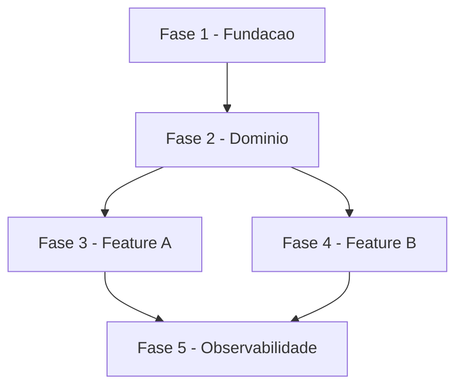

# Tarefas {Nome do Projeto} - {Escopo}

Escopo: {Descricao concisa do que este backlog cobre}

**Legenda de status:**
- `[ ]` Pendente
- `[~]` Em andamento
- `[x]` Concluido
- `[!]` Bloqueado

**Legenda de criticidade:**
- `[C]` Critico - Impacto financeiro direto ou bloqueante
- `[A]` Alto - Funcionalidade essencial
- `[M]` Medio - Necessario mas sem urgencia imediata

---

## FASE {N} - {Nome da Fase}

### {N}.1 {Nome da Tarefa} `[{C|A|M}]`

Ref: {Referencia a UC, ADR ou documento, se aplicavel}

- [ ] {N}.1.1 {Descricao da subtarefa}
- [ ] {N}.1.2 {Descricao da subtarefa}
- [ ] {N}.1.3 {Descricao da subtarefa}

### {N}.2 {Nome da Tarefa} `[{C|A|M}]`

- [ ] {N}.2.1 {Descricao da subtarefa}
- [ ] {N}.2.2 {Descricao da subtarefa}

---

## Matriz de Dependencias

## Resumo Quantitativo

| Fase | Tarefas | Subtarefas | Criticidade |
|------|---------|------------|-------------|
| 1 - {Nome} | {N} | {N} | {C\|A\|M} |
| **Total** | **{N}** | **{N}** | - |

## Escopo Coberto

| Item | Descricao | Fase |
|------|-----------|------|
| {ID} | {O que esta incluido} | {N} |

## Escopo Excluido

| Item | Descricao | Motivo |
|------|-----------|--------|
| {ID} | {O que foi excluido} | {Justificativa} |
