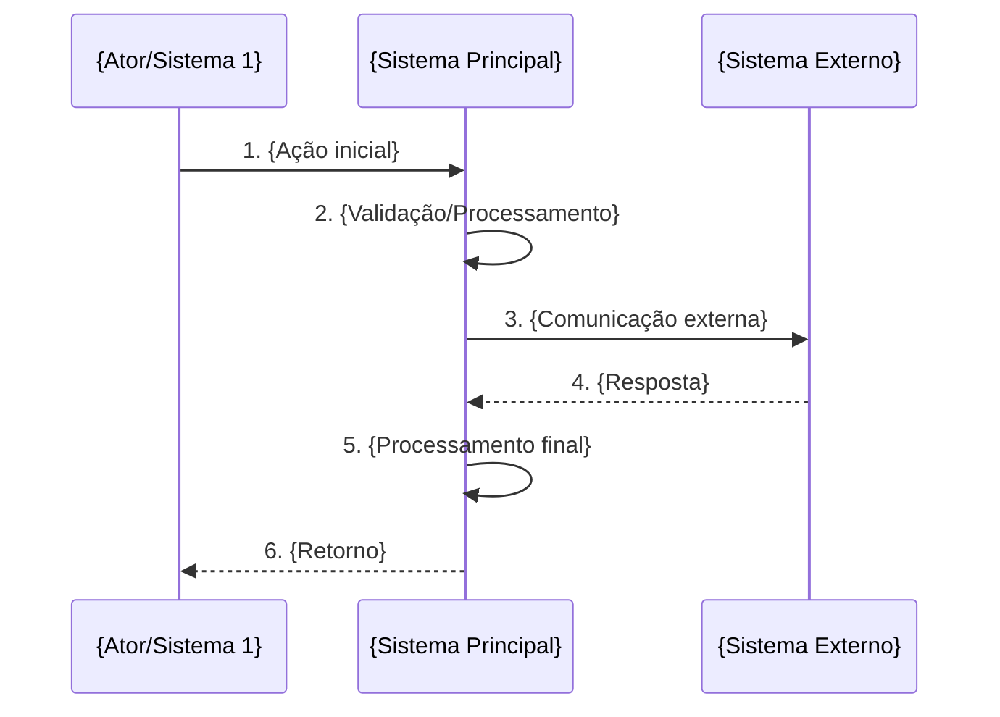

# UC-{ID}: {Nome do Caso de Uso}

## Informações Gerais

| Campo          | Valor                                    |
|----------------|------------------------------------------|
| **ID**         | UC-{ID}                                  |
| **Nome**       | {Nome descritivo}                        |
| **Domínio**    | {Nome do domínio}                        |
| **Prioridade** | {Alta/Média/Baixa}                       |
| **Versão**     | 1.0                                      |
| **Status**     | Rascunho                                 |

---

## 1. Descrição

{Descrição clara e concisa do que o caso de uso faz, seu propósito e contexto de negócio. Deve explicar O QUE faz e POR QUE é necessário. Mínimo 2 parágrafos.}

---

## 2. Atores

| Ator                  | Tipo     | Descrição                                          |
|-----------------------|----------|----------------------------------------------------|
| {Ator Principal}      | Primário | {Descrição do papel e responsabilidade}            |
| {Sistema Externo}     | Sistema  | {Descrição da integração}                          |

---

## 3. Pré-condições

1. {Pré-condição 1 - o que deve estar pronto antes}
2. {Pré-condição 2 - autenticações necessárias}
3. {Pré-condição 3 - dados necessários}

---

## 4. Pós-condições

### Sucesso
- {Resultado principal esperado}
- {Dados persistidos/atualizados}
- Log de operação registrado

### Falha
- Log de erro registrado com detalhes
- {Ação de rollback se aplicável}
- Notificação enviada se erro crítico

---

## 5. Fluxo Principal



### Passos Detalhados

| Passo | Ação                                                                |
|-------|---------------------------------------------------------------------|
| 1     | {Descrição detalhada - quem faz o quê}                              |
| 2     | {Descrição detalhada - validações aplicadas}                        |
| 3     | {Descrição detalhada - dados enviados}                              |
| 4     | {Descrição detalhada - dados recebidos}                             |
| 5     | {Descrição detalhada - transformações}                              |
| 6     | {Descrição detalhada - resultado final}                             |

---

## 6. Fluxos Alternativos

### FA1: {Nome do cenário alternativo}

| Passo | Condição                        | Ação                                    |
|-------|---------------------------------|-----------------------------------------|
| Xa    | {Quando ocorre o desvio}        | {O que fazer}                           |
| Xb    | -                               | {Continuação}                           |
| Xc    | -                               | {Retorno ao fluxo principal ou fim}     |

### FA2: {Outro cenário alternativo}

| Passo | Condição                        | Ação                                    |
|-------|---------------------------------|-----------------------------------------|
| Ya    | {Condição de desvio}            | {Ação alternativa}                      |
| Yb    | -                               | {Continuação}                           |

---

## 7. Exceções

| Código | Exceção                         | Tratamento                           |
|--------|---------------------------------|--------------------------------------|
| E001   | {Erro de validação}             | {Log + notificar + ação}             |
| E002   | {Erro de integração}            | {Retry + fallback}                   |
| E003   | Timeout na comunicação          | Retry com backoff exponencial        |
| E004   | {Erro de negócio}               | {Rejeitar + notificar}               |

---

## 8. Regras de Negócio

| ID   | Regra                                                                              |
|------|------------------------------------------------------------------------------------|
| RN01 | {Regra de validação}                                                               |
| RN02 | {Regra de transformação}                                                           |
| RN03 | {Regra de comportamento}                                                           |

### Detalhamento RN{X} - {Nome da regra complexa}

{Quando uma regra precisa de mais explicação:}

**Condições:**
```
SE {condição} ENTÃO
    {ação}
SENÃO
    {ação alternativa}
```

**Valores válidos:**

| Código | Descrição |
|--------|-----------|
| A      | {Valor A} |
| B      | {Valor B} |

---

## 9. Requisitos Não-Funcionais

| ID    | Requisito                                                     |
|-------|---------------------------------------------------------------|
| RNF01 | Tempo de resposta: < {X} segundos                             |
| RNF02 | Throughput: {N} operações/minuto                              |
| RNF03 | Retry automático: até {N}x com backoff                        |
| RNF04 | Log detalhado de todas as operações                           |

---

## 10. Dados Técnicos

### Mapeamento de Campos: {Sistema Origem} → {Sistema Destino}

| Campo Origem    | Campo Destino    | Tipo          | Obrigatório | Observação           |
|-----------------|------------------|---------------|-------------|----------------------|
| {campoOrigem}   | {CAMPO_DESTINO}  | VARCHAR(100)  | Sim         | {Transformação}      |
| {campo2}        | {CAMPO2}         | INT           | Não         | Via De-Para          |

### Endpoint {Sistema} - {Operação}

```http
{METHOD} {URL}
Authorization: Bearer {token}
Content-Type: application/json
```

### Request Body

```json
{
  "campo1": "valor",
  "campo2": 123,
  "objetoAninhado": {
    "subcampo": "valor"
  }
}
```

### Response (Sucesso)

```json
{
  "status": "success",
  "data": {
    "id": "123",
    "resultado": "valor"
  }
}
```

### Response (Erro)

```json
{
  "status": "error",
  "code": "ERROR_CODE",
  "message": "Descrição do erro"
}
```

---

## 11. Casos de Teste

| ID   | Cenário                              | Entrada                           | Resultado Esperado               |
|------|--------------------------------------|-----------------------------------|----------------------------------|
| CT01 | {Cenário de sucesso básico}          | {Dados válidos completos}         | {Operação concluída}             |
| CT02 | {Cenário com dados mínimos}          | {Apenas obrigatórios}             | {Operação concluída}             |
| CT03 | {Cenário de validação}               | {Dados inválidos}                 | Erro E001                        |
| CT04 | {Cenário de integração}              | {Sistema externo offline}         | Retry + fallback                 |
| CT05 | {Cenário de borda}                   | {Valores limite}                  | {Comportamento esperado}         |

---

## 12. Métricas e Monitoramento

| Métrica                      | Descrição                                |
|------------------------------|------------------------------------------|
| {operacao}_total             | Total de operações realizadas            |
| {operacao}_duration_seconds  | Duração média da operação                |
| {operacao}_errors_total      | Erros durante operação                   |
| {operacao}_success_rate      | Taxa de sucesso (%)                      |

---

## 13. Dependências

| Caso de Uso  | Relação      | Descrição                              |
|--------------|--------------|----------------------------------------|
| UC-{XX}-{N}  | Depende de   | {Pré-requisito necessário}             |
| UC-{XX}-{N}  | Estende      | {Funcionalidade estendida}             |
| UC-{XX}-{N}  | Usado por    | {Quem consome este UC}                 |

---

## 14. Referências

- [{Documento relacionado}]({caminho relativo})
- [{Especificação técnica}]({URL ou caminho})

---

*Criado em: {YYYY-MM-DD}*
*Última atualização: {YYYY-MM-DD}*