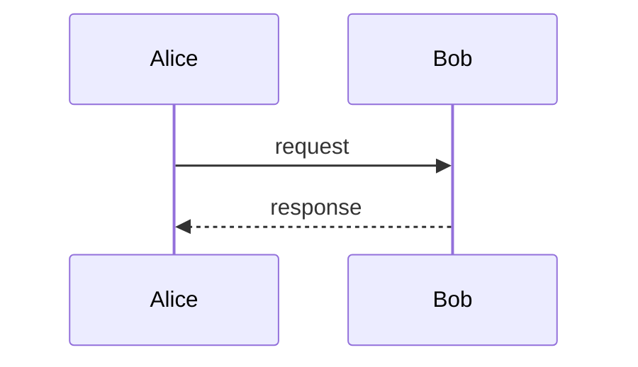

# Documento com mermaid invalido

Este fixture deve FALHAR na checagem Mermaid do `validate.sh`:
`sequenceDiagram` usa os nomes `Alice` e `Bob` em setas, mas nunca declara
`participant Alice` ou `participant Bob`. O script deve reportar ERRO
"participant `Alice` usado sem declaracao previa" (ou equivalente para Bob).

O restante do documento passa nas demais checagens — este fixture isola
o erro em Mermaid para que o teste nao confunda com outros problemas.
