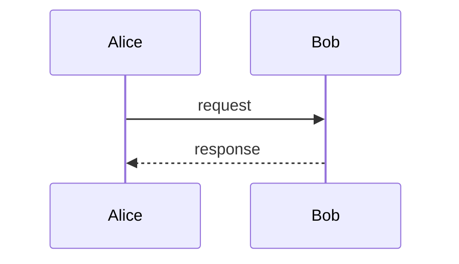

# Documento valido

Este fixture deve passar todas as checagens de `validate.sh`:

1. Frontmatter YAML fechado corretamente.
2. Code block com linguagem declarada.
3. Mermaid sequenceDiagram com participants declarados.
4. Link interno resolvivel.
5. Tabela bem formada.

## Exemplo de codigo

```bash
printf 'hello world\n'
```

## Diagrama



## Tabela

| Campo  | Tipo   | Obrigatorio |
|--------|--------|-------------|
| id     | uuid   | sim         |
| name   | string | sim         |

## Ver tambem

Consulte [o outro documento](./target.md) para contexto.
